# PINESPHERE STAY — HOTEL PROPERTY MANAGEMENT SYSTEM
## Enterprise Product Requirements Document (PRD)

**Document Type:** Implementation-Ready Enterprise Software Specification
**Scope of This Document:** Super Admin · Owner · Guest Portal · Manager · Receptionist · Housekeeping · Kitchen · Accountant · Security Guard · Broker · Unified Login & Platform Routing · Subscription Paywall Enforcement · Offline App Data Layer · License Anti-Theft Sync · Owner Registration & Property Onboarding Pipeline · Dynamic Subscription & Pricing Rule Engine · Single-Session Enforcement & Account Lock · App Integrity & Anti-Piracy Protection · Super Admin Security Dashboard · Foreign Guest Compliance (Form C / FRRO) · Dynamic Broker Commission Engine
**Version:** 1.0
**Classification:** Internal — Product / Engineering / QA / DevOps

---

## 0. SYSTEM OVERVIEW

| Attribute | Value |
|---|---|
| Project Name | Pinesphere Stay |
| Product Type | Offline-First Multi-Property Hotel Property Management System (PMS) |
| Backend Framework | FastAPI (Python 3.11+) |
| Web Frontend | Flutter Web — **Super Admin and Guest Portal only** |
| App Frontend | Flutter (Android/iOS) with a native Kotlin offline data layer — **all other roles** (Owner, Manager, Receptionist, Housekeeping, Kitchen, Maintenance, Accountant, Security Guard, Broker) |
| App Offline Persistence | ObjectBox (primary embedded object DB for offline-first entities) + SQLite (relational mirror for reporting-style/ad-hoc local queries), accessed through a **thin Kotlin data-access/optimization layer** — not a separate native app. Kotlin's sole role is fast, low-overhead retrieval and marshaling of data between ObjectBox/SQLite and the Flutter UI (via platform channels) and between that local store and the FastAPI backend during sync; all screens, navigation, and business-workflow logic remain in Flutter/Dart. This keeps the APK lightweight and lets the app run smoothly across the full supported Android version range (see §15.8). |
| Primary Database (Server) | PostgreSQL 15+ |
| Cache Layer | Redis 7+ |
| Object Storage | MinIO / S3-compatible |
| Authentication | JWT (Access Token 15 min) + Refresh Token (7 days, rotating) |
| Subscription Gate | Owner access is fully paywalled — zero functional access without an `active` (or in-grace-period) subscription |
| Offline License | Supported — device-bound signed license file, **re-validated on every app session/sync cycle** (anti-theft) |
| Offline Sync | Supported — bidirectional, conflict-resolved; every locally-completed action is queued and transmitted once connectivity returns |
| Notification Channels | Email (SMTP/SES), WhatsApp Business API, Push (FCM/APNs), In-App |
| Multi-Tenancy | Multi-Property, Multi-Owner, Single Database with Row-Level Tenant Isolation |
| API Style | REST (JSON), versioned /api/v1/ |
| Event Backbone | Redis Streams / RabbitMQ for async inter-module events |

### 0.1 User Hierarchy

```
Super Admin -> Owner -> Manager -> Receptionist -> Housekeeping -> Kitchen
   -> Maintenance -> Accountant -> Security Guard -> Broker -> Guest Portal
```

This document details three actors in full implementation depth: Super Admin, Owner, and Guest. All other roles (Manager, Receptionist, Housekeeping, Kitchen, Accountant, Security Guard, Broker) are referenced only as communication targets/sources for the three in-scope modules.

### 0.2 RBAC Model

Roles never receive hardcoded feature access. Every module exposes a Permission Registry; roles are assigned permissions at runtime via a `role_permissions` mapping table. Super Admin can create custom roles per property.

Permission naming convention: `<module>.<resource>.<action>` e.g. `booking.reservation.create`, `subscription.plan.assign`.

Core actions: `view`, `create`, `edit`, `delete`, `cancel`, `refund`, `approve`, `export`, `override`.

### 0.3 Platform Access Model (Web vs App)

Pinesphere Stay is split across two physical client platforms. A role is bound to exactly one platform as its **home platform**; attempting to use the other platform never grants degraded access — it either redirects (for web-only roles landing on the app) or is explicitly refused (for app-only roles landing on the web). Full behavioral specification is in **Module 4 — Unified Login & Platform Routing** (§13).

| Platform | Roles Permitted | Rationale |
|---|---|---|
| **Web** (Flutter Web) | Super Admin, Guest | Both are inherently online-only, low-frequency, high-trust-boundary actors (platform operator; time-boxed external guest) with no need for offline field operation. |
| **App** (Flutter + native Kotlin/ObjectBox/SQLite offline layer, Android/iOS) | Owner, Manager, Receptionist, Housekeeping, Kitchen, Maintenance, Accountant, Security Guard, Broker | All are on-property operational roles that must keep working during internet outages (front desk, housekeeping floor, kitchen, etc.). |

This is a hard architectural boundary, not a UI preference — the Web build does not ship the offline data layer or operational modules (Booking/Room/Housekeeping/etc.) at all, and the App build does not ship the Super Admin console or Guest OTP-portal UI at all. This keeps each binary lean and prevents an operational role's credentials from ever being usable against a surface that was never designed for offline conflict handling.

---

# MODULE 1 — SUPER ADMIN PORTAL

## 1.1 Module Overview

**Purpose:** The Super Admin Portal is the platform-owner-level control center for Pinesphere Stay. It governs the entire SaaS estate — every customer (Owner account), every property, every subscription, every licensed device, and every offline license issued across the platform.

**Business Value:** Enables the SaaS operator to onboard, monetize, monitor, and support unlimited hotel properties from a single console; converts the product from a single-tenant tool into a scalable multi-tenant business.

**Problem It Solves:** Without a centralized control layer, there is no way to enforce subscription limits, track platform health, issue offline licenses, or intervene when a property's sync/device fails. Super Admin closes that gap.

**Dependencies:** Subscription Service, Device/License Service, Property Service, Notification Service, Audit Service, Payment Gateway (for platform billing), Redis (session/cache), PostgreSQL (system-of-record).

**Actors**

| Actor | Type |
|---|---|
| Super Admin | Primary User |
| Owner | Secondary User (recipient of actions such as plan assignment, property approval) |
| Support Engineer (Super Admin sub-role) | Secondary User (restricted permission subset) |

**Access:** Super Admin only. Owner, Manager, Receptionist, and all property-level roles have **zero** access to this module. Guests have no visibility whatsoever.

## 1.2 Business Objectives

1. Reduce customer onboarding time to under 10 minutes per property.
2. Achieve 99.9% subscription-billing accuracy (no orphaned/duplicate charges).
3. Detect and surface failed offline syncs within 5 minutes of occurrence.
4. Provide real-time platform revenue visibility (MRR, churn, trial conversion).
5. Ensure every device operating against the platform is licensed, traceable, and revocable within 60 seconds of a remote-wipe command.

## 1.3 Scope

**In Scope:** Platform dashboard/analytics, customer (Owner) lifecycle management, property lifecycle management, subscription plan management, platform user management for Owner accounts, device/license lifecycle, support tooling, global reporting, global audit trail.

**Out of Scope:** Day-to-day hotel operations (bookings, housekeeping, kitchen) — these belong to the Owner/property-level modules and are never editable from Super Admin. Super Admin can *view* aggregated data but cannot create a booking, guest, or room.

## 1.4 User Stories

- As a Super Admin, I want to see all properties whose trial expires in the next 7 days, so I can proactively trigger renewal outreach.
- As a Super Admin, I want to suspend a customer instantly when payment fails, so unpaid usage is halted without deleting their data.
- As a Super Admin, I want to generate an offline license bound to a specific device fingerprint, so the property can operate without internet while remaining tamper-resistant.
- As a Super Admin, I want to remote-wipe a lost/stolen device, so property and guest data cannot be exfiltrated.
- As a Super Admin, I want to view global audit logs filtered by property and date range, so I can investigate a support escalation.
- As an Owner, I want my property to automatically move from Trial to Active the moment my payment clears, so there is no manual delay.

## 1.5 Permission Registry — Super Admin Module

| Resource | Permissions Exposed |
|---|---|
| `platform.dashboard` | `view` |
| `customer` | `view`, `create`, `edit`, `suspend`, `activate`, `archive`, `delete`, `transfer_ownership`, `export` |
| `property` | `view`, `create`, `edit`, `approve`, `allocate_limit`, `backup`, `restore`, `export` |
| `subscription.plan` | `view`, `create`, `edit`, `delete` |
| `subscription.assignment` | `view`, `assign`, `upgrade`, `downgrade`, `renew`, `suspend`, `enable`, `disable` |
| `subscription.license` | `view`, `generate`, `revoke`, `reset` |
| `platform.user` | `view`, `create`, `reset_password`, `disable`, `activate`, `view_login_history` |
| `device` | `view`, `register`, `approve`, `lock`, `disable`, `logout`, `transfer`, `remote_wipe` |
| `support` | `force_sync`, `view_logs`, `remote_diagnostics` |
| `report.global` | `view`, `export` |
| `audit.global` | `view`, `export` |

Roles such as "Support Engineer" are created by assigning a subset — e.g. `support.*`, `device.view`, `device.lock`, `audit.global.view` — without granting `customer.delete` or `subscription.plan.edit`.

## 1.6 Functional Requirements

### 1.6.1 Feature: Platform Dashboard

**Purpose:** Real-time operational and financial snapshot of the entire platform.

**Preconditions:** Authenticated Super Admin session with `platform.dashboard.view`.

**Inputs:** None (auto-loads); optional date-range filter, optional property-group filter.

**Outputs:** KPI tiles — Total Customers, Active Properties, Trial Properties, Expired Properties, Monthly Revenue (MRR), Subscription Statistics (plan distribution), Online Devices, Offline Devices, Failed Syncs (last 24h), Today's Check-ins (aggregated across properties), Today's Revenue (aggregated), Open Support Tickets, WhatsApp Message Usage (against quota), platform-wide Analytics charts (churn trend, occupancy trend, revenue trend).

**Validations:** Date range ≤ 366 days; property-group filter must reference existing group IDs.

**Workflow:**
```
GET /api/v1/superadmin/dashboard
   ↓ Validate JWT + permission
   ↓ Fetch aggregates from Redis cache (TTL 60s)
   ↓ On cache miss → query materialized views in PostgreSQL
   ↓ Merge device-status stream from Redis (device heartbeat keys)
   ↓ Return composed JSON
```

**Backend Process:** A scheduled job (`aggregate_platform_kpis`, every 60s) recomputes materialized views `mv_customer_counts`, `mv_property_status`, `mv_revenue_daily`, `mv_device_status`. The dashboard endpoint reads from cache first to guarantee <500ms response.

**Frontend Behaviour:** Flutter web dashboard renders tiles with skeleton loaders; auto-refreshes every 60s via polling (WebSocket upgrade planned Phase 2); tapping a tile deep-links to the relevant management screen (e.g. "Expired Properties" tile → Property Management filtered view).

**Success Flow:** Dashboard renders within 3 seconds with all tiles populated.

**Failure Flow:** If a materialized view query times out, the tile shows a "Retry" state while other tiles still render (partial-failure tolerant).

**Business Rules:** Trial Properties count excludes properties suspended for non-payment. Failed Syncs counts only syncs that failed after 3 automatic retries.

**Edge Cases:** Property with zero rooms still counts toward Active Properties if subscription is active. Device that has never synced (newly registered, unconnected) is excluded from Online/Offline counts until first heartbeat.

**Notifications:** None generated by viewing; underlying threshold breaches (e.g. Failed Syncs > 10) trigger a separate Support alert (see §1.11).

**Audit Logs:** Dashboard *views* are not logged (read-only, high frequency); dashboard *exports* are logged.

**Acceptance Criteria:**
- [ ] Given valid Super Admin session, dashboard loads in <3s (95th percentile).
- [ ] Given a property with an active subscription and one room, it is counted in "Active Properties."
- [ ] Given a device with zero heartbeats, it does not appear in Online or Offline counters.

### 1.6.2 Feature: Customer (Owner Account) Management

**Purpose:** Full lifecycle control of the Owner-level tenant account that anchors a customer's properties, staff, and billing.

**Preconditions:** `customer.create` / `customer.edit` / etc.

**Inputs (Create Customer):** Business Name (string, required), Owner Full Name (string, required), Owner Email (email, required, unique), Owner Mobile (E.164, required, unique), Preferred Language, Initial Plan (FK to `subscription_plans`), Billing Address.

**Outputs:** Customer record created with status `trial` or `pending_payment` depending on plan; Owner receives welcome Email + WhatsApp with portal login link and temporary password.

**Validations:**

| Field | Min | Max | Regex/Type | Required | Unique | Nullable |
|---|---|---|---|---|---|---|
| business_name | 3 | 120 | `^[\w\s.&'-]+$` | Yes | No | No |
| owner_email | 5 | 254 | RFC 5322 email | Yes | Yes | No |
| owner_mobile | 8 | 15 | `^\+[1-9]\d{7,14}$` | Yes | Yes | No |
| billing_address_line1 | 5 | 200 | free text | Yes | No | No |
| plan_id | — | — | UUID FK | Yes | No | No |

**Workflow:**
```
Input → Validation → Create customer (status=trial) → Create default Owner user
   → Generate temp credentials → Send Email + WhatsApp
   → Create Audit Log → Response
```

**Backend Process:** `POST /api/v1/superadmin/customers` runs inside a DB transaction: insert `customers`, insert `users` (role=owner), insert `subscriptions` (status=trial, trial_end = now()+14 days), enqueue `notification.welcome` event, insert `audit_logs`. All-or-nothing commit.

**Frontend Behaviour:** Multi-step wizard (Business Info → Owner Info → Plan Selection → Review); inline validation per field; disable Submit until all required fields pass; success toast + redirect to Customer Detail screen.

**Success Flow:** Customer created → 201 → Owner can log in immediately with temp password (forced reset on first login).

**Failure Flow:** Duplicate email/mobile → 409 Conflict with field-level error; invalid plan_id → 422; transaction rollback on notification-enqueue failure does **not** roll back customer creation (notification failures are retried independently, not transactional with the create).

**Business Rules:**
- Cannot delete a customer with an active (non-cancelled) subscription; must suspend/cancel subscription first.
- Cannot archive a customer with properties that have guests currently checked in.
- Transfer Ownership requires the new owner to already exist as a verified user, or to complete email+mobile verification during the transfer flow, and requires the outgoing owner's explicit confirmation OR Super Admin override with a mandatory reason code.

**Edge Cases:** Customer with two properties, one suspended and one active — Suspend Customer action suspends both; Activate Customer reactivates only properties that were suspended *because of* the customer-level suspension (properties independently suspended for other reasons remain suspended).

**Notifications:**

| Trigger | Recipient | Channel | Template |
|---|---|---|---|
| Customer Created | Owner | Email + WhatsApp | `welcome_owner_v1` |
| Customer Suspended | Owner | Email + Push | `account_suspended_v1` |
| Customer Activated | Owner | Email + WhatsApp | `account_reactivated_v1` |
| Ownership Transferred | Old Owner, New Owner | Email | `ownership_transfer_v1` |

**Audit Logs:** Every create/edit/suspend/activate/archive/delete/transfer logs: actor (Super Admin ID), action, target customer ID, previous value (JSON snapshot), new value (JSON snapshot), timestamp, IP address, device fingerprint, geo-location (IP-derived city/country).

**Acceptance Criteria:**
- [ ] Duplicate owner_email returns 409 and does not create a partial record.
- [ ] Suspending a customer immediately blocks all Owner/staff login attempts for that customer's properties (401 with `account_suspended` error code).
- [ ] Transfer Ownership without a second active owner on record is rejected per Business Rules (see §1.9 Global Business Rules).

### 1.6.3 Feature: Property Management

**Purpose:** Approve, provision, and govern each physical hotel property under a customer account, including resource limits (rooms, staff, devices).

**Inputs (Create/Approve Property):** Property Name, Property Type (Hotel/Resort/Homestay/Cottage), Address, GPS Coordinates, Room Limit (int), Staff Limit (int), Timezone, Currency, linked Customer ID.

**Validations:** `room_limit` ≥ 1 and ≤ plan's max-room entitlement; `staff_limit` ≥ 1; GPS coordinates within valid lat/lng ranges; Property Name unique per customer (not globally).

**Workflow:**
```
Owner submits "Request New Property" (Owner module)
   ↓ Property row created with status=pending_approval
   ↓ Super Admin reviews request
   ↓ Approve → status=active, allocate room_limit within plan cap
   ↓ Reject → status=rejected, reason required, Owner notified
   ↓ Audit Log
```

**Business Rules:**
- Cannot allocate a `room_limit` below the count of rooms already created at that property (applies to downward edits).
- Cannot approve a property if the customer's subscription plan's `max_properties` would be exceeded.
- Backup Property generates a full data snapshot (rooms, bookings history metadata, guests — PII-redacted per retention policy) to object storage; Restore Property is only permitted onto a property in `suspended` or `active` state, never onto another customer's property.

**Database Mapping:** Table `properties` (FK `customer_id` → `customers.id`); `property_limits` (room_limit, staff_limit, device_limit); `property_backups` (storage_key, checksum, created_at).

**API Specification (representative):**

```
POST /api/v1/superadmin/properties/{property_id}/approve
Headers: Authorization: Bearer <JWT>
Request Body:
{
  "room_limit": 25,
  "staff_limit": 15,
  "notes": "Approved after document verification"
}
Response 200:
{
  "property_id": "uuid",
  "status": "active",
  "room_limit": 25,
  "staff_limit": 15,
  "approved_by": "uuid",
  "approved_at": "2026-07-16T10:00:00Z"
}
Errors:
400 - malformed body
401 - missing/expired token
403 - actor lacks property.approve permission
404 - property not found
409 - room_limit exceeds plan's max_room entitlement
422 - validation failure (e.g. negative room_limit)
```

**Notifications:** Property Approved → Owner (Email + WhatsApp, `property_approved_v1`); Property Rejected → Owner (Email, `property_rejected_v1`, includes reason).

**Acceptance Criteria:**
- [ ] Approving a property with `room_limit` greater than the plan's cap returns 409.
- [ ] Restoring a backup onto a different customer's property is rejected with 403 regardless of Super Admin override flag.

### 1.6.4 Feature: Subscription Management

**Purpose:** Define plans and govern each customer's subscription lifecycle, billing, and offline licensing.

**Inputs (Create Plan):** Plan Name, Price, Billing Cycle (monthly/annual), Max Properties, Max Rooms per Property, Max Staff, Max Devices, WhatsApp Message Quota, Feature Flags (JSON — e.g. `{"offline_sync": true, "kitchen_module": true}`).

**Workflow (Assign/Upgrade/Downgrade):**
```
Input plan change request → Validate current usage against target plan limits
   → If downgrade and usage exceeds new limits → Reject (409) with itemized overage list
   → If upgrade/valid downgrade → Prorate billing → Update subscription row
   → Regenerate feature-flag cache for property → Notify Owner → Audit Log
```

**Business Rules:**
- Cannot downgrade a subscription if current room count, staff count, or device count exceeds the target plan's limits (must reduce usage first).
- Suspending a subscription immediately disables new bookings, new guest check-ins, and WhatsApp sends for that property, but preserves read access to historical data for Owner/Accountant for 90 days.
- Generate Offline License requires an `active` subscription; license embeds `property_id`, `device_fingerprint`, `expiry`, `feature_flags`, signed with the platform's private key (Ed25519).

**State Machine — Subscription Lifecycle:**

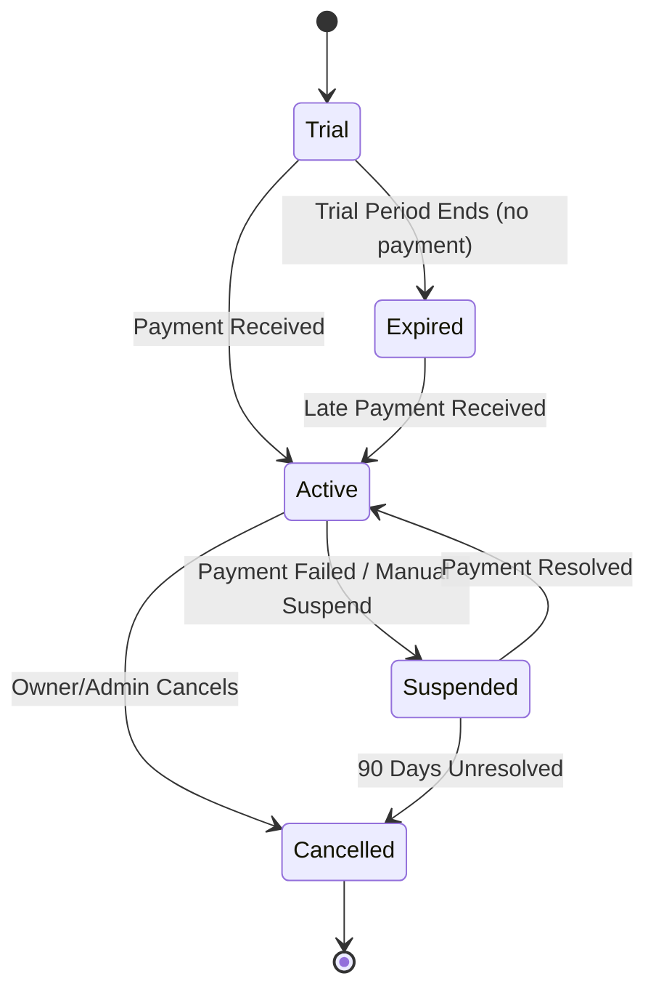

**Database Mapping:** `subscription_plans`, `subscriptions` (FK `customer_id`, `plan_id`), `subscription_history` (audit of every state transition), `licenses` (FK `property_id`, `device_id`, `signed_payload`, `expires_at`).

**API Specification (representative):**

```
POST /api/v1/superadmin/subscriptions/{subscription_id}/downgrade
Request:
{ "target_plan_id": "uuid" }
Response 409 (overage):
{
  "error": "plan_limit_exceeded",
  "details": {
     "rooms": {"current": 30, "target_limit": 20},
     "staff": {"current": 18, "target_limit": 10}
  }
}
```

**Notifications:** Plan Assigned/Upgraded/Downgraded/Renewed/Suspended → Owner (Email + WhatsApp); License Generated → Owner + registered device (push, silent data message to sync new license).

**Acceptance Criteria:**
- [ ] Downgrade request with current room count above target plan limit returns 409 with itemized overage.
- [ ] Generated license fails cryptographic verification if `device_fingerprint` does not match requesting device.

### 1.6.5 Feature: User Management (Owner Accounts)

**Purpose:** Manage platform-level login credentials/status for Owner users (distinct from Owner's own Staff Management, which is scoped to the Owner module).

**Inputs:** Owner user ID, action (reset_password/disable/activate).

**Business Rules:** Cannot disable the only Owner user on a customer account without also flagging the customer account itself as `access_blocked`, since a customer with zero active Owner logins cannot manage its properties.

**Notifications:** Password reset → Owner (Email with secure reset link, 30-minute expiry token).

**Audit Logs:** Reset Password logs requester, target, timestamp, IP — but never logs the password itself (plaintext or hash).

### 1.6.6 Feature: Device Management

**Purpose:** Register, approve, and control every physical device (POS terminal, tablet, desktop) running the Pinesphere Stay client against a given property, particularly for offline-license enforcement.

**Inputs (Register Device):** Device Fingerprint (hardware-derived hash), Property ID, Device Label, OS/Platform.

**Workflow:**
```
Device app generates fingerprint → POST /devices/register (status=pending)
   → Super Admin reviews → Approve → status=approved, license issued
   → Reject → status=rejected
```

**Business Rules:**
- Cannot disable the primary/only device of a property while an active sync operation is in-flight (must wait for sync completion or force-abort with explicit override + reason).
- Remote Wipe issues a signed wipe command via push channel; local client purges cached PostgreSQL/SQLite offline store and self-invalidates its license on next connectivity or on receipt of the push while offline via a locally cached wipe-on-next-boot flag.
- Transfer Device re-binds a license from one physical device fingerprint to another only after the source device confirms license deactivation (or after a 24-hour timeout grace period if source device is unreachable).

**State Machine — Device Lifecycle:**

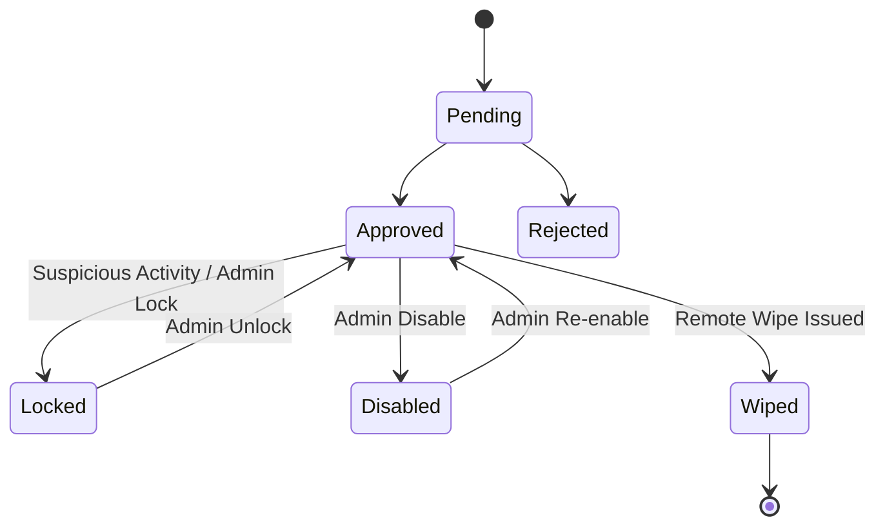

**Database Mapping:** `devices` (FK `property_id`), `device_licenses` (FK `device_id`), `device_heartbeats` (device_id, last_seen_at, sync_status).

**Notifications:** Device Approved → Owner (Push + In-App); Remote Wipe Issued → Owner (Email + WhatsApp, high-priority template) and the target device (silent push).

**Acceptance Criteria:**
- [ ] Disabling a property's only device while `sync_status = in_progress` returns 409 unless `force=true` and a `reason` string ≥10 characters is supplied.
- [ ] A wiped device cannot re-authenticate even with a valid cached refresh token.

### 1.6.7 Feature: Support Tooling

**Purpose:** Give Support Engineers (a constrained Super Admin sub-role) tools to diagnose and resolve customer issues without full platform-admin rights.

**Functions:** Force Sync (queues an immediate sync job for a property, bypassing the normal sync interval), View Logs (read-only, filtered by property/device/date, PII-masked), Reset License (revokes and reissues a device license without changing plan), Remote Diagnostics (pulls device health snapshot — app version, last error, storage usage, connectivity type).

**Business Rules:** Force Sync cannot be triggered more than once per device per 5-minute window (rate-limited) to prevent sync storms.

**Audit Logs:** Every support action is logged with a mandatory `ticket_reference` field linking to the support ticket ID.

### 1.6.8 Feature: Global Reports

**Purpose:** Cross-property, cross-customer analytical reporting for platform operators and finance.

**Reports Exposed:** Global Reports (platform KPIs over time), Property Reports (per-property health scorecards), Financial Reports (MRR, churn, ARPU, payment failures), Device Reports (fleet inventory, license expiry calendar), Subscription Reports (plan distribution, upgrade/downgrade trend, trial-conversion rate).

**Export Formats:** CSV, XLSX, PDF. Exports >10,000 rows are generated as an async background job; user is notified in-app + email with a signed, time-limited (24h) download URL from object storage.

## 1.7 UI Requirements (Super Admin)

**Screen Layout:** Left-nav persistent sidebar (Dashboard, Customers, Properties, Subscriptions, Users, Devices, Support, Reports, Audit); top bar with global search (customer/property/device by name or ID) and notification bell.

**Cards:** KPI cards on dashboard with trend arrows (↑/↓ vs. previous period).

**Tables:** Server-side paginated data grids for Customers/Properties/Devices with column sort, multi-select bulk actions (bulk-suspend, bulk-export), sticky header, row-level action menu (⋮).

**Forms:** Stepper forms for multi-stage creation (Customer, Property Approval); inline validation; disabled submit until valid.

**Filters:** Status (active/trial/suspended/expired), Plan, Date Range, Property Group.

**Search:** Debounced (300ms) server-side search across name/email/mobile/device-fingerprint.

**Pagination:** Cursor-based, 25/50/100 rows per page.

**Drawer:** Right-side detail drawer for quick-view of a Customer/Property without full navigation, with an "Open Full Page" link.

**Dialogs:** Confirmation modal required for all destructive actions (Delete, Suspend, Remote Wipe, Revoke License) — must display the target's name and require typing the entity name to confirm for `delete` actions specifically.

**Empty State:** Illustrated empty state with primary CTA (e.g. "No properties yet — Approve your first property").

**Loading State:** Skeleton loaders for tables/cards; never a blank white screen.

**Error State:** Inline error banner with retry button; distinguishes network errors from permission errors (403 shows "Contact your administrator," not a generic error).

## 1.8 Database Mapping (Super Admin Module)

| Table | Purpose | Key Relationships |
|---|---|---|
| `customers` | Tenant root record | 1—N `properties`, 1—1 `subscriptions` |
| `properties` | Physical hotel property | N—1 `customers`; 1—N `rooms`, `devices` |
| `subscription_plans` | Plan catalog | 1—N `subscriptions` |
| `subscriptions` | Active plan assignment | N—1 `customers`, `subscription_plans`; 1—N `subscription_history` |
| `licenses` | Signed offline license | N—1 `devices`, `properties` |
| `devices` | Registered client devices | N—1 `properties`; 1—N `device_heartbeats` |
| `users` | Platform + property login accounts | N—1 `customers` (for owner-role rows) |
| `audit_logs` | Immutable action trail | Polymorphic FK to any entity via `entity_type` + `entity_id` |

**Indexes:** `customers(owner_email)` unique, `customers(owner_mobile)` unique, `properties(customer_id, status)`, `devices(property_id, status)`, `audit_logs(entity_type, entity_id, created_at)`, `subscriptions(customer_id)` unique.

**CRUD Operations:** All tables support Create/Read/Update; `audit_logs` is Insert-only (no Update/Delete — enforced via DB trigger rejecting UPDATE/DELETE at the database role level).

## 1.9 Security Rules (Super Admin)

- All Super Admin endpoints require role claim `super_admin` in JWT; no property-scoped token can access `/superadmin/*` routes (enforced at API-gateway and re-validated at service layer — defense in depth).
- Rate Limit: 100 requests/minute per Super Admin session on read endpoints; 20 requests/minute on mutating endpoints.
- Data Protection: PII fields (mobile, email, government ID scans referenced in guest data) are never returned in bulk export unless the exporting Super Admin has `data.pii.export` permission, which is off by default and requires a second Super Admin's co-approval (four-eyes principle) for exports >1,000 rows.
- Encryption: All licenses signed with Ed25519; database column-level encryption (AES-256) for `owner_mobile`, `billing_address`; TLS 1.3 in transit; object storage server-side encryption enabled.
- Session: Super Admin sessions force MFA (TOTP) at login; session idle-timeout 15 minutes.

## 1.10 Audit Requirements (Super Admin)

Every mutating action logs: `actor_id`, `actor_role`, `action`, `entity_type`, `entity_id`, `previous_value` (JSON), `new_value` (JSON), `timestamp` (UTC), `ip_address`, `device_fingerprint` (of the admin's own session), `geo_location` (derived from IP). Audit logs are immutable and retained for 7 years (compliance requirement for financial-adjacent records).

## 1.11 Notifications (Super Admin Module Triggers)

| Trigger | Recipient | Channel | Template |
|---|---|---|---|
| Failed Syncs > 10 in 1 hour for a property | Super Admin (on-call) | Email + In-App | `platform_alert_sync_failures` |
| Subscription payment failed | Owner, Super Admin | Email + WhatsApp | `payment_failed_v1` |
| Device Remote Wipe issued | Owner | Email + WhatsApp | `device_wiped_v1` |
| Property approaching room-limit (>90%) | Owner | In-App | `room_limit_warning_v1` |

## 1.12 Acceptance Criteria (Module-Level)

- [ ] A Super Admin with only `support.*` permissions cannot access `/superadmin/customers/{id}/delete` (403).
- [ ] All destructive actions require confirmation dialog + audit log entry.
- [ ] Dashboard, Customer list, Property list all paginate server-side and never load >100 records client-side at once.
- [ ] Every subscription state transition is captured in `subscription_history` with before/after snapshot.

---

# MODULE 2 — OWNER PORTAL

## 2.1 Module Overview

**Purpose:** The Owner Portal is the property-operator control center. It is where a hotel owner runs day-to-day operations: staff, rooms, bookings, guests, payments, housekeeping oversight, kitchen oversight, maintenance oversight, and business reporting — scoped strictly to the properties they own.

**Business Value:** Consolidates what would otherwise require 5–6 disconnected tools (booking sheet, accounting software, WhatsApp groups, spreadsheets, paper housekeeping logs) into a single offline-capable system, directly reducing revenue leakage (missed payments, double-bookings) and staff coordination overhead.

**Problem It Solves:** Small-to-mid hotel owners lack real-time visibility into occupancy, revenue, and staff performance, and rely on manual, error-prone, internet-dependent tools.

**Dependencies:** Booking Service, Room Service, Guest Service, Payment Service, Housekeeping Service, Kitchen Service, Maintenance Service, Staff Service, Notification Service (incl. WhatsApp nightly summary job), Subscription Service (for entitlement checks), Audit Service.

**Actors**

| Actor | Type |
|---|---|
| Owner | Primary User |
| Manager, Receptionist, Housekeeping, Kitchen, Maintenance, Accountant, Security Guard, Broker | Secondary Users (operate within Owner-defined scope, not detailed further in this document) |
| Guest | Secondary User (recipient of Owner-triggered communications) |

**Access:** Owner has full access to all features listed below, scoped to properties they own. Manager/Receptionist/etc. see subsets per their own role's Permission Registry (out of scope for this document but governed by the same RBAC engine described in §0.2). Super Admin can *view* Owner data for support purposes only, never edit operational records (bookings/guests/rooms).

## 2.2 Business Objectives

1. Reduce booking-creation time to under 60 seconds end-to-end (guest lookup → room allocation → payment → confirmation).
2. Achieve zero double-bookings through real-time room-availability locking.
3. Deliver a nightly WhatsApp business summary with 100% delivery reliability (retry-backed).
4. Provide Owner visibility into staff performance and housekeeping SLAs (task completion time).
5. Ensure 100% of financial transactions (payments, refunds) are traceable to an invoice and an audit entry.

## 2.3 Scope

**In Scope:** Owner Dashboard, Property profile management, Subscription self-service (view/renew/billing history), Staff Management, Room Management, Guest Management, Booking, Check-In/Check-Out, Payments, Housekeeping oversight, Kitchen oversight, Maintenance oversight, Reports, Audit (property-scoped), Settings, Nightly WhatsApp Summary.

**Out of Scope:** Platform-level billing configuration (plan pricing, feature-flag definitions) — owned by Super Admin. Cross-property benchmarking against other customers — not exposed to Owners (privacy).

## 2.4 User Stories

- As an Owner, I want to see today's check-ins and check-outs on one screen, so I can plan staffing.
- As an Owner, I want to override a check-in for a guest arriving before the standard time, so I don't lose the booking to a manual workaround.
- As an Owner, I want to receive a nightly WhatsApp summary of occupancy, revenue, and housekeeping status, so I stay informed without opening the app.
- As a Receptionist, I want to create a booking and collect payment in one flow, so guests aren't kept waiting at the counter.
- As an Owner, I want to block a room for maintenance, so it cannot be accidentally booked.
- As an Owner, I want to approve a refund request, so financial control stays with me even when staff initiate the request.

## 2.5 Permission Registry — Owner Module

| Resource | Permissions Exposed |
|---|---|
| `owner.dashboard` | `view` |
| `property.profile` | `view`, `edit`, `request_new` |
| `subscription.self` | `view`, `renew`, `view_billing`, `download_invoice` |
| `staff` | `view`, `create`, `edit`, `disable`, `assign_role`, `assign_device`, `view_attendance`, `view_performance` |
| `room` | `view`, `create`, `edit`, `delete`, `change_status`, `configure_pricing`, `configure_amenities`, `block`, `mark_maintenance` |
| `guest` | `view`, `create`, `edit`, `upload_document`, `view_history`, `add_note` |
| `booking` | `view`, `create`, `edit`, `cancel`, `confirm`, `export` |
| `checkinout` | `view`, `override_checkin`, `override_checkout` |
| `payment` | `view`, `collect`, `refund.approve`, `generate_invoice`, `export` |
| `housekeeping` | `view`, `assign`, `monitor`, `view_ratings` |
| `kitchen` | `view`, `monitor` |
| `maintenance` | `view`, `assign`, `close` |
| `report.property` | `view`, `export` |
| `audit.property` | `view` |
| `settings` | `view`, `edit` |

## 2.6 Functional Requirements

### 2.6.1 Feature: Owner Dashboard

**Purpose:** Single-glance operational snapshot for the current business day, per property (with a property switcher for multi-property owners).

**Inputs:** Property selector (defaults to primary property or "All Properties" aggregate view).

**Outputs:** Today's Check-ins, Today's Check-outs, Occupied Rooms, Vacant Rooms, Pending Payments (count + amount), Housekeeping Status (rooms clean/dirty/in-progress), Revenue Today, Active Guests (currently in-house), Staff Status (present/absent), Property Alerts (e.g. license expiring, room-limit near cap, low inventory).

**Workflow:**
```
GET /api/v1/owner/properties/{property_id}/dashboard
   → Validate JWT + property ownership
   → Aggregate from booking, payment, housekeeping, staff services (internal service calls, not cross-DB reads)
   → Return composed response (cached 30s in Redis, keyed by property_id)
```

**Business Rules:** "Occupied Rooms" counts only rooms in `checked_in` state at query time, not merely `confirmed` bookings for today. Pending Payments excludes invoices already fully paid even if marked unconfirmed by a stale client cache.

**Offline Behaviour:** Dashboard renders from the last-synced local SQLite snapshot when offline, with a visible "Offline — data as of HH:MM" banner; figures reconcile automatically on reconnect.

**Acceptance Criteria:**
- [ ] Dashboard for a property with 0 bookings today shows explicit zero-states, not blank cards.
- [ ] Switching property selector re-fetches and does not show stale data from the previous property (verified via `property_id` in every cached key).

### 2.6.2 Feature: Room Management

**Purpose:** Define and maintain the physical room inventory, pricing, amenities, and operational status.

**Inputs (Create Room):** Room Number (unique per property), Room Type (FK to room-type catalog), Floor, Max Occupancy (adults/children), Base Price, Weekend/Seasonal Price Rules, Amenities (multi-select), Photos (upload to MinIO/S3), Status (default `available`).

**Validations:**

| Field | Min | Max | Regex | Required | Unique (scope) |
|---|---|---|---|---|---|
| room_number | 1 | 10 | `^[A-Za-z0-9\-]+$` | Yes | Yes (per property) |
| max_adults | 1 | 10 | integer | Yes | — |
| base_price | 0.01 | 999999.99 | decimal(10,2) | Yes | — |
| photos | — | 10 files | jpg/png/webp, ≤5MB each | No | — |

**Workflow:**
```
Input → Validate uniqueness of room_number within property
   → Validate room_limit not exceeded (checks subscription entitlement)
   → Create room (status=available) → Upload photos to object storage
   → Audit Log → Response
```

**Business Rules:**
- Cannot create a room beyond the property's `room_limit` (enforced against Super Admin-allocated cap — returns 409 `room_limit_exceeded`).
- Cannot delete a room with any booking history (must be Blocked/Archived instead, preserving historical/financial referential integrity).
- Marking a room "Maintenance" automatically blocks it from the booking-availability search, and if a booking already exists for future dates on that room, the Owner is prompted to reassign or the system flags a conflict requiring manual resolution — a room cannot silently remain booked while under maintenance.
- Room status transitions: `available → occupied → dirty → cleaning → available`, or `available → blocked/maintenance → available`.

**State Machine — Room Status:**

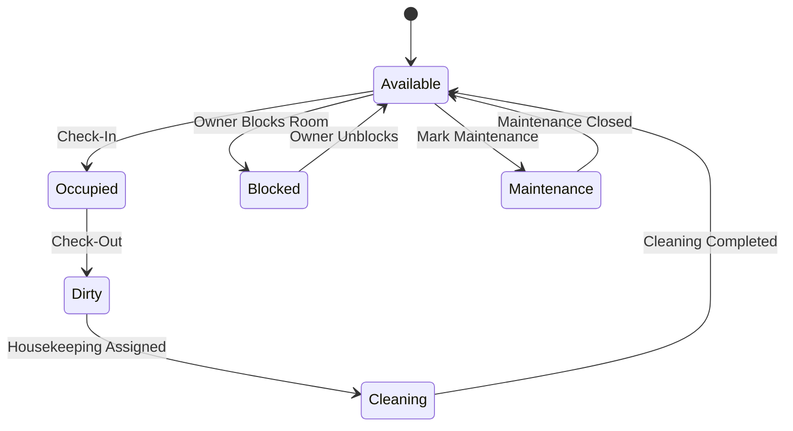

**Database Mapping:** `rooms` (FK `property_id`, `room_type_id`), `room_pricing_rules` (FK `room_id`, date-range, price override), `room_amenities` (junction table), `room_photos` (FK `room_id`, storage_key).

**Notifications:** Room marked Maintenance → Maintenance role (In-App + Push, `maintenance_room_flagged_v1`).

**Acceptance Criteria:**
- [ ] Creating a room number that already exists at the same property returns 409.
- [ ] Deleting a room that has ≥1 historical booking returns 409; Owner must Archive instead.

### 2.6.3 Feature: Booking Management

**Purpose:** Create, modify, confirm, and cancel guest reservations with real-time room-availability locking.

**Inputs (Create Booking):** Guest (existing guest_id or inline new-guest fields), Room (or Room Type + auto-allocate), Check-In Date, Check-Out Date, Adults, Children, Rate Plan, Advance Payment Amount (optional), Booking Source (Direct/OTA/Broker/Walk-in).

**Validations:** `check_out_date` > `check_in_date`; room must be `available` for the entire requested date range (no overlapping `confirmed`/`checked_in` booking); `adults + children` ≤ room's `max_occupancy`.

**Workflow:**
```
Input → Validate guest exists or create guest → Acquire distributed lock (Redis) on room_id + date-range
   → Check availability (no overlap) → Create booking (status=confirmed)
   → Release lock → Process advance payment (if provided) → Generate invoice
   → Notify guest (booking confirmation) → Audit Log → Response
```

**Backend Process:** Availability check uses a PostgreSQL exclusion constraint (`EXCLUDE USING gist`) on `(room_id, daterange(check_in, check_out))` as the authoritative guard, with a Redis lock as a fast-path optimization to reduce contention before hitting the DB constraint.

**Frontend Behaviour:** Booking calendar (Gantt-style) shows room rows × date columns; drag-to-select date range pre-fills the booking form; conflicting rooms are visually greyed out.

**Success Flow:** Booking created → 201 → Booking confirmation sent to guest via Email/WhatsApp (if contact info provided) → Booking appears on calendar.

**Failure Flow:** Overlapping reservation attempt → 409 `room_unavailable` with the conflicting booking's date range returned so the front-end can suggest alternative rooms.

**Business Rules:**
- Cannot cancel a booking that is already `checked_in` (must go through Check-Out or a documented early-departure workflow with refund calculation).
- Cancelling a booking with a non-refundable rate plan does not auto-refund; refund requires separate `payment.refund.approve` action.
- Editing dates on a `confirmed` booking re-runs the full availability check as if creating new; it does not silently override.

**Data Flow:**
```
Input → Validation → Business Logic (availability lock) → Database (booking + invoice)
   → Notification (guest confirmation) → Audit → Response
```

**State Machine — Booking Lifecycle:**

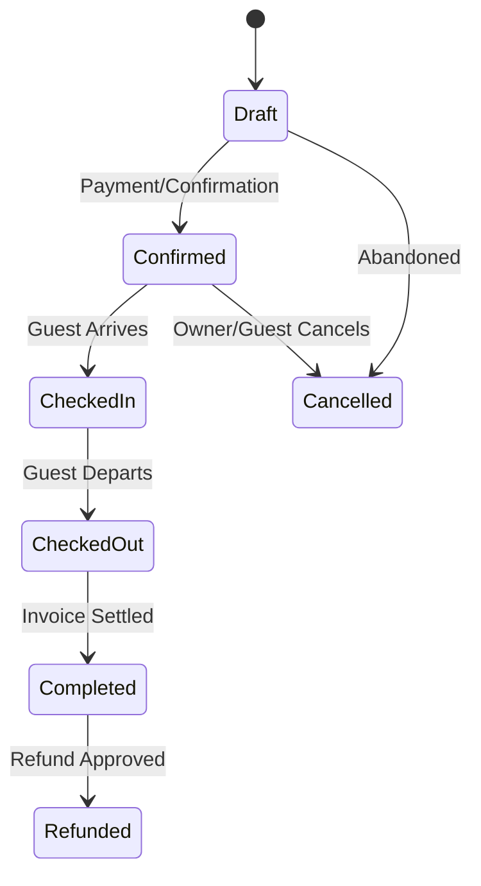

**Sequence Diagram — Create Booking:**

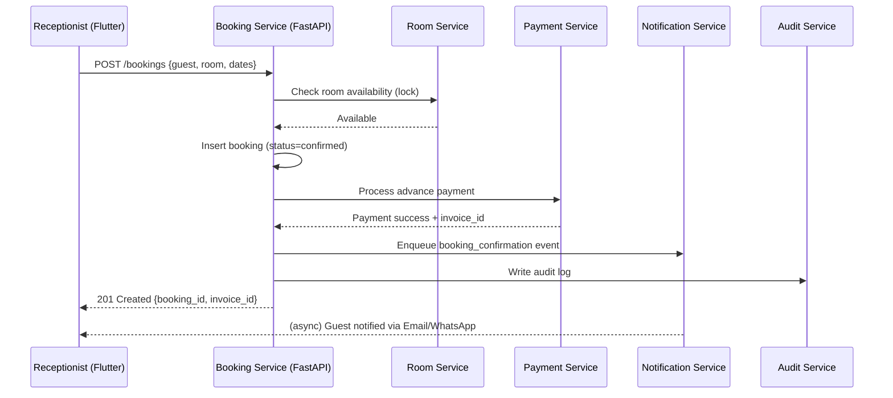

**Database Mapping:** `bookings` (FK `guest_id`, `room_id`, `property_id`), `booking_guests` (for multi-guest bookings), `invoices` (FK `booking_id`), exclusion constraint on `(room_id, stay_range)`.

**API Specification:**

```
POST /api/v1/owner/properties/{property_id}/bookings
Headers: Authorization: Bearer <JWT>
Request:
{
  "guest_id": "uuid|null",
  "new_guest": {"name": "John Doe", "mobile": "+919876543210"},
  "room_id": "uuid",
  "check_in": "2026-07-20",
  "check_out": "2026-07-22",
  "adults": 2,
  "children": 0,
  "advance_amount": 1500.00,
  "source": "direct"
}
Response 201:
{ "booking_id": "uuid", "status": "confirmed", "invoice_id": "uuid" }
Errors: 400, 401, 403, 404 (room/guest not found), 409 (room_unavailable), 422 (validation)
```

**Notifications:** Booking Created → Guest (Email/WhatsApp, `booking_confirmation_v1`); Booking Cancelled → Guest (Email/WhatsApp, `booking_cancelled_v1`).

**Offline Support:** Bookings created offline are queued locally with a client-generated UUID and `sync_status=pending`; on reconnect, the exclusion-constraint check runs server-side — if a conflict is detected (two devices booked the same room offline), the **earlier-timestamped** booking (by server-authoritative creation time once synced) wins, the later one is flagged `sync_conflict` and surfaced to the Owner for manual reassignment (Merge Strategy: last-writer-does-not-automatically-win; conflicts always require human resolution for room-assignment conflicts specifically, given financial/guest-experience stakes).

**Acceptance Criteria:**
- [ ] Two simultaneous booking requests for the same room/overlapping dates result in exactly one success and one 409.
- [ ] A cancelled booking's room reappears in availability search immediately.
- [ ] Offline-created conflicting bookings never both silently persist as confirmed — one is always flagged for review.

### 2.6.4 Feature: Check-In / Check-Out

**Purpose:** Transition a confirmed booking into an active stay and later close it out.

**Inputs (Check-In):** Booking ID, ID Document Verification (optional OCR), Room Key Assignment, Early Check-In flag.

**Business Rules:** Cannot check in a booking with an outstanding balance greater than the property's configured "minimum advance %" without Owner/Manager override + reason code. Cannot check out a guest with unpaid outstanding invoices unless `payment.refund.approve`-equivalent override role settles it as "pay later" with Owner approval.

**Workflow:**
```
Input → Validate booking status = confirmed → Validate ID/payment thresholds
   → Update booking status = checked_in → Update room status = occupied
   → Audit Log → Notify guest (welcome message) → Response
```

**Acceptance Criteria:**
- [ ] Check-out of a booking with unpaid balance blocks by default (409) unless override flag + reason supplied.
- [ ] Checked-out room automatically transitions to `dirty` and creates a housekeeping task.

### 2.6.5 Feature: Payments

**Purpose:** Record payment collection, refunds, and invoice generation tied to bookings.

**Inputs (Collect Payment):** Invoice ID, Amount, Method (Cash/UPI/Card/Bank), Reference Number (for non-cash).

**Business Rules:** Cannot delete a paid invoice (immutable once `paid` — corrections happen via a linked credit note, never by editing/deleting the original). Refund requires Owner-level `payment.refund.approve`; a Receptionist can only *request* a refund, never approve their own request (segregation of duties).

**Database Mapping:** `invoices`, `payments` (FK `invoice_id`), `refunds` (FK `payment_id`, `approved_by`), `credit_notes`.

**Acceptance Criteria:**
- [ ] Attempting to delete a `paid` invoice returns 409 `invoice_immutable`.
- [ ] A refund request created by a Receptionist cannot be approved by that same Receptionist's user ID (403 if attempted).

### 2.6.6 Feature: Staff Management

**Purpose:** Create and govern staff accounts (Manager, Receptionist, Housekeeping, Kitchen, Maintenance, Accountant, Security Guard, Broker) within the property's `staff_limit`.

**Inputs:** Full Name, Mobile, Role, Assigned Device(s), Shift Schedule.

**Business Rules:** Cannot create staff beyond the property's `staff_limit` (returns 409 `staff_limit_exceeded`). Disabling a staff member immediately revokes all active JWT sessions for that user (token blacklist in Redis).

**Acceptance Criteria:**
- [ ] Staff creation beyond `staff_limit` is rejected with 409.
- [ ] Disabled staff member's existing access token is rejected on next request within 60 seconds (blacklist propagation SLA).

### 2.6.7 Feature: Housekeeping / Kitchen / Maintenance Oversight

**Purpose:** Owner-level monitoring and assignment authority over operational task queues owned by their respective service modules.

**Owner Capabilities:** View Requests, Assign Requests, Monitor Progress, View Ratings (Housekeeping); View Orders, Monitor Kitchen, View Room Service Status (Kitchen); View Issues, Assign Maintenance, Close Maintenance Requests (Maintenance).

**Business Rules:** Owner can reassign a housekeeping/maintenance task to any active staff member of the matching role; cannot assign a Kitchen order to a Housekeeping staff member (role-task type mismatch enforced server-side, not just UI-hidden).

### 2.6.8 Feature: Reports

**Purpose:** Property-scoped operational and financial reporting.

**Reports Exposed:** Daily/Weekly/Monthly Reports, Occupancy Reports, Revenue Reports, Staff Reports, Housekeeping Reports, Payment Reports. All exportable (CSV/XLSX/PDF).

### 2.6.9 Feature: Settings

**Purpose:** Property-level configuration: Business Settings (name, address, tax ID), WhatsApp Settings (sender number, opt-in templates), Tax Settings (GST rate, tax-inclusive/exclusive pricing), Notification Settings (per-channel toggles), Security Settings (session timeout, MFA requirement for staff).

### 2.6.10 Feature: Nightly WhatsApp Business Summary

**Purpose:** Automated end-of-day operational and financial digest delivered via WhatsApp without requiring the Owner to open the app.

**Trigger:** Scheduled Cron Job, default 22:00 property-local-time (configurable per property in Settings).

**Inputs:** None (system-generated from the day's aggregated data).

**Backend Process:**
```
Cron (per property timezone) → Aggregate: rooms (total/occupied/vacant/occupancy%),
   bookings (check-ins/check-outs/new/cancelled), revenue (by payment method + total),
   pending payments (top N by amount), housekeeping (completed/pending),
   kitchen (orders/delivered/pending), maintenance (open/resolved), guest rating (avg),
   inventory alerts (low-stock flags), staff (present/absent)
   → Render WhatsApp template → Send via WhatsApp Business API
   → Log delivery status → Retry up to 3x on failure (exponential backoff: 1m, 5m, 15m)
```

**Business Rules:** If WhatsApp delivery fails after 3 retries, an in-app + email fallback digest is sent instead, and the failure is logged for Support visibility (feeds the Super Admin "WhatsApp Usage" and delivery-health metrics).

**Acceptance Criteria:**
- [ ] Summary reflects data accurate as of the scheduled send time, not stale cache older than 5 minutes.
- [ ] Failed WhatsApp delivery triggers email fallback within 15 minutes of the final retry.

## 2.7 UI Requirements (Owner)

**Screen Layout:** Bottom-nav (mobile) / side-nav (web): Dashboard, Bookings, Rooms, Guests, Payments, Staff, Reports, Settings. Property switcher in top app bar for multi-property owners.

**Cards:** Dashboard KPI cards; Room cards on Room Management grid (color-coded by status).

**Tables:** Booking list, Guest list, Payment list — paginated, sortable, filterable.

**Forms:** Booking creation stepper; Room creation form with image upload (drag-and-drop on web, camera/gallery on mobile).

**Buttons:** Primary CTA per screen (e.g. "+ New Booking"); destructive actions styled distinctly (red) with confirmation dialogs.

**Filters:** Booking status, date range, room type, payment status.

**Search:** Guest search by name/mobile/ID number; Booking search by booking reference.

**Pagination:** 20 rows default, cursor-based for large lists.

**Drawer:** Guest detail drawer showing stay history without full navigation.

**Dialogs:** Confirm before Cancel Booking, Delete, Refund Approval.

**Empty/Loading/Error States:** Consistent with Super Admin module patterns (§1.7), themed per Owner branding where property has custom branding entitlement.

## 2.8 Database Mapping (Owner Module Summary)

| Table | Purpose |
|---|---|
| `rooms`, `room_types`, `room_pricing_rules` | Inventory & pricing |
| `bookings`, `booking_guests`, `invoices`, `payments`, `refunds` | Reservation & financial lifecycle |
| `guests`, `guest_documents` | Guest profile & KYC |
| `staff`, `staff_shifts`, `staff_devices` | Workforce |
| `housekeeping_tasks`, `kitchen_orders`, `maintenance_tickets` | Operational task queues (owned by their respective service, referenced read-only by Owner dashboard) |
| `whatsapp_summary_log` | Delivery tracking for nightly digest |

## 2.9 Security Rules (Owner)

Property-scoped JWT claim `property_ids: []` restricts every query to owned properties (enforced via mandatory `WHERE property_id = ANY(:property_ids)` at the ORM/repository layer — never trusted from client input). Rate limit: 300 requests/minute per Owner session (higher than Super Admin given operational, high-frequency usage). Guest PII (ID documents) encrypted at rest, access logged per view.

## 2.10 Audit Requirements (Owner)

Booking edits, cancellations, refund approvals, staff creation/disabling, and room deletions log actor, action, before/after snapshot, timestamp, IP, device — identical structure to §1.10, scoped to `property_id`.

## 2.11 Acceptance Criteria (Module-Level)

- [ ] Owner cannot query or mutate a property not in their `property_ids` claim (403, not 404, to avoid leaking existence — actually returns 404 to avoid resource-existence leakage, per standard security practice).
- [ ] Nightly WhatsApp summary sends for every property with `notification_settings.whatsapp_summary = true`.
- [ ] Every booking, payment, and refund action produces exactly one corresponding audit log entry.

---

# MODULE 3 — GUEST PORTAL (WEB)

## 3.1 Module Overview

**Purpose:** A token-authenticated, no-app-install web portal that lets a guest view their booking, request in-stay services, pay outstanding balances, and give feedback — active during the stay and for 30 days post-checkout.

**Business Value:** Reduces front-desk call volume for routine requests (towels, food, housekeeping), increases ancillary revenue (food/laundry orders placed directly), and improves review capture rate via in-portal feedback prompts.

**Problem It Solves:** Guests currently must call/visit reception for every request, and hotels lose feedback/reviews because there is no structured post-stay prompt.

**Dependencies:** Booking Service (read), Housekeeping Service, Kitchen Service, Maintenance Service, Payment Service, Notification Service, Document/OCR Service, Review aggregation (Google Business Profile deep-link).

**Actors**

| Actor | Type |
|---|---|
| Guest | Primary User |
| Housekeeping, Kitchen, Maintenance, Front Desk/Receptionist | Secondary Users (recipients of guest-initiated requests) |

**Access:** Guest Portal access is granted only via a booking-linked authentication token (Booking Reference + OTP to registered mobile/email). No username/password account exists. Guest cannot access any Owner/Staff/Super Admin functionality under any circumstance — the portal is a fully separate, heavily restricted authentication domain.

## 3.2 Business Objectives

1. Deflect ≥40% of routine service requests (towels, extra bed, housekeeping) from phone/front-desk to self-service.
2. Increase in-stay ancillary revenue (food, laundry) captured digitally by ≥15%.
3. Achieve ≥30% guest feedback submission rate (currently near-zero via manual methods).
4. Ensure 100% automatic portal expiry at 30 days post-checkout with zero manual intervention.

## 3.3 Scope

**In Scope:** Guest authentication (Booking ID/Reference + OTP), Dashboard, Booking Details, Room Details, Stay Duration, Service Requests (Housekeeping, Food, Laundry, Extra Bed, Extra Towels, Maintenance, Luggage Assistance), Payments (Pay Outstanding, Download Invoice), Documents (Upload ID), View Booking, Feedback (Housekeeping/Food/Stay ratings, Google Review redirect), Post-Checkout 30-day access, Automatic Portal Expiry.

**Out of Scope:** Guest cannot edit booking dates/room, cannot view other guests' data, cannot access pricing configuration, cannot see internal staff notes.

## 3.4 User Stories

- As a Guest, I want to log in with just my booking reference and an OTP, so I don't need to create/remember a password.
- As a Guest, I want to request extra towels from my phone, so I don't have to call the front desk.
- As a Guest, I want to pay my outstanding balance online, so I can skip the counter at checkout.
- As a Guest, I want to download my invoice after checkout, so I can submit it for expense reimbursement.
- As a Guest, I want to rate my stay and optionally post a Google review, so I can share my experience easily.
- As a Guest, I want my portal access to end automatically after 30 days, so I understand data isn't kept indefinitely accessible.

## 3.5 Permission Registry — Guest Module

Guest permissions are not role-assigned in the standard RBAC sense (no staff role hierarchy applies) — they are **scope-bound to the guest's own booking_id** via the auth token. Effectively:

| Resource | Permissions Exposed (self-scoped only) |
|---|---|
| `guest.booking` | `view` (own booking only) |
| `guest.room` | `view` (own assigned room only) |
| `guest.request.housekeeping` | `create`, `view_status` |
| `guest.request.food` | `create`, `view_status` |
| `guest.request.laundry` | `create`, `view_status` |
| `guest.request.maintenance` | `create`, `view_status` |
| `guest.request.luggage` | `create`, `view_status` |
| `guest.payment` | `view`, `pay`, `download_invoice` |
| `guest.document` | `upload` |
| `guest.feedback` | `create` |

No `edit`/`delete`/`export`/`approve` permissions exist for Guests on any resource — enforced structurally, not merely hidden in UI.

## 3.6 Functional Requirements

### 3.6.1 Feature: Guest Authentication

**Purpose:** Passwordless, low-friction identity verification scoped to a single booking.

**Preconditions:** Booking exists with status `confirmed`, `checked_in`, or `checked_out` (within 30-day window).

**Inputs:** Booking Reference (or deep-link token from confirmation message) + Mobile/Email OTP (6-digit, 5-minute expiry).

**Workflow:**
```
Guest enters Booking Reference → System validates booking exists and is within active/30-day window
   → Generate 6-digit OTP → Send via SMS/WhatsApp/Email (whichever contact is on file)
   → Guest submits OTP → Validate (max 5 attempts, then 15-min lockout)
   → Issue short-lived Guest Session Token (JWT, scope=booking_id, expiry=24h, silently renewable while portal is active)
```

**Validations:** OTP must be exactly 6 digits; max 5 verification attempts per 15-minute window before lockout; Booking Reference format `^[A-Z0-9]{6,12}$`.

**Business Rules:** Cannot authenticate against a `cancelled` booking. Cannot authenticate more than 30 days after `check_out_date` (portal expiry, see §3.6.10).

**Security:** OTP rate-limited to 3 sends per 10 minutes per booking to prevent SMS/WhatsApp-bombing abuse; session token scoped exclusively to that `booking_id` — cannot be replayed against any other booking even if guessed/leaked.

**Acceptance Criteria:**
- [ ] 6 consecutive OTP failures locks further attempts for 15 minutes.
- [ ] A valid session token for Booking A returns 403 when used against Booking B's endpoints.

### 3.6.2 Feature: Dashboard

**Purpose:** Quick overview of current stay status.

**Inputs:** None (auto-loads on authenticated session).

**Process:** Authenticate guest and fetch booking details.

**Outputs:** Booking status, room number, check-in/check-out dates, outstanding balance, pending service requests (with live status), quick-action buttons (Request Service, Pay Now, View Invoice).

**Acceptance Criteria:**
- [ ] Outstanding balance shown matches the authoritative invoice total minus confirmed payments at query time (no stale cache >60s).

### 3.6.3 Feature: Booking Details / Room Details / Stay Duration

**Booking Details — Input:** Booking ID (from session). **Process:** Retrieve booking and guest information. **Output:** Booking number, guest details, room category, adults/children, booking source, check-in, check-out, payment status.

**Room Details — Input:** Booking ID. **Process:** Fetch assigned room details. **Output:** Room number, room type, floor, amenities, occupancy, room photos.

**Stay Duration — Input:** Check-in & Check-out dates. **Process:** Calculate stay duration. **Output:** Total nights, nights completed, remaining nights, countdown to checkout.

**Business Rule:** If the Owner reassigns the guest's room mid-stay (rare operational override), Room Details reflects the new room within 60 seconds of the change (event-driven cache invalidation, not polling-only).

### 3.6.4 Feature: Service Requests (Housekeeping, Food, Laundry, Extra Bed, Extra Towels, Maintenance, Luggage Assistance)

Each request type shares a common workflow shape:

```
Input (type-specific fields) → Validation → Create request record (status=pending)
   → Notify target staff role (Housekeeping/Kitchen/Maintenance/Bell Desk) → Assign task
   → Guest sees status updates (pending → assigned → in_progress → completed)
```

**Housekeeping** — Input: Request Type, Preferred Time, Special Instructions. Output: Request ID, Status, Estimated completion time.

**Food** — Input: Menu Item(s), Quantity, Delivery Time, Room Number (auto-filled). Process: Send order to Kitchen module, calculate bill against property's menu pricing, notify restaurant/Kitchen staff. Output: Order confirmation, estimated delivery time, bill amount (added to guest's running folio).

**Laundry** — Input: Clothing Items (itemized with quantity), Laundry Type (wash/dry-clean/iron), Pickup Time. Output: Laundry request ID, pickup schedule, estimated completion.

**Extra Bed** — Input: Number of Extra Beds. Process: Check room's max-occupancy/extra-bed availability, calculate additional charge per property rate card, notify Housekeeping. Output: Request status, charges (added to folio), delivery ETA.

**Extra Towels** — Input: Quantity. Process: Notify Housekeeping. Output: Request confirmation, delivery ETA.

**Maintenance** — Input: Issue Category (Plumbing/Electrical/AC/TV/Other), Description, Optional Photo (upload to object storage, ≤5MB, jpg/png). Process: Create maintenance ticket, assign Maintenance staff. Output: Ticket Number, Status, Technician Assigned.

**Luggage Assistance** — Input: Pickup Time, Location (Room/Lobby). Process: Notify Bell Desk/Front Desk role. Output: Request status, assigned staff.

**Validations (common):** All free-text fields ≤500 characters; photo uploads restricted to jpg/png/webp ≤5MB; Preferred/Pickup/Delivery Time must be a future timestamp within the guest's current stay window (cannot request a laundry pickup after checkout date).

**Business Rules:** A request cannot be created against a booking that is not currently `checked_in` (i.e., a guest cannot order room service before arrival or after departure — post-checkout Guest Portal disables the `create` permission on all `guest.request.*` resources, leaving only historical `view_status`).

**Notifications:**

| Trigger | Recipient | Channel |
|---|---|---|
| Housekeeping/Extra Bed/Extra Towels request created | Housekeeping staff | In-App + Push |
| Food order created | Kitchen staff | In-App + Push |
| Laundry request created | Housekeeping/Laundry staff | In-App |
| Maintenance ticket created | Maintenance staff | In-App + Push |
| Luggage request created | Front Desk/Bell Desk | In-App |
| Any request status change | Guest | In-App + Push (portal) |

**Acceptance Criteria:**
- [ ] Attempting a service request after checkout returns 403 `stay_not_active`.
- [ ] Food order amount is automatically appended to the guest's folio/invoice, visible in real time in Payments.

### 3.6.5 Feature: Payments (Pay Outstanding, Download Invoice)

**Pay Outstanding — Input:** Selected Invoice, Payment Method (Card/UPI via payment gateway). **Process:** Calculate outstanding balance, process payment via gateway, update invoice. **Output:** Payment success/failure, receipt, updated balance.

**Download Invoice — Input:** Invoice selection. **Process:** Generate PDF. **Output:** Downloadable Invoice PDF.

**Business Rules:** Guest-initiated payments are always full or partial payments toward an existing invoice — a Guest can never modify invoice line items, only pay against the total. Payment gateway webhook confirmation is authoritative; a client-reported "success" without matching webhook confirmation within 5 minutes is flagged `payment_pending_verification` and does not mark the invoice paid.

**Acceptance Criteria:**
- [ ] Invoice PDF total always matches the sum of its line items plus applicable tax at generation time.
- [ ] A payment is never marked "successful" in the UI purely from client-side redirect without server-side gateway webhook confirmation.

### 3.6.6 Feature: Documents (Upload ID)

**Input:** Aadhaar / Passport / Driving License / Other Government ID (image or PDF upload).

**Process:** Upload to encrypted object storage, optional OCR extraction, verification workflow (auto-flag mismatches between OCR-extracted name and booking guest name for Front Desk review).

**Output:** Upload status, verification status (`pending`, `verified`, `mismatch_flagged`).

**Security:** Uploaded ID documents are encrypted at rest (AES-256), access-logged per view, and automatically purged from active storage 90 days after checkout per data-retention policy (archived to cold storage per applicable local KYC/hospitality regulations, configurable per property jurisdiction).

**Nationality Branching:** Which document(s) are required and mandatory here depends on the guest's nationality status — Indian nationals upload any standard Indian proof of identity; Foreign nationals must additionally provide passport and visa details, which feed the automatic Form C / FRRO compliance workflow specified in full in **Section 28**. This screen collects the data; Section 28 governs its downstream compliance obligations.

**Acceptance Criteria:**
- [ ] Uploaded document exceeding 5MB or in an unsupported format is rejected client-side and server-side (defense in depth) with a clear error.

### 3.6.7 Feature: View Booking

**Input:** Booking Reference. **Process:** Fetch booking. **Output:** Booking summary, invoice, room information, payment history.

### 3.6.8 Feature: Feedback

**Rate Housekeeping — Input:** Rating (1–5), Comments (≤1000 chars). Process: Save feedback, update housekeeping performance metrics (feeds Owner's "View Ratings" in §2.6.7). Output: Feedback submitted confirmation.

**Rate Food — Input:** Rating (1–5), Comments. Process: Save restaurant/Kitchen feedback. Output: Feedback confirmation.

**Rate Stay — Input:** Overall Rating (1–5), Category Ratings (Cleanliness/Staff/Value/Amenities, each 1–5), Comments. Process: Save guest review, update hotel rating analytics feeding Owner Dashboard's aggregate rating. Output: Review submitted successfully.

**Google Review — Input:** Guest taps "Write Google Review." Process: Redirect guest to the property's configured Google Business Profile review URL (Owner configures this URL once in Settings). Output: Google Review page opens in a new tab/window.

**Business Rules:** A guest can submit each feedback type (Housekeeping/Food/Stay) only once per booking; subsequent attempts update the existing record rather than creating duplicates (upsert semantics, keyed on `booking_id + feedback_type`).

**Acceptance Criteria:**
- [ ] Submitting Rate Stay twice for the same booking updates the original record, not a duplicate.
- [ ] Google Review redirect only appears if the property has configured a review URL; otherwise the action is hidden (not a dead link).

### 3.6.9 Feature: Post-Checkout Access (30-Day Window)

**Input:** Guest Login (post-checkout). **Process:** Verify checkout date, validate the request falls within the 30-day access window. **Output:** Guest can view Booking History, download Invoices/Receipts, submit any Pending Feedback, and view Payment History. All `create` permissions on service-request resources are disabled (read-only mode for operational requests; Payments/Feedback/Documents view remains available).

**Acceptance Criteria:**
- [ ] On day 30 post-checkout (inclusive), portal access still functions; on day 31, access is denied (see §3.6.10).

### 3.6.10 Feature: Portal Expiry (After 30 Days)

**Input:** Guest Login Attempt after the 30-day window.

**Process:** Compare current date to `check_out_date`; if `current_date - check_out_date > 30 days`, invalidate the session and reject authentication (OTP is still issuable up to the boundary, but no new session is created beyond it, and any existing token is rejected server-side regardless of its own unexpired JWT `exp` claim — the booking-level 30-day rule always takes precedence over the token's own expiry).

**Output:** Guest is informed access has expired; all booking/invoice/feedback endpoints return 410 `portal_expired`; the UI shows a message directing the guest to contact the hotel directly if records are required.

**Business Rules:** Portal expiry is calculated server-side only (never trust a client-cached checkout date); this is a hard business rule with zero manual override available to the Guest — only the Owner/Super Admin support tooling can manually extend access for an exceptional case (logged as an explicit administrative action, not a Guest-triggered one).

**Acceptance Criteria:**
- [ ] A guest attempting login on day 31+ post-checkout receives a clear expiry message, never a generic 500 error.
- [ ] An already-issued, technically-unexpired JWT is still rejected once the 30-day booking-level window has passed.

## 3.7 UI Requirements (Guest Portal)

**Screen Layout:** Single-column mobile-first responsive layout (guests predominantly access via phone browser from a WhatsApp/SMS link); minimal top bar (Hotel Logo, Booking Reference, Logout).

**Cards:** Dashboard summary cards (Stay Status, Outstanding Balance, Quick Actions).

**Forms:** Simple single-screen forms per request type (Housekeeping/Food/Laundry/etc.) — no multi-step wizards, optimized for speed on mobile data.

**Buttons:** Large, thumb-friendly primary CTAs ("Request Service," "Pay Now," "Rate Your Stay").

**Filters/Search:** Minimal — Booking History (post-checkout) has a simple date filter only, no complex search given the low per-guest record count.

**Pagination:** Simple "Load More" pattern for Booking History (guests with repeat stays).

**Empty State:** "No active requests yet" with CTA to raise one.

**Loading State:** Lightweight spinner (portal must load fast on 3G/4G).

**Error State:** Friendly, non-technical error copy (e.g. "Something went wrong — please try again" rather than raw error codes), with the expiry state (§3.6.10) as a distinct, clearly-worded screen rather than a generic error.

## 3.8 Database Mapping (Guest Portal)

| Table | Purpose |
|---|---|
| `guest_sessions` | OTP/session tokens, scoped to `booking_id`, with `expires_at` |
| `service_requests` | Polymorphic table for housekeeping/food/laundry/extra-bed/extra-towel/maintenance/luggage requests, discriminated by `request_type` |
| `guest_feedback` | Unique constraint on `(booking_id, feedback_type)` |
| `guest_documents` | Uploaded KYC documents, FK `guest_id` |
| `invoices`, `payments` | Shared with Owner module (Guest has read + pay-only access, enforced at API layer) |

**Indexes:** `guest_sessions(booking_id)`, `service_requests(booking_id, status)`, `guest_feedback(booking_id, feedback_type)` unique.

## 3.9 API Specification (Representative Endpoints)

```
POST /api/v1/guest/auth/request-otp
Request: { "booking_reference": "PS2026JUL001" }
Response 200: { "otp_sent_to": "+91******3210", "expires_in": 300 }

POST /api/v1/guest/auth/verify-otp
Request: { "booking_reference": "PS2026JUL001", "otp": "482913" }
Response 200: { "session_token": "<jwt>", "expires_in": 86400 }
Errors: 400 (bad format), 401 (invalid otp), 429 (lockout after 5 attempts), 410 (portal_expired)

POST /api/v1/guest/requests/housekeeping
Headers: Authorization: Bearer <guest_session_token>
Request: { "request_type": "extra_pillow", "preferred_time": "2026-07-20T18:00:00Z", "notes": "2 pillows please" }
Response 201: { "request_id": "uuid", "status": "pending", "eta_minutes": 20 }
Errors: 400, 401, 403 (stay_not_active), 422

GET /api/v1/guest/invoices/{invoice_id}/download
Response 200: application/pdf (signed, time-limited link)
Errors: 401, 404, 410 (portal_expired)
```

## 3.10 Security Rules (Guest Portal)

- No password storage for Guests at all — OTP-only, reducing credential-stuffing attack surface entirely.
- Guest session JWT scope-locked to a single `booking_id` claim; every endpoint validates the token's `booking_id` matches the resource's `booking_id` before any processing.
- Rate Limits: OTP request — 3/10min per booking; OTP verify — 5 attempts/15min lockout; general API — 60 requests/minute per session.
- Data Protection: Guest can only ever see their own booking's data; no endpoint accepts a guest-supplied `booking_id` that differs from their token's scope, even for read-only requests.
- Encryption: ID documents AES-256 at rest; all traffic TLS 1.3; payment processing is tokenized via PCI-DSS-compliant gateway — Pinesphere Stay never stores raw card numbers.

## 3.11 Audit Requirements (Guest Portal)

Every guest-initiated action (request creation, payment, document upload, feedback submission) is logged with: `guest_session_id`, `booking_id`, `action`, `entity_id`, `timestamp`, `ip_address`, `device/user-agent`. Guest logins (OTP verify success/failure) are logged for security monitoring (lockout pattern detection).

## 3.12 Notifications (Guest Portal — Outbound to Guest)

| Trigger | Channel | Template |
|---|---|---|
| Booking Confirmed | Email + WhatsApp | `booking_confirmation_v1` (includes portal link) |
| Check-In Completed | WhatsApp + In-App | `welcome_checkin_v1` |
| Service Request Status Change | Push (In-App) | `request_status_update_v1` |
| Payment Success | Email + WhatsApp | `payment_receipt_v1` |
| Feedback Request (post-checkout) | Email + WhatsApp | `feedback_request_v1` (sent once, 2 hours after checkout) |
| Portal Expiring Soon (day 25 of 30) | Email | `portal_expiry_reminder_v1` |

## 3.13 Overall Guest Portal Workflow (Mermaid)

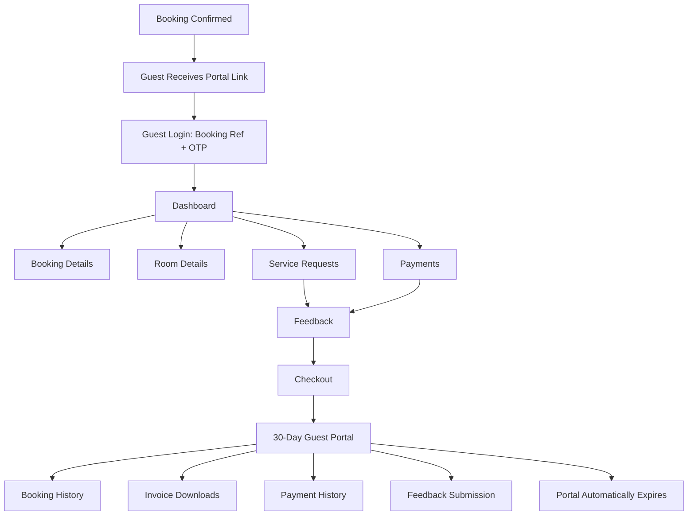

## 3.14 Acceptance Criteria (Module-Level)

- [ ] Guest cannot, under any request payload manipulation, retrieve another booking's data.
- [ ] All service-request creation is blocked outside the `checked_in` window; all remains view-only during the 30-day post-checkout window.
- [ ] Portal access is hard-denied at day 31 post-checkout with zero exceptions absent an explicit administrative override.

---

# 4. CROSS-MODULE COMMUNICATION MATRIX (MANDATORY)

Modules never access another module's database directly. All inter-module communication uses REST APIs, the event bus (Redis Streams/RabbitMQ), scheduled/cron jobs, or offline sync — never a shared-table read/write across service boundaries.

| Source Module | Target Module | Why Communication Happens | Communication Type | Payload | Sync/Async |
|---|---|---|---|---|---|
| Super Admin | Owner (Notification) | Property Approved/Rejected | REST API → Notification Service | property_id, status, reason | Async |
| Super Admin | Subscription | Assign/Upgrade/Downgrade Plan | REST API | customer_id, plan_id | Sync |
| Super Admin | Device | Generate Offline License | REST API | device_id, property_id, expiry, feature_flags | Sync |
| Super Admin | Audit | Log every admin mutation | Event (Database Trigger + Event) | actor, action, entity, before/after | Async |
| Subscription | Device | Push updated license after plan change | Webhook / Push | license_payload | Async |
| Owner | Guest (Notification) | Booking Confirmation | REST API → Notification Service | guest contact, booking summary | Async |
| Booking | Room | Reserve/Release Room | REST API | room_id, booking_id, date_range, status | Sync |
| Booking | Payment | Advance Payment Collection | REST API | booking_id, amount, tax | Sync |
| Booking | Guest | Create/Link Guest Record | REST API | guest information | Sync |
| Booking | Notification | Booking Confirmation/Cancellation | Redis Queue | booking_id, template_id | Async |
| Booking | Audit | Log booking creation/edit/cancel | Event | before/after snapshot | Async |
| Check-In/Out | Housekeeping | Checkout Completed → Room Needs Cleaning | Event Queue | room_id, "cleaning_required" | Async |
| Housekeeping | Maintenance | Room Damage Reported During Cleaning | Event | room_id, issue, priority | Async |
| Guest Portal | Housekeeping | Service Request Created | REST API | booking_id, request_type, details | Sync (request) + Async (task assignment) |
| Guest Portal | Kitchen | Food Order Created | REST API | booking_id, items, room_number | Sync (order) + Async (kitchen queue) |
| Guest Portal | Maintenance | Maintenance Ticket Created | REST API | booking_id, category, description, photo | Sync |
| Guest Portal | Payment | Pay Outstanding | REST API → Payment Gateway Webhook | invoice_id, amount, method | Sync (initiate) + Async (webhook confirm) |
| Kitchen | Inventory | Reduce Stock on Order Prepared | REST API | food_item_id, quantity | Sync |
| Payment | Accountant/Reports | Feed financial ledger | Database Trigger → Materialized View Refresh | payment_id, amount, method | Async |
| Owner | WhatsApp Notification (Nightly Summary) | Aggregated Daily Digest | Scheduled Job (Cron) | occupancy, revenue, housekeeping, kitchen, maintenance, ratings, inventory, staff | Async |
| Device | Support (Super Admin) | Heartbeat / Sync Failure Reporting | Offline Sync + REST API | device_id, sync_status, last_error | Async |
| Offline Client | Booking / Payment / Guest Services | Bidirectional Sync on Reconnect | Offline Sync (batched REST) | queued mutations with client UUIDs | Async |
| All Modules | Audit Service | Every state-changing action | Event (append-only) | actor, action, entity_type, entity_id, before, after, ip, device | Async |
| Guest Portal | Notification | Feedback Request, Payment Receipt, Portal Expiry Reminder | Redis Queue / Cron Job | booking_id, template_id | Async |
| Login/Routing | Auth Service | Resolve role, verify credential | REST API | identifier, client_platform, credential | Sync |
| Login/Routing | Subscription Gate | Check access eligibility at login | REST API | property_id(s), subscription_status | Sync |
| App (Owner/Staff) | Subscription Gate | Every mutating request re-checked | REST API (middleware) | property_id, JWT claims | Sync |
| App (Kotlin Sync Engine) | Booking / Room / Guest / Payment / Housekeeping / Kitchen / Maintenance Services | Batched offline mutation transmission | Offline Sync (batched REST, idempotency-keyed) | queued mutations with client_uuid | Async |
| App (Kotlin Native Layer) | License Service | Session-start + periodic heartbeat re-validation | REST API | device_fingerprint, current_license_hash | Sync |
| License Service | Super Admin (Security Alert) | Device fingerprint mismatch / revoked device heartbeat | Event → Notification Service | device_id, mismatch details | Async |
| Subscription Gate | App (all Owner-scoped roles) | Block mutating actions on lapse | REST API (402 response) | subscription_status, renew_url | Sync |
| Property Onboarding Pipeline | Pricing Engine | Compute dynamic subscription quote at Assign Subscription step | REST API | plan_id, room_count, evaluation_date | Sync |
| Pricing Engine | Subscription | Confirm payment, activate subscription, fix room_limit | REST API | subscription_id, effective_rate, room_count, total_amount | Sync |
| Pricing Engine | Audit | Log every price calculation (quote or billing) | Event | subscription_price_calculations snapshot | Async |
| Property Onboarding Pipeline | Device / License Services | Unlock Register Device + Generate License only after subscription.active | REST API | property_id, subscription_status | Sync |
| Super Admin (Admin-Assisted Registration) | Customer / Property | Create Owner account and/or property on Owner's behalf | REST API | customer info, assistance_reason | Sync |
| Login/Routing | Session Enforcement | Check for active concurrent session before granting new one | REST API (internal) | user_id, device_fingerprint, last_heartbeat_at | Sync |
| Session Enforcement | Security Dashboard | Raise concurrent-session-violation incident | Event | user_id, both device fingerprints | Async |
| Integrity Service | Auth/Routing + License Service | Gate login and heartbeat on signature/attestation validity | REST API (internal) | integrity_token | Sync |
| Integrity Service | Security Dashboard | Raise app-integrity-failure incident | Event | device_fingerprint, failure_type | Async |
| License Service | Security Dashboard | Raise device-fingerprint-mismatch incident | Event | device_id, mismatch details | Async |
| Security Dashboard | Auth/Routing + License Service | Blacklist propagation (reject at next check) | REST API | fingerprint_hash | Sync |
| Manager | Housekeeping / Maintenance | Assign Cleaning/Laundry/Maintenance tasks | REST API | task_id, staff_id | Sync |
| Manager | Booking | View/Modify/Confirm (delegated Owner authority, no Cancel) | REST API | booking_id, changes | Sync |
| Receptionist | Guest / Booking / Payment | Register guest, create booking, collect payment | REST API | guest info, booking info, payment info | Sync |
| Receptionist | Notification | Guest welcome / payment receipt | Redis Queue | booking_id, template_id | Async |
| Housekeeping | Room | Update room status through cleaning lifecycle | REST API | room_id, status | Sync |
| Housekeeping | Maintenance | Property Issue reported during cleaning | Event | room_id, issue, photo, severity | Async |
| Kitchen | Payment/Folio | Append/reverse order charge on order status change | REST API | booking_id, order_id, amount | Sync |
| Accountant | Payment (read) | Reconcile transactions against ledger | REST API (read-only) | payment_id, method, amount | Sync |
| Accountant | Report Service | Generate GST / Financial reports | REST API | property_id, period | Sync |
| Security Guard | Guest/Booking (read) | Verify visitor against active guest record | REST API (read-only, PII-minimized) | room_or_guest_query | Sync |
| Security Guard | Notification | Incident created (high priority) | Redis Queue | incident_id, category | Async |
| Broker | Booking (request only) | Submit booking request for staff confirmation | REST API | client info, dates, room type | Sync |
| Booking (confirmed) | Commission | Compute/qualify/reverse commission on booking state change | Event | booking_id, broker_id, state | Async |
| Guest Registration (Receptionist/Guest Portal) | Form C / FRRO Compliance Service | Foreign national check-in triggers Form C generation | REST API + Event | guest passport/visa data, check_in_time | Sync (generation) + Async (deadline tracking) |
| Form C / FRRO Compliance Service | Notification | Deadline-approaching / overdue alerts | Redis Queue / Cron Job | form_c_id, deadline_at | Async |
| Form C / FRRO Compliance Service | Report Service | Feed Foreign Guest Compliance report | REST API (internal) | property_id, status counts | Async |
| Payment Service | Commission Engine | Real-time commission accrual on broker-sourced booking payment | Event | payment_id, booking_id, broker_id, amount | Sync (same transaction as payment confirmation) |
| Commission Engine | Broker (Notification/Wallet) | Credit wallet, notify earned commission | REST API + In-App Notification | broker_id, commission_amount | Sync (wallet credit) + Async (notification) |
| Booking Cancellation/Refund | Commission Engine | Reverse accrued/disbursed commission | Event | payment_id, booking_id | Async |

**Communication Types Glossary (as used above):** REST API (synchronous request/response between services), Event Queue / Redis Queue / RabbitMQ (asynchronous, at-least-once delivery, consumer-acknowledged), Webhook (inbound callback from external providers — payment gateway, WhatsApp Business API), Cron/Scheduled Job (time-triggered, e.g. nightly summary, portal-expiry sweep), Offline Sync (client-queued mutation batch reconciled against server-authoritative constraints on reconnect), Database Trigger (used only for internal same-service materialized-view refresh, never for cross-module reads).

---

# 5. GLOBAL BUSINESS RULES

1. Cannot delete a checked-in guest or their active booking record.
2. Cannot delete a paid invoice — corrections require a linked credit note.
3. Cannot reduce a property's `room_limit` below the count of rooms already created.
4. Cannot downgrade a subscription if current usage (rooms/staff/devices) exceeds the target plan's limits.
5. Cannot transfer Owner-level ownership of a customer account without another verified active owner on record, or explicit Super Admin override with a logged reason code.
6. Cannot disable a property's primary/only device while an active sync operation is in progress, absent explicit override + reason.
7. Cannot check out a guest with an unpaid outstanding balance without an explicit Owner/Manager override and reason code.
8. Cannot approve one's own refund request (segregation of duties — requester ≠ approver).
9. Cannot create a guest service request outside the `checked_in` stay window.
10. Cannot extend Guest Portal access beyond 30 days post-checkout except via an explicit, logged Owner/Super Admin administrative action.
11. Cannot create staff beyond a property's `staff_limit`, or rooms beyond its `room_limit`.
12. Cannot approve a property whose requested `room_limit` exceeds the customer's subscription plan entitlement.
13. Cannot register a device or generate a license for a property whose subscription is not `active` (Assign Subscription must be completed and paid before Register Device or Generate License in the onboarding pipeline, §17).
14. Cannot hardcode any subscription price, duration, or percentage in application code — all pricing is sourced from the Dynamic Subscription & Pricing Rule Engine's data tables (§18), editable by Super Admin without a deployment.
15. Cannot list, activate, or use more rooms than the count fixed by confirmed payment at the effective rate in force at time of payment (§18.5) — the enforced `room_limit` always originates from paid rooms, never from an Owner's unpaid request alone.
16. Cannot maintain two genuinely concurrent active sessions on the same account — a second login while the first is actively heartbeating locks the account (§13.7) rather than silently allowing both.
17. Cannot self-unlock a locked account — unlock always requires both account-holder OTP re-verification and an explicit, reasoned Super Admin action (§20.3.2).
18. Cannot obtain a session, license, or API access from an app instance that fails signature verification or platform-integrity attestation, regardless of credential validity (§19.3).
19. Cannot check in a Foreign National guest without complete, verified passport and visa data (§28.2) — this is a stricter superset of the general "cannot check in unverified guest" rule, applied only to foreign nationals.
20. Cannot edit a submitted Form C in place — corrections require a linked amendment record (§28.3).
21. Cannot generate broker commission for a booking not sourced from that broker (`booking_source != broker`), and cannot retroactively recalculate already-accrued commission when a commission rate changes (§29.7).

---

# 6. GLOBAL VALIDATION RULES (REPRESENTATIVE FIELD STANDARDS)

| Field Type | Min Length | Max Length | Regex/Format | Required | Unique | Nullable |
|---|---|---|---|---|---|---|
| Email | 5 | 254 | RFC 5322 | Yes (where used as login/contact) | Yes (per account tier) | No |
| Mobile Number | 8 | 15 | `^\+[1-9]\d{7,14}$` (E.164) | Yes | Yes (per account tier) | No |
| Password (staff accounts) | 10 | 128 | ≥1 upper, ≥1 lower, ≥1 digit, ≥1 symbol | Yes | — | No |
| OTP | 6 | 6 | `^\d{6}$` | Yes | — | No |
| Room Number | 1 | 10 | `^[A-Za-z0-9\-]+$` | Yes | Yes (per property) | No |
| Currency Amount | — | — | `decimal(10,2)`, ≥0 | Yes | — | No |
| Free-text notes/comments | 0 | 1000 | — | No | — | Yes |
| Booking Reference | 6 | 12 | `^[A-Z0-9]{6,12}$` | Yes | Yes (global) | No |
| File Upload (image) | — | 5MB | jpg/png/webp | Context-dependent | — | Yes |
| File Upload (document/PDF) | — | 10MB | pdf/jpg/png | Context-dependent | — | Yes |

---

# 7. ERROR HANDLING STANDARDS (ALL APIs)

| Code | Meaning | Standard Usage |
|---|---|---|
| 400 | Bad Request | Malformed JSON, missing required top-level fields |
| 401 | Unauthorized | Missing/expired/invalid JWT |
| 403 | Forbidden | Valid token, insufficient permission or wrong resource scope |
| 404 | Not Found | Entity does not exist, or exists outside caller's scope (used instead of 403 where existence itself must not be leaked) |
| 409 | Conflict | Business-rule violation (double-booking, limit exceeded, duplicate unique field) |
| 422 | Unprocessable Entity | Field-level validation failure (regex/type/range) |
| 429 | Too Many Requests | Rate limit or OTP-attempt lockout exceeded |
| 500 | Internal Server Error | Unhandled exception — always logged with a correlation ID returned to the client for support reference |

**Retry Strategy:** Client-side automatic retry (exponential backoff: 1s, 3s, 9s, max 3 attempts) applies only to idempotent GET requests and to queued offline mutations (which carry a client-generated idempotency key to prevent duplicate creation on retry). Mutating POST/PUT/PATCH requests are never silently auto-retried by the client beyond the idempotency-key-guarded offline-sync queue; 5xx on a direct online mutation surfaces to the user with a manual "Retry" action.

---

# 8. OFFLINE SUPPORT STRATEGY

Applies to all operational modules used at the property (Booking, Room, Guest, Payment-collection recording, Housekeeping, Kitchen, Maintenance). Super Admin and Guest Portal are online-only (Super Admin is inherently platform/internet-dependent; Guest Portal requires connectivity to authenticate via OTP).

| Aspect | Behaviour |
|---|---|
| Offline Behaviour | Local SQLite mirrors the property's active dataset (rooms, current bookings, guests, staff); mutations are queued with client-generated UUIDs and an idempotency key. |
| Conflict Resolution | Server-authoritative constraints (e.g. room-availability exclusion constraint) are the final arbiter; conflicting room-booking mutations are never auto-merged — they are flagged `sync_conflict` for human resolution. Non-conflicting field edits (e.g. guest phone number update) use last-write-wins by server-received timestamp. |
| Sync Trigger | Automatic on network reconnect detection; manual "Sync Now" button always available; Super Admin can force a sync remotely via Support tooling. |
| Sync Retry | 3 automatic retries with exponential backoff (30s, 2min, 10min); after 3 failures, the item remains queued and flagged for manual review, and a Failed Sync counter increments (feeds Super Admin dashboard alerting, §1.11). |
| Merge Strategy | Field-level last-write-wins for non-exclusive data; explicit human-in-the-loop resolution for anything touching room-date exclusivity or financial totals (payments are never merged automatically — duplicate offline payment records are flagged, never auto-summed). |

---

# 9. REPORTING & ANALYTICS FRAMEWORK

| Module | KPIs | Analytics | Export | Dashboard |
|---|---|---|---|---|
| Super Admin | MRR, churn, ARPU, trial-conversion %, fleet health | Revenue trend, occupancy trend across portfolio, device fleet status | CSV/XLSX/PDF, async for >10k rows | Real-time platform dashboard, 60s cache |
| Owner | Occupancy %, RevPAR, ADR, housekeeping SLA, staff attendance % | Daily/weekly/monthly trend charts, payment-method mix | CSV/XLSX/PDF | Real-time property dashboard, 30s cache |
| Guest Portal | (Owner-facing only) Feedback submission rate, average rating, request-type volume | Feeds Owner's rating trend, not guest-exposed directly | N/A (guest-facing) | Guest sees only their own stay summary, not analytics |

---

# 10. PERFORMANCE REQUIREMENTS

| Operation | Target |
|---|---|
| Standard API Response (read) | < 500 ms (95th percentile) |
| Dashboard Full Load | < 3 seconds |
| Search (guest/booking/room) | < 1 second |
| Booking Creation (end-to-end incl. payment) | < 60 seconds user-perceived, < 2 seconds server processing excluding gateway round-trip |
| Offline Sync (per queued mutation) | < 5 seconds per item on reconnect, batched |
| Guest Portal Page Load (3G/4G) | < 3 seconds |

---

# 11. NON-FUNCTIONAL RESTRICTIONS

- Modules never access another module's database directly — only REST, Events, Queues, or Offline Sync, as enumerated in §4.
- Business logic is never duplicated across services; a single service owns each domain's rules (e.g. only Booking Service enforces the room-exclusion constraint; Owner Dashboard only *reads* the result).
- Every state-changing action generates an audit log entry — no silent mutations anywhere in the system.
- Every feature is permission-based via the non-hardcoded RBAC engine described in §0.2.
- Every feature is API-driven; the Flutter client contains no direct database access, even in offline mode (offline mode talks to a local embedded API-compatible data layer, not ad-hoc SQL scattered through UI code).
- Every module supports multi-property scoping via `property_id`, including Guest Portal (each guest session is additionally scoped to a single `booking_id` within that property).

---

# 12. DOCUMENT SUMMARY

This PRD delivers full implementation-ready specifications for all ten Pinesphere Stay actors — **Super Admin, Owner, Manager, Receptionist, Housekeeping, Kitchen, Accountant, Security Guard, Broker, and Guest Portal** — including RBAC permission registries, functional requirements per feature (workflow, validation, business rules, edge cases, notifications, audit), UI requirements, database mappings, API specifications, security rules, state machines, sequence diagrams, cross-module communication contracts, global business/validation rules, error handling standards, offline-support strategy, reporting framework, and performance requirements. It further specifies platform-wide cross-cutting systems: Unified Login & Platform Routing (Web vs. App boundary enforcement), Subscription Paywall Enforcement, the Offline-First App Data Layer (ObjectBox/SQLite via a thin Kotlin optimization layer), License Anti-Theft Continuous Sync, the Owner Registration & Property Onboarding Pipeline, the Dynamic Subscription & Pricing Rule Engine, Single Active Session Enforcement & Account Lock, App Integrity & Anti-Piracy Protection, and the Super Admin Security Dashboard. Every module in this document follows the same structural template, so any future role or feature addition can be specified identically.

---

# 13. MODULE 4 — UNIFIED LOGIN & PLATFORM ROUTING

## 13.1 Module Overview

**Purpose:** A single, shared authentication front-door service that every client (Web and App) calls first. It identifies the account's role from the submitted credential *before* rendering any role-specific UI, and enforces the platform-boundary rule from §0.3: Super Admin/Guest are Web-only; all other roles are App-only. No role is ever left to "figure out" it's on the wrong platform after a full login attempt — the routing decision happens at the earliest possible step.

**Business Value:** Prevents support confusion ("I can't log in"), prevents operational roles from attempting to run offline-critical workflows in a browser tab that has no offline data layer, and prevents Super Admin/Guest credentials — the platform's highest-trust and most externally-exposed identities respectively — from ever existing inside a general-purpose mobile app binary distributed to hundreds of on-property devices.

**Problem It Solves:** Without a routing layer, a user could technically authenticate on the wrong platform and hit broken/missing screens, or worse, a lost/stolen operational device could be used to attempt a Super Admin login if that surface were present in the same binary.

**Dependencies:** Auth Service (shared, platform-agnostic identity check), Web App, Mobile App, Deep Link Service (for App → Web redirect), Subscription Gate (§14), License Sync Service (§15).

**Actors:** All ten actor types are Primary Users of this module in the sense that every login attempt from every actor passes through it.

## 13.2 Functional Requirements

### 13.2.1 Feature: Platform-Aware Login Resolution

**Purpose:** Determine the account's role at credential-submission time and route accordingly, before issuing any session.

**Preconditions:** None — this is the first-touch endpoint for both clients.

**Inputs:** Identifier (email/mobile for staff roles and Super Admin; Booking Reference for Guest) + credential (password for staff/Super Admin, OTP for Guest) + `client_platform` header (`web` | `app`, set automatically by each build, never user-editable).

**Outputs:** Either (a) a session token and the caller proceeds normally, (b) a redirect instruction (App → Web), or (c) a refusal instruction (Web → "use the App").

**Workflow:**
```
Credential submitted with client_platform
   → Auth Service resolves account_role from identifier
   → Evaluate routing matrix (see 13.2.2)
   → Case: role's home_platform == client_platform → proceed with normal auth (password/OTP verification) → issue session token
   → Case: role's home_platform == "web" AND client_platform == "app" (Super Admin or Guest on App)
        → Do NOT verify credential on-device → return redirect_required response with a signed one-time deep-link / URL to the Web login, pre-filled with the identifier where safe to do so (never pre-fill password/OTP)
   → Case: role's home_platform == "app" AND client_platform == "web" (any operational role on Web)
        → Do NOT verify credential → return access_denied response with message "Please use the Pinesphere Stay App to log in" and, where feasible, applicable App Store/Play Store deep links
   → Audit Log the resolution outcome (including denials — these are security-relevant events)
```

**Backend Process:** The role→platform check happens **before** password/OTP verification specifically so that a mis-platformed login attempt never even validates whether the credential is correct — this avoids leaking "your password is right, but wrong platform" information to an attacker probing from the wrong surface, and avoids unnecessary OTP sends for Guests who mistakenly try the (nonexistent) app entry point.

**Frontend Behaviour — App, Super Admin/Guest attempt:** App shows a clear interstitial: "Super Admin and Guest access is available on the Web only," with a "Continue on Web" button that opens the system browser / a deep link to the Web login (identifier pre-filled if it is a non-sensitive field such as email, never for OTP-eligible booking references without explicit guest consent given re-derivable PII concerns — booking reference is not treated as secret, so it may be pre-filled).

**Frontend Behaviour — Web, operational-role attempt:** Web shows a plain, non-technical message: "Sorry — this account type is only available in the Pinesphere Stay App. Please download the app to continue," with store badges.

**Success Flow:** Correct-platform login proceeds through normal credential verification (password+MFA for Super Admin, password for staff roles subject to §14 subscription gate, OTP for Guest) and issues a scoped session token per the relevant module's spec (§1, §2, §3).

**Failure Flow:** Wrong-platform attempts never reach credential verification; they terminate at the routing decision with the messages above. Genuinely wrong credentials (right platform, bad password/OTP) follow each module's existing failure handling (§1, §2, §3 auth details, including OTP lockout rules in §3.6.1).

**Business Rules:**
- The routing decision is made server-side only; the client never locally decides "I am the wrong platform" from static role assumptions, because role is only known after the server resolves the identifier — this prevents a client-side bypass.
- A `client_platform` value that does not match the expected header for that binary (e.g., a tampered App claiming `client_platform: web`) is rejected outright (400) — this header is set by build configuration, not read from user-controllable request body.
- Redirect deep-links are single-use, signed, and expire in 5 minutes to prevent replay/phishing reuse.

**Edge Cases:** An Owner who is also, hypothetically, granted a Broker-style secondary login on the same mobile number is still resolved to a single canonical role per account — Pinesphere Stay does not support one identifier mapping to multiple roles across platforms; a person needing both must use two distinct accounts.

**Notifications:** A denied/misrouted login attempt does not notify the user beyond the in-UI message; however, ≥3 misrouted attempts on the same identifier within 10 minutes raises an in-app security notice to that account (once they do log in correctly) and is visible to Super Admin in the global audit log as a low-severity flag (possible confusion or possible probing).

**Audit Logs:** Every resolution outcome (proceed / redirect / denied) is logged with identifier (hashed for non-Super-Admin roles in the log's searchable index, plaintext only in the encrypted payload), `client_platform`, resolved `role`, outcome, timestamp, IP, device fingerprint.

**Acceptance Criteria:**
- [ ] A Super Admin identifier submitted from the App never triggers a password-verification call; it always short-circuits to the redirect response.
- [ ] A Housekeeping-role identifier submitted from the Web always short-circuits to the access-denied response, even with a correct password.
- [ ] A Guest booking reference submitted from the App returns the Web-redirect response rather than attempting to send an OTP.
- [ ] Tampering the `client_platform` header client-side to bypass routing is rejected at the API gateway (schema/build-signature validation), not merely ignored.

### 13.2.2 Routing Matrix

| Role | Home Platform | Attempt on Web | Attempt on App |
|---|---|---|---|
| Super Admin | Web | ✅ Proceed to MFA login | 🔁 Redirect to Web |
| Guest | Web | ✅ Proceed to OTP login | 🔁 Redirect to Web |
| Owner | App | 🚫 Denied — "use the App" | ✅ Proceed to login (subject to §14 subscription gate) |
| Manager | App | 🚫 Denied | ✅ Proceed |
| Receptionist | App | 🚫 Denied | ✅ Proceed |
| Housekeeping | App | 🚫 Denied | ✅ Proceed |
| Kitchen | App | 🚫 Denied | ✅ Proceed |
| Maintenance | App | 🚫 Denied | ✅ Proceed |
| Accountant | App | 🚫 Denied | ✅ Proceed |
| Security Guard | App | 🚫 Denied | ✅ Proceed |
| Broker | App | 🚫 Denied | ✅ Proceed |

## 13.3 Sequence Diagram — Platform Routing

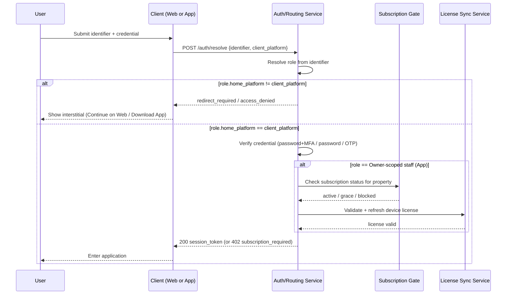

## 13.4 API Specification

```
POST /api/v1/auth/resolve
Headers: X-Client-Platform: web|app  (set by build config, verified against build signature)
Request:
{ "identifier": "owner@example.com" }
Response 200 (same platform, proceed):
{ "action": "proceed", "role": "owner", "auth_method": "password" }
Response 200 (cross-platform, web-capable role on app):
{ "action": "redirect", "redirect_url": "https://app.pinespherestay.com/login?t=<signed_token>", "expires_in": 300 }
Response 403 (app-only role on web):
{ "action": "denied", "message": "Please use the Pinesphere Stay App to log in.", "app_links": {"android": "...", "ios": "..."} }
Errors: 400 (bad/tampered client_platform), 404 (unknown identifier — returned generically to avoid account enumeration where the module's own auth flow requires it, per §3.6.1 pattern for Guest)
```

## 13.5 Security Rules

- Role resolution never reveals whether an identifier exists when doing so would aid enumeration (Guest and staff-password flows return a uniform "if this account exists, you'll receive..." style response where applicable — consistent with each module's own auth section).
- Cross-platform redirect tokens are single-use and platform-bound (a redirect token minted for the App→Web hop cannot be replayed as a login token itself; it only pre-fills the identifier field).
- All routing decisions are logged; ≥5 denied attempts on one identifier within 15 minutes triggers a temporary lock (429) independent of the underlying module's own credential-lockout rules, since repeated wrong-platform attempts against a valid identifier can indicate account-existence probing.

## 13.6 Acceptance Criteria (Module-Level)

- [ ] No credential verification network call is ever made for a mis-platformed login attempt.
- [ ] Redirect and denial messages never expose which specific role the identifier belongs to beyond what is operationally necessary ("use the App" does not further specify "because you are Housekeeping").
- [ ] The routing matrix (§13.2.2) is enforced identically regardless of which specific staff sub-role is involved — the check is `home_platform`-based, not a per-role special case list, so adding a future role only requires setting its `home_platform` attribute.

## 13.7 Feature: Single Active Session Enforcement & Account Lock

**Purpose:** Guarantee that one account credential can never be genuinely in-use on two devices at the same time. A stolen, shared, or extracted credential that is used concurrently with the legitimate session is treated as a security incident, not a routine re-login — the account is automatically locked and both sessions are killed, requiring Super Admin intervention to restore access.

**Preconditions:** Applies to every role's login (Super Admin, Owner, all App staff roles, and — in a lighter-weight form — Guest sessions per §3.6.1's own single-booking-scope rules).

**Data Model:** `login_sessions` — `session_id`, `user_id`, `device_fingerprint`, `client_platform`, `issued_at`, `last_heartbeat_at`, `status` (`active` \| `terminated` \| `revoked_concurrent_violation`), `ip_address`.

**Workflow — Normal Device Change (not a violation):**
```
User logs in on Device B
   -> System finds an existing session for this user on Device A
   -> Device A's last_heartbeat_at is OLDER than the heartbeat_timeout (default 5 minutes,
      Super-Admin-configurable) -> treated as an inactive/abandoned session
   -> Device A's session is gracefully terminated (status=terminated), Device B's login proceeds normally
   -> No lock triggered; this is the expected "I switched phones" case
```

**Workflow — Concurrent Use Violation:**
```
User logs in on Device B
   -> System finds an existing session for this user on Device A
   -> Device A's last_heartbeat_at is WITHIN the heartbeat_timeout (i.e. Device A is actively in use RIGHT NOW)
   -> This is flagged as concurrent_session_violation
   -> Both Device A's and Device B's sessions are immediately revoked (status=revoked_concurrent_violation)
   -> user.account_status = locked
   -> High-severity security event raised to the Super Admin Security Dashboard (Section 20)
   -> User is notified via an out-of-band channel (Email, never just in-app/push, since the app itself
      may be the compromised surface) that their account has been locked for suspected concurrent use
   -> Any further login attempt (from either device or any new device) returns 423 account_locked
      until a Super Admin explicitly unlocks it (Section 20.3)
```

**Business Rules:**
- The heartbeat_timeout window exists specifically to distinguish "switched devices" from "used simultaneously" — a session is only considered "actively in use" if it has sent a heartbeat (any authenticated API call, or the license heartbeat from §16.2 for App sessions) within that window.
- Unlocking is never self-service; only a Super Admin (or a Support-Engineer sub-role explicitly granted `security.account.unlock`) can lift a lock, and doing so always requires a logged `unlock_reason` and re-verification of the account holder's identity (mobile/email OTP re-verification at minimum) before the unlock takes effect.
- A locked account's existing offline-cached data on any device is not wiped by a lock alone (locking is an access control, not a data-destruction action) — it simply cannot authenticate further or pass license heartbeat (§16.2), and per §15.4 will degrade to read-only once its offline-validity window lapses.
- Guest sessions (§3.6.1) are exempt from the lock-and-notify escalation (a locked-out Guest simply re-authenticates via a fresh OTP, since booking-scoped tokens are inherently short-lived and low-privilege) but are still subject to the same concurrent-session detection to prevent a leaked Guest portal link from being used by two people at once mid-session — in that lighter case, the second concurrent session is simply rejected (409) rather than triggering an account lock, since there is no persistent "account" to lock.

**Notifications:**

| Trigger | Recipient | Channel | Template |
|---|---|---|---|
| Account locked (concurrent violation) | Affected user | Email (mandatory) + SMS if available | `account_locked_security_v1` |
| Account locked (concurrent violation) | Super Admin Security Dashboard | In-App (real-time) | `security_alert_concurrent_session` |
| Account unlocked | Affected user | Email | `account_unlocked_v1` |

**Acceptance Criteria:**
- [ ] Logging into Device B while Device A's session is actively heartbeating locks the account and revokes both sessions within the same request cycle that detected the violation.
- [ ] Switching devices after Device A has been idle beyond the heartbeat timeout never triggers a lock.
- [ ] A locked account cannot be unlocked by any means other than an explicit, audited Super Admin action.
- [ ] A locked account's App instance loses functional access at its very next license heartbeat (§16.2) even if it never re-attempts login.

---

# 19. APP INTEGRITY & ANTI-PIRACY PROTECTION

## 19.1 Purpose

Prevent the App binary from being extracted, repackaged/modded (in the manner of unauthorized "cracked" Spotify APKs), or run on a tampered/rooted environment to bypass licensing, subscription gating, or the single-session lock described in §13.7. This treats app integrity as a continuously-verified property, not a one-time install-time check.

## 19.2 Protective Layers

| Layer | Mechanism |
|---|---|
| Build-time hardening | Code obfuscation and minification (R8/ProGuard for the Android build, equivalent tooling for iOS), string/constant obfuscation for API endpoints and signing keys, so a decompiled APK does not trivially reveal how the app talks to the backend. |
| Signature verification | The app's own APK signing certificate hash is pinned and checked against the running binary at every app launch and before every license heartbeat (§16.2); a mismatch (indicating a repackaged/re-signed APK) blocks the app entirely with a clear "unauthorized build detected" message, before any login screen is even reachable. |
| Platform integrity attestation | Android builds call Google Play Integrity API; iOS builds call Apple's App Attest, on every login and on every license heartbeat cycle — not just at install — to detect emulators, rooted/jailbroken devices, debuggers/hooking frameworks (e.g. Frida/Xposed), and repackaged installs. A failed attestation is treated identically to a failed license heartbeat (§16.2): block, log, alert. |
| Server-side enforcement | Every authenticated API request from the App includes a signed integrity token (from the attestation check above); the backend independently re-validates this token — client-reported "I'm fine" is never trusted on its own. Requests without a currently-valid integrity token are rejected (403 `app_integrity_failed`), including for otherwise-valid JWTs, since a stolen JWT replayed from a tampered build must still fail this independent check. |
| Certificate pinning | All API traffic is pinned to Pinesphere Stay's TLS certificate; a man-in-the-middle proxy commonly used to intercept/patch mobile traffic during modding is rejected at the network layer. |
| Runtime self-check | The app periodically re-verifies its own binary checksum against a server-issued expected hash (piggybacked on the existing sync/heartbeat traffic, per §16.2's bandwidth-friendly pattern) and self-terminates the session if a mismatch is detected mid-use, not only at launch. |

## 19.3 Business Rules

- An app instance that fails signature verification or platform-integrity attestation is never granted a session, license, or any API access, regardless of whether the underlying account credentials are valid — integrity failure is checked *before* credential verification proceeds, mirroring the platform-routing precedence established in §13.2.1.
- A previously-valid, currently-active session is immediately terminated if a subsequent integrity re-check (periodic runtime self-check or next license heartbeat) fails — passing the check once is never sufficient for the life of a session.
- Integrity-check failures are treated as security events of at least the same severity as the concurrent-session violation in §13.7, and are surfaced identically on the Super Admin Security Dashboard (Section 20), including device fingerprint, failure type, and timestamp.
- Because Super Admin and Guest are Web-only roles (§0.3), this section applies specifically to the App binary used by Owner and all operational staff roles — the highest-value target for piracy given it holds the offline-capable, license-bearing client.

## 19.4 Sequence Diagram — Integrity-Gated Access

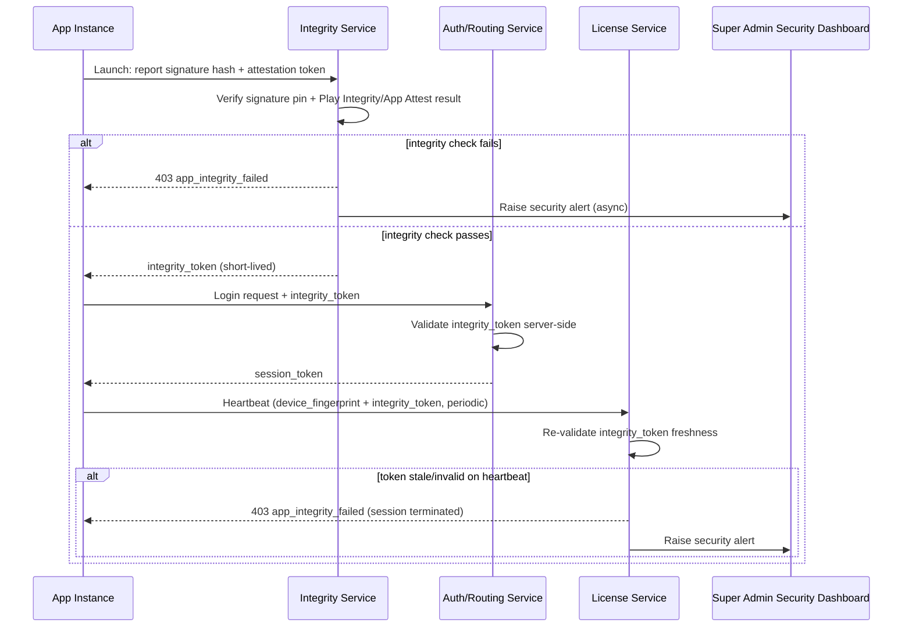

## 19.5 Acceptance Criteria

- [ ] A re-signed/repackaged APK fails signature verification at launch and never reaches the login screen.
- [ ] An app running on a rooted device or under a debugger/hooking framework fails platform-integrity attestation and is blocked, even with fully valid account credentials.
- [ ] A session that was valid at login is terminated mid-use if a subsequent periodic integrity re-check fails.
- [ ] Every integrity failure generates a Super Admin Security Dashboard alert with device fingerprint and failure reason, distinguishable from a routine subscription-lapse or license-mismatch block.

---

# 14. SUBSCRIPTION PAYWALL ENFORCEMENT (OWNER ACCESS GATE)

## 14.1 Purpose

Owner (and by extension, all staff roles created under that Owner's properties) must have a **paid, active** subscription — or be within an explicitly configured grace period — to obtain or retain any functional access to the App. This section formalizes and extends the subscription lifecycle already defined in §1.6.4 into a hard, universally-enforced access gate rather than a billing-status flag that individual features must remember to check.

## 14.2 Enforcement Point

The gate is enforced as **middleware on every authenticated App request** (not just at login), because a subscription can lapse mid-session (e.g., a recurring payment fails while an Owner is actively using the app).

```
Every App API request (post-login)
   → Validate JWT → Resolve property_id(s) in scope
   → Check subscription_status for each property (cached in Redis, 60s TTL, invalidated immediately on any subscription state-change event from §1.6.4)
   → status == active → proceed
   → status == grace_period → proceed, response includes a non-blocking "X days remaining" banner flag
   → status in (expired, suspended, cancelled) → reject with 402 Payment Required, minimal read-only exception below
```

## 14.3 Business Rules

- **No functional access without payment.** A `trial` status is treated as active-but-time-boxed (per §1.6.4's state machine) and is the only non-paid state that grants full access, since it is itself a deliberate, time-limited allowance — not an exemption from the rule.
- On `expired`/`suspended`/`cancelled`, the App blocks **all** create/edit/delete operations across every module (Booking, Room, Guest, Payment, Housekeeping, Kitchen, Maintenance, Staff) with 402, and restricts the UI to a single "Renew Subscription" screen plus a strictly read-only, non-exportable view of the Owner's own existing data (so the Owner is never permanently locked out of *seeing* what they built, only from *using* it further) — this read-only exception exists to support the "view billing history / download last invoice" self-service flow needed to actually resolve the lapse.
- Grace period length, if any, is a Super-Admin-configured plan attribute (default 0 days — no grace — unless explicitly set per plan); it is never a client-side default.
- A device that goes offline while `active` and stays offline past the point its cached license/subscription-status snapshot would have expired is treated per §15's license-sync rule: the local app enforces the same block once the cached validity window lapses, without needing a live connection to know it should do so.
- Reactivation (payment resolved) restores full access within 60 seconds platform-wide via the same event-driven cache invalidation used for the subscription state machine in §1.6.4 — no manual "refresh" action should be required, though a manual sync button remains available.

## 14.4 UI Requirements

- A persistent, dismissible-but-recurring banner appears at 7 days, 3 days, and 1 day before subscription expiry (or grace-period end), each with a "Renew Now" CTA.
- On hard block (402), all navigation collapses to a single non-dismissible "Subscription Required" screen; the Owner's staff (Manager, Receptionist, etc.) see a simplified variant: "This property's subscription needs attention — please contact your Owner," without exposing billing details staff should not see.

## 14.5 API Specification

```
Any App endpoint, when gate fails:
Response 402:
{
  "error": "subscription_required",
  "status": "expired",
  "grace_period_ends_at": null,
  "renew_url": "/owner/subscription/renew"
}
```

## 14.6 Acceptance Criteria

- [ ] An Owner whose subscription lapses mid-session is blocked on their very next mutating request, not merely on next login.
- [ ] Staff accounts under a lapsed Owner are blocked identically to the Owner for all mutating actions, immediately.
- [ ] Read-only billing/history views remain reachable even in a fully blocked state, so the Owner can always find the "Renew" path.
- [ ] A device that has been offline for longer than its cached subscription-validity window self-enforces the block without needing to reach the server first (see §15.4).

---

# 15. OFFLINE-FIRST APP DATA LAYER (OBJECTBOX + SQLITE + KOTLIN)

## 15.1 Purpose

Every App-platform role (Owner and all operational staff) must be able to complete their full workflow — create bookings, check guests in/out, record payments, update housekeeping/kitchen/maintenance status — with **zero internet connectivity**, and have every one of those actions transmitted to the server automatically and completely once connectivity returns, with nothing silently lost or duplicated.

## 15.2 Architecture

Kotlin is deliberately scoped as a **thin data-access and performance-optimization layer**, not a parallel native application. All screens, navigation, workflow logic, and business rules live in Flutter/Dart, exactly as specified for the rest of the system (§0). Kotlin exists solely so that reading from and writing to the on-device databases — and packaging that data for transmission to FastAPI — is as fast and memory-light as possible on low-to-mid-range Android hardware, which is common in on-property hospitality settings.

| Layer | Technology | Responsibility |
|---|---|---|
| UI, navigation, workflow logic | **Flutter/Dart** | Owns 100% of screens, state management, and business-rule presentation for every App-platform role (Owner and all operational staff). Kotlin never renders UI or owns workflow decisions. |
| Local data-access & optimization layer | **Kotlin** (Android platform channel implementation; an equivalent thin native layer on iOS) | A narrow, purpose-built bridge with exactly three jobs: (1) fast reads/writes against ObjectBox and SQLite, (2) marshaling query results into the lightweight payload shape Flutter expects with minimal serialization overhead, (3) batching and forwarding queued local mutations to FastAPI during sync. It does **not** contain business logic, validation rules, or UI state — those stay in Dart so behavior is identical regardless of platform-channel implementation details. |
| Primary embedded store | **ObjectBox** | Stores the operational entity graph the app needs offline-first: rooms, bookings, guests, staff shift state, housekeeping/kitchen/maintenance task queues, payment records pending sync. Chosen for object-graph read/write speed on-device, accessed exclusively through the Kotlin data-access layer. |
| Secondary relational store | **SQLite** | Mirrors a normalized, query-friendly subset of the same data for local reporting-style screens (Owner Dashboard aggregates, occupancy calculations) where SQL aggregation is simpler/faster than object-store traversal, plus the append-only local **sync-queue** and **audit shadow log** tables — also accessed only through the Kotlin layer, never directly from Dart. |
| Sync Engine | Kotlin background service (WorkManager-scheduled on Android) | Detects connectivity, batches queued mutations from the SQLite sync-queue, calls the FastAPI sync endpoints, reconciles server responses (including conflict flags per §8), and updates local store status — a mechanical transport/reconciliation job, not a decision-making one; conflict *resolution rules* themselves are still server-authoritative business logic (§8), Kotlin only executes the resulting instructions. |

**Why this division matters:** keeping Kotlin narrowly scoped to data access and transport (rather than duplicating business logic natively) means the app stays small, avoids maintaining two parallel implementations of the same rules, and lets the Flutter layer remain the single place workflow behavior is defined and tested — while still getting near-native speed for the highest-frequency operation in an offline-first app: reading and writing local data.

## 15.3 Offline Mutation Lifecycle

```
User action (e.g., Check-In Guest) in Flutter UI
   -> Flutter calls the Kotlin data-access layer via platform channel with the validated payload
      (validation itself already happened in Dart, per the workflow rules in Sections 2/3)
   -> Kotlin layer: write entity update to ObjectBox (immediate, so UI reflects it instantly)
      + append mutation record to SQLite sync_queue (client_uuid, entity_type, entity_id,
        operation, payload, idempotency_key, created_at, status=pending)
   -> Kotlin returns the write result to Flutter; UI reflects the change immediately (optimistic, offline-capable)
   -> Sync Engine (Kotlin background service):
        connectivity available?
           yes -> batch-POST pending sync_queue entries to /api/v1/sync/batch
                 -> server applies each with idempotency_key dedup + authoritative
                   business-rule validation (e.g. room-exclusion constraint)
                 -> server returns per-item result: applied | conflict | rejected
                 -> Kotlin layer updates ObjectBox + marks SQLite queue rows accordingly;
                   `conflict` items are surfaced back to Flutter, which displays the
                   human-in-the-loop resolution flow per Section 8's rule
           no -> remain queued, retry on next connectivity check (Section 8 retry schedule)
```

**All completed offline actions are guaranteed to be transmitted once connectivity resumes** — this is enforced structurally: nothing is considered "done" from the sync engine's perspective until the server has returned an explicit `applied` result for that `client_uuid`; the local queue row is the only thing that can mark it complete, and it is never deleted until that acknowledgment is received (at-least-once delivery, deduplicated server-side by `idempotency_key`).

## 15.4 License & Data Validity Windowing (ties to §16)

The Kotlin layer stores the current signed license (§16) alongside a `last_verified_at` timestamp. The app computes a **local offline-validity window** (configurable per plan, default 72 hours) from that timestamp; operational features remain usable offline within that window, and progressively restrict to read-only as the window is exceeded, even with zero connectivity, preventing indefinite offline use of a license that should have been re-validated (see §16 for the full anti-theft rationale).

## 15.5 Database Mapping (Local)

| Store | Table/Box | Purpose |
|---|---|---|
| ObjectBox | `RoomBox`, `BookingBox`, `GuestBox`, `StaffBox`, `TaskBox` (housekeeping/kitchen/maintenance) | Live operational entities, reactively bound to Flutter widgets |
| SQLite | `sync_queue` | Append-only pending/applied/conflict/rejected mutation log, keyed by `client_uuid` |
| SQLite | `audit_shadow_log` | Local mirror of actions pending audit-log transmission, reconciled against server `audit_logs` on sync |
| SQLite | `kpi_aggregates` | Precomputed local rollups for the Owner Dashboard's offline rendering |

## 15.6 Business Rules

- A mutation is never marked complete locally until server acknowledgment; app restarts or crashes do not lose queued items (SQLite queue survives process death).
- Conflicting room/date mutations from two devices are never both silently applied — consistent with §8, this is enforced server-side regardless of which device synced first.
- The local license-validity window (§15.4) is enforced even if the device's system clock is manipulated backward, by anchoring `last_verified_at` comparisons to a monotonic clock reading captured at verification time, not solely wall-clock time.

## 15.8 App Weight & Android Version Compatibility

**Purpose:** Ensure the App remains genuinely lightweight and runs smoothly across the full range of Android hardware and OS versions realistically found in hotel front-desk/housekeeping environments, which frequently includes older or budget devices — this is a direct consequence of scoping Kotlin narrowly (§15.2) rather than bundling a second full native runtime.

| Requirement | Target |
|---|---|
| Minimum supported Android version | API 24 (Android 7.0) and above, verified on real low-RAM devices, not emulators only |
| Installed APK size | Target ≤ 40 MB for the base App build (role-specific modules loaded/enabled via feature flags rather than bundling every module's assets for every role) |
| Cold start time | < 2.5 seconds on a low-mid tier device (≤3 GB RAM) |
| Idle memory footprint | < 150 MB resident, including the ObjectBox/SQLite layer warm with a typical single-property dataset |
| Kotlin layer scope discipline | The Kotlin data-access layer contains no UI rendering code, no third-party analytics/ad SDKs, and no business-rule duplication — its dependency footprint is limited to ObjectBox, SQLite/Room bindings, and the platform-channel/WorkManager sync plumbing, specifically to avoid binary bloat. |
| Battery/background behavior | Sync Engine background work is scheduled via WorkManager's battery-aware constraints (deferred under low battery, batched rather than continuous polling) so offline-first operation does not measurably degrade device battery life over a normal operating shift. |

**Business Rule:** Any new dependency proposed for the Kotlin layer must be justified against this weight budget before inclusion; UI libraries, analytics SDKs, or anything achievable in Dart are explicitly disallowed from the native layer to keep the "Kotlin optimizes data access only" boundary from eroding over time.

**Acceptance Criteria:**
- [ ] The App installs and runs its full offline booking/check-in/housekeeping workflow without crashing on a reference low-end device running Android 7.0.
- [ ] APK size and cold-start time are measured on every release build and block release if they regress beyond the targets above without an explicit, documented exception.
- [ ] Removing or auditing the Kotlin layer's dependency list confirms no UI, analytics, or business-rule code has been introduced outside its defined scope.

## 15.9 Acceptance Criteria (Data Layer)

- [ ] A booking created fully offline, followed immediately by a force-quit of the app, is still present in the sync queue on next launch and transmits successfully on reconnect.
- [ ] Two devices offline-booking the same room for overlapping dates never both show as "confirmed" once both have synced — exactly one is confirmed, the other is flagged per §8.
- [ ] An app left offline beyond its licensed validity window (§15.4/§16) automatically degrades to read-only, without requiring a network call to know it should.

---

# 16. LICENSE ANTI-THEFT CONTINUOUS SYNC

## 16.1 Purpose

Extend the offline-license mechanism already defined in §1.6.4 and §1.6.6 from a one-time issuance into a **continuously re-validated** control, specifically to prevent a licensed device (and the offline data it holds) from being usable indefinitely after theft, unauthorized transfer, or after the underlying subscription/device authorization has been revoked.

## 16.2 Mechanism

| Trigger | Behaviour |
|---|---|
| Every app foreground/session start (with connectivity) | App calls `/api/v1/devices/{device_id}/license/heartbeat`; server checks device status (`approved`/`locked`/`disabled`/`wiped`), subscription status (§14), and reissues/renews the signed license payload with a fresh `last_verified_at` and expiry window. |
| Every full sync cycle (§15.3) | The sync batch call additionally re-validates the license as part of its handshake — license checking is piggybacked on the existing sync traffic, not a separate always-on connection requirement, to remain bandwidth-friendly on-property. |
| Every N hours while connected (default 4h, Super-Admin-configurable per plan) | A background heartbeat re-validates even without a user-initiated foreground session, so a device left running (e.g., a reception desktop client) doesn't silently drift past its validity window while technically online. |
| Device flagged `locked`, `disabled`, or `wiped` by Super Admin (§1.6.6) | Next heartbeat (online) or next offline-validity-window expiry (§15.4, offline) immediately downgrades the local app to blocked/read-only; a `wiped` status additionally triggers local purge of ObjectBox/SQLite operational data per §1.6.6's remote-wipe behaviour. |
| Device fingerprint mismatch detected (e.g., license payload copied to a different physical device) | Heartbeat rejects with `license_device_mismatch`; app blocks entirely (not read-only — this is treated as a suspected-theft/cloning signal, more severe than a lapsed subscription) and raises a Super Admin security alert. |

## 16.3 Business Rules

- A license is never valid indefinitely offline — its usable window is always bounded (§15.4's `last_verified_at` + configured window), so theft of a device only yields a time-boxed exposure, not permanent unauthorized access.
- Re-validation failure due to a **revoked/suspended** state blocks with a clear "contact your Owner/Support" message; failure due to a **device-fingerprint mismatch** blocks with no further detail exposed to the device itself (to avoid coaching an attacker on exactly what was detected) while still generating a detailed internal audit/security event for Super Admin.
- Transferring a device (§1.6.6 Transfer Device) is the only sanctioned path to move a license to new hardware; any license payload detected on hardware other than its bound fingerprint outside that sanctioned flow is treated as the mismatch case above, not silently honored.
- License heartbeat failures do not, by themselves, delete local offline data (data loss is not used as a punitive mechanism for a merely-lapsed subscription) — only an explicit Remote Wipe command (§1.6.6) purges data; a lapsed/mismatched license instead restricts *access* to that data going forward.

## 16.4 Sequence Diagram — License Heartbeat

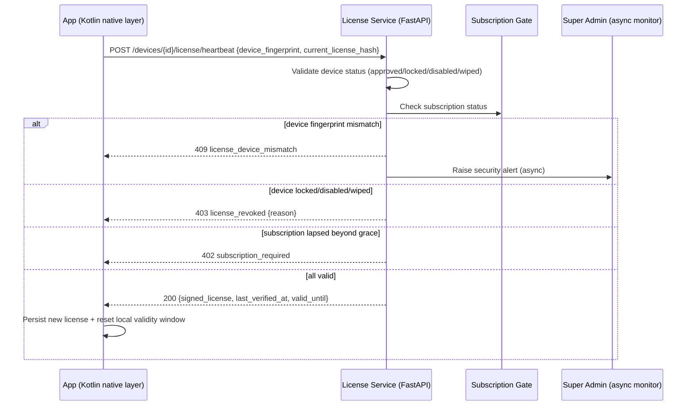

## 16.5 Acceptance Criteria

- [ ] A device whose license has not been heartbeat-verified within its configured window automatically restricts to read-only, independent of any explicit server push (works even if the device never reconnects).
- [ ] A cloned license payload used on a second physical device fails heartbeat with `license_device_mismatch` and generates a Super Admin security alert on the very first heartbeat attempt from the unauthorized device.
- [ ] A Remote Wipe (§1.6.6) issued while a device is offline is enforced locally the moment that device's next heartbeat or offline-window check occurs — it is never possible to indefinitely avoid a wipe simply by staying offline past the license's own validity window.
- [ ] License heartbeat traffic is piggybacked on existing sync calls where possible, so it does not introduce a separate constant-connectivity requirement beyond the app's already-necessary periodic sync.

---

# 17. OWNER REGISTRATION & ADMIN-ASSISTED ONBOARDING

## 17.1 Purpose

Two entry paths exist for a new customer to enter the platform: **Self-Registration** (Owner completes signup unaided) and **Admin-Assisted Registration** (Owner cannot complete signup — e.g. unclear on plan selection, payment issue, or simply prefers a guided setup — and instead reaches Super Admin via a Help/Support request, who then performs the registration on the Owner's behalf using the same underlying Customer Management capability already defined in §1.6.2).

Both paths converge on the same `customers` record shape and the same Property Onboarding Workflow (§19) — the only difference is *who* performs data entry and *how* the first step is triggered.

## 17.2 Path A — Self-Registration

**Entry Point:** A public, pre-authentication signup surface (marketing site / App first-run flow — accessible without any existing account, distinct from the authenticated App/Web split defined in §0.3 since no role exists yet).

**Inputs:** Business Name, Owner Full Name, Owner Email, Owner Mobile, Password (staff-grade complexity per §6), OTP verification of mobile.

**Workflow:**
```
Owner fills signup form → Mobile OTP verification → Account created (customers.status = self_registered_pending)
   → Owner redirected into Property Onboarding Workflow (§19), starting at "New Property"
   → No subscription is assigned yet — Owner sees the Dynamic Pricing Engine's live quote (§18) once room count is entered
```

**Business Rules:** A self-registered Owner has no active subscription and therefore no functional access beyond completing the onboarding wizard itself (Property creation, draft-saving) until a subscription is actually assigned per §18 — consistent with the paywall gate in §14; onboarding-wizard screens themselves are the one narrow exception explicitly allowed pre-payment, since the Owner cannot be shown a price without first entering property/room details.

### 17.3 Path B — Admin-Assisted Registration (Help Request)

**Entry Point:** Owner contacts support via phone/WhatsApp/email/help-widget (channel outside the app itself); a Support Ticket is logged.

**Inputs (captured by Super Admin/Support on the Owner's behalf):** Identical field set to Path A, entered through the existing `POST /api/v1/superadmin/customers` flow already specified in §1.6.2, plus a mandatory `onboarding_source = admin_assisted` flag and `support_ticket_id` reference.

**Workflow:**
```
Owner raises help request → Support Ticket created → Super Admin/Support opens Create Customer (§1.6.2)
   → Fills details on Owner's behalf → Owner receives welcome Email + WhatsApp with credentials
   → Owner (or Support, with Owner's verbal/recorded consent) proceeds through Property Onboarding Workflow (§19)
```

**Business Rules:** Admin-assisted creation always records which Super Admin/Support user performed the entry (`created_by_admin_id`) distinctly from self-registration's `created_by = null` (self), for audit and support-quality tracking; the underlying subscription/paywall rules (§14, §18) apply identically regardless of registration path — Admin assistance changes *who types the form*, never *what the Owner is entitled to for free*.

## 17.4 Notifications

| Trigger | Recipient | Channel | Template |
|---|---|---|---|
| Self-registration completed | Owner | Email + WhatsApp | `welcome_self_registered_v1` |
| Admin-assisted registration completed | Owner | Email + WhatsApp | `welcome_owner_v1` (shared with §1.6.2) |
| Help request received (pre-registration) | Super Admin/Support queue | In-App + Email | `support_ticket_new_v1` |

## 17.5 Acceptance Criteria

- [ ] A self-registered Owner cannot access any operational module (Booking, Room, etc.) until a subscription is assigned via §18, but can complete the full onboarding wizard through to seeing a price quote.
- [ ] Every customer record indicates its `onboarding_source` (`self` or `admin_assisted`) and, if admin-assisted, the responsible Super Admin/Support user and ticket reference.

---

# 18. DYNAMIC SUBSCRIPTION PRICING ENGINE

## 18.1 Purpose

Subscription pricing, billing rules, and duration options are **never hardcoded** in application logic. Super Admin fully owns and can reconfigure, at any time, without a code deployment: the pricing model (e.g. per-room), the base rate, the available durations, and any number of time-based/conditional price modifiers (e.g. weekend surcharges that themselves escalate across a multi-stage schedule before resetting). An Owner's actual functional entitlement (how many rooms they may activate, which features are unlocked) is derived **dynamically** from what they are currently paying for under whichever rule set is in force at the time of assignment or renewal — never from a static plan table alone.

This extends and formalizes the `subscription_plans` / `subscriptions` model already introduced in §1.6.4 into a full rule engine.

## 18.2 Core Data Model

| Entity | Purpose | Key Fields |
|---|---|---|
| `pricing_rules` | The base pricing definition Super Admin authors | `id`, `name`, `pricing_model` (`per_room` \| `flat` \| `tiered`), `base_amount`, `currency`, `is_active`, `priority` |
| `pricing_rule_durations` | Duration options attached to a rule | `pricing_rule_id`, `duration_type` (`monthly`\|`quarterly`\|`annual`\|`custom_days`), `duration_days`, `duration_discount_pct` |
| `pricing_modifiers` | Conditional adjustments layered on top of the base rule | `id`, `pricing_rule_id`, `condition_type` (`day_of_week`\|`date_range`\|`seasonal`\|`promotional`\|`usage_threshold`), `condition_value` (JSON), `is_active` |
| `pricing_modifier_stages` | Ordered sub-periods **within** a single modifier's active window, enabling escalating/de-escalating dynamic pricing (the weekend 15%→20%→revert pattern) | `pricing_modifier_id`, `stage_order`, `offset_start` (e.g. `Fri 00:00`), `offset_end` (e.g. `Sat 12:00`), `adjustment_type` (`percentage`\|`flat`), `adjustment_value` |
| `subscription_entitlements` | The resolved, point-in-time entitlement snapshot an Owner actually holds, derived from the engine | `subscription_id`, `rooms_paid_for`, `effective_rate`, `valid_from`, `valid_to`, `computed_price` |

**Worked Example — the requested weekend-escalation pattern:** A `pricing_modifier` of `condition_type = day_of_week`, `condition_value = {"days": ["Fri","Sat","Sun"]}` has three `pricing_modifier_stages`:
1. Stage 1 — `Fri 00:00 → Sat 12:00` — `+15%`
2. Stage 2 — `Sat 12:00 → Sun 18:00` — `+20%`
3. Stage 3 — `Sun 18:00 → Mon 00:00` — `+0%` (reverts to the base `pricing_rule` rate — "moves to initial")

The engine evaluates whichever stage's offset window contains the current timestamp; outside all stages (Monday–Thursday), the base rate applies with no modifier at all. Super Admin can define any number of stages, of any duration, escalating, de-escalating, or oscillating, without any code change — this is purely configuration data.

## 18.3 Price Calculation Workflow

```
Input: property_id (room_count known), duration_type, evaluation_timestamp
   ↓
Resolve applicable pricing_rule for the customer's plan tier
   ↓
Compute base_price = base_amount × room_count   (if pricing_model = per_room)
                     = base_amount               (if pricing_model = flat)
                     = tiered_lookup(room_count)  (if pricing_model = tiered)
   ↓
Apply duration_discount_pct from pricing_rule_durations for the selected duration_type
   ↓
Resolve any pricing_modifiers whose condition matches evaluation_timestamp
   ↓ For each matching modifier, resolve the active pricing_modifier_stage for evaluation_timestamp
   ↓ Apply stage's adjustment_value (percentage or flat) — modifiers stack in `priority` order, each applied to the running total
   ↓
final_price = base_price − duration_discount + Σ(stage adjustments)
   ↓
Persist as a quote (not yet an entitlement) → Return to Owner/Super Admin for confirmation
```

**Sequence Diagram — Dynamic Price Quote:**

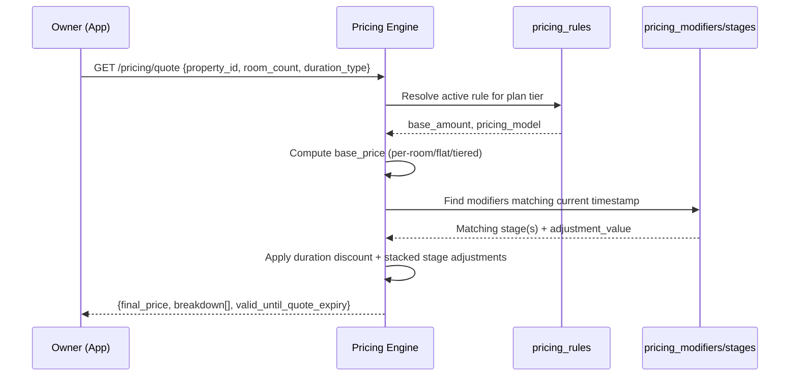

## 18.4 Functional Requirements

### 18.4.1 Feature: Manage Pricing Rules (Super Admin)

**Inputs:** Rule Name, Pricing Model, Base Amount, Currency, Duration Options (with per-duration discount %), Active flag, Priority (for stacking order when multiple rules could apply).

**Validations:** `base_amount` > 0; `duration_discount_pct` between 0 and 100; at least one `pricing_rule_duration` required before a rule can be set `is_active = true`.

**Business Rules:** A `pricing_rule` cannot be deleted if any `active` subscription currently references it (must be deactivated instead — existing subscriptions continue at their locked-in `computed_price` until their next renewal, which re-evaluates against whatever rule is active *at renewal time*, per §18.6).

### 18.4.2 Feature: Manage Dynamic Modifiers & Stages

**Inputs:** Condition Type, Condition Value (day-of-week set, date range, or usage threshold), one or more Stages, each with an offset window and adjustment value.

**Validations:** Stage windows within a single modifier must not overlap; stages must be contiguous or explicitly gapped (a gap implicitly means "base rate" for that sub-window, requiring no explicit zero-value stage, though an explicit `+0%` stage is also permitted for clarity as shown in the worked example).

**Business Rules:** Multiple active modifiers can apply simultaneously (e.g. a weekend modifier and a seasonal modifier); they stack in ascending `priority` order, each applied to the running total from the previous step, not all applied independently to the original base (compounding, not parallel, to keep the calculation deterministic and auditable).

### 18.4.3 Feature: Assign Subscription (Room-Based Entitlement)

**Purpose:** Convert a confirmed price quote (§18.3) into an active, paid `subscription_entitlements` record that gates the Owner's actual room-listing capacity.

**Inputs:** Confirmed Quote ID, Payment confirmation (from Payment Gateway webhook).

**Workflow:**
```
Owner accepts quote → Payment collected → Payment webhook confirms
   → Create subscription_entitlements {rooms_paid_for, effective_rate, valid_from, valid_to}
   → Update property.room_limit = min(physical_room_count, rooms_paid_for)
   → Trigger License Generation (§19 step) → Audit Log → Notify Owner
```

**Business Rule (the core dynamic-access rule requested):** The Owner's functional `room_limit` is **never** simply "whatever rooms exist at the property" — it is capped at `rooms_paid_for` under the currently active `subscription_entitlements` record. If a property physically has 25 rooms but the Owner has only paid for 20 under a ₹100/room rule (₹2,000), only 20 rooms may be listed/activated for booking; the remaining 5 exist in the system as `unlisted_pending_subscription` and become bookable automatically, without any code change, the moment the Owner pays to extend `rooms_paid_for` to cover them (§18.4.4).

### 18.4.4 Feature: Incremental Room Entitlement (Pay-to-Unlock Additional Rooms)

**Purpose:** Allow an Owner to add rooms mid-cycle by paying the incremental per-room rate for the remainder of the current billing period (prorated).

**Workflow:**
```
Owner adds a room beyond current rooms_paid_for → Pricing Engine computes prorated incremental cost
   = (base_amount × 1 room) × (days_remaining_in_cycle / total_cycle_days) × applicable modifier at time of purchase
   → Owner pays → rooms_paid_for += 1 → room_limit recalculated → new room becomes bookable immediately
```

**Business Rule:** A room created in the Owner module (§2.6.2) beyond current `rooms_paid_for` is permitted to exist as a draft/unlisted record (so an Owner can prepare it in advance) but is structurally blocked from appearing in booking availability search or being assigned a booking until its incremental entitlement is paid — enforced at the same query layer that already excludes `maintenance`/`blocked` rooms, not merely hidden in the UI.

## 18.5 API Specification

```
GET /api/v1/pricing/quote?property_id={id}&room_count={n}&duration_type=monthly
Response 200:
{
  "base_price": 2000.00,
  "duration_discount": 0.00,
  "modifiers_applied": [
    {"name": "Weekend Escalation", "stage": "Stage 2 (Sat 12:00-Sun 18:00)", "adjustment": "+20%", "amount": 400.00}
  ],
  "final_price": 2400.00,
  "currency": "INR",
  "quote_expires_at": "2026-07-17T23:59:59Z"
}

POST /api/v1/superadmin/pricing-rules
Request:
{
  "name": "Standard Per-Room",
  "pricing_model": "per_room",
  "base_amount": 100.00,
  "currency": "INR",
  "durations": [
    {"duration_type": "monthly", "duration_days": 30, "duration_discount_pct": 0},
    {"duration_type": "annual", "duration_days": 365, "duration_discount_pct": 15}
  ]
}
Response 201: { "pricing_rule_id": "uuid", "is_active": false }

POST /api/v1/superadmin/pricing-rules/{id}/modifiers
Request:
{
  "condition_type": "day_of_week",
  "condition_value": {"days": ["Fri","Sat","Sun"]},
  "stages": [
    {"stage_order": 1, "offset_start": "Fri 00:00", "offset_end": "Sat 12:00", "adjustment_type": "percentage", "adjustment_value": 15},
    {"stage_order": 2, "offset_start": "Sat 12:00", "offset_end": "Sun 18:00", "adjustment_type": "percentage", "adjustment_value": 20},
    {"stage_order": 3, "offset_start": "Sun 18:00", "offset_end": "Mon 00:00", "adjustment_type": "percentage", "adjustment_value": 0}
  ]
}
Response 201: { "modifier_id": "uuid" }
```

## 18.6 Business Rules (Summary)

- Pricing rules, durations, and modifiers are 100% Super-Admin-authored configuration data — never hardcoded constants in the FastAPI codebase.
- A subscription's `computed_price` is locked for its current billing cycle once paid; the engine only re-evaluates against the live rule set at the *next* renewal or at the moment of an incremental room purchase (§18.4.4) — an Owner already mid-cycle is never retroactively charged more because a modifier's stage changed.
- Room-level functional access (`room_limit`) is always derived from `rooms_paid_for`, never from the property's raw physical room count — this is the concrete mechanism by which "if the rule is pay ₹100/room, only rooms paid for are listed" is enforced.
- Overlapping modifier stages within the same modifier are rejected at authoring time (422); overlapping *different* modifiers are permitted and stack per §18.4.2.
- Deactivating a `pricing_rule` never retroactively affects existing paid subscriptions; it only prevents new assignments/renewals from selecting it.

## 18.7 Audit Requirements

Every pricing rule/modifier/stage create, edit, activate, deactivate is logged with the standard actor/before/after/timestamp/IP structure (§1.10); every generated quote and every resulting `subscription_entitlements` creation is logged and retained for financial-audit purposes (7-year retention, matching §1.10's compliance window).

## 18.8 Acceptance Criteria

- [ ] A property with 25 physical rooms and `rooms_paid_for = 20` exposes exactly 20 rooms in booking-availability search; the remaining 5 are visible to the Owner as "unlisted — pay to activate" but never bookable.
- [ ] A weekend-escalation modifier with the three worked-example stages produces `+15%` on Friday, `+20%` from Saturday noon, and reverts to `+0%` from Sunday evening — verified by quoting at timestamps inside each stage window.
- [ ] Changing a `pricing_rule`'s `base_amount` does not alter the `computed_price` of any subscription already paid for the current cycle.
- [ ] Incremental room purchase mid-cycle correctly prorates by remaining days and immediately unlocks the new room for booking without any deployment/config change.

---

# 19. PROPERTY ONBOARDING WORKFLOW (END-TO-END)

## 19.1 Purpose

Formalizes the exact sequence a property must pass through — from first creation to fully bookable — as a strict, gated state machine, tying together Property Management (§1.6.3), the Dynamic Pricing Engine (§18), Device Management (§1.6.6), and License Generation (§1.6.4/§16) into one auditable pipeline.

## 19.2 State Machine

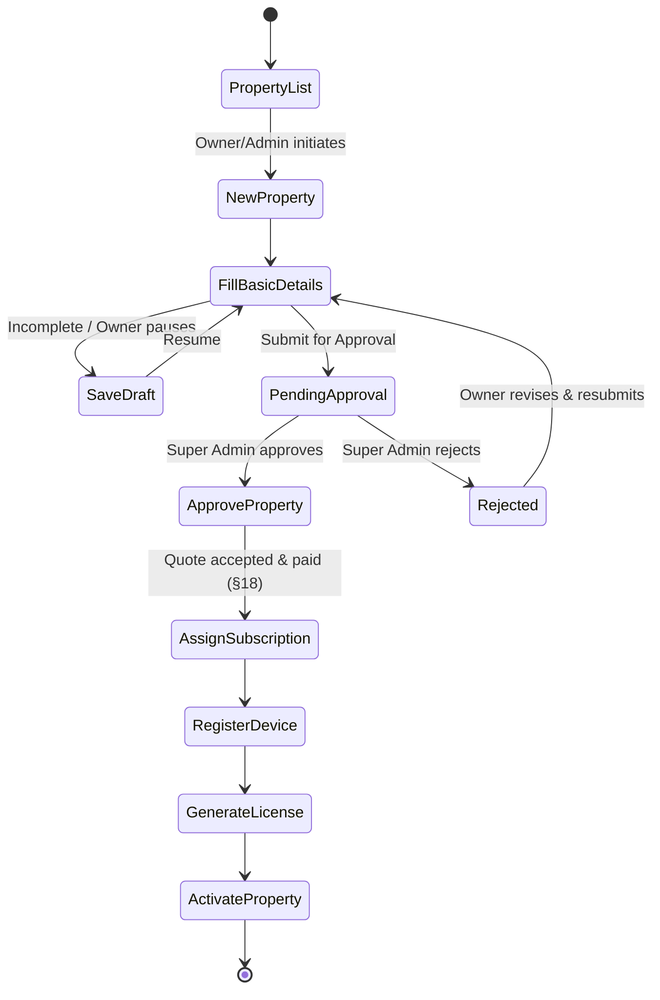

## 19.3 Step-by-Step Functional Requirements

### Step 1 — Property List
**Input:** None. **Process:** Owner (App) or Super Admin (Web) views existing properties for the customer account. **Output:** List with status badges (`draft`, `pending_approval`, `active`, `rejected`, `suspended`). **Access:** Owner sees only their own customer's properties; Super Admin sees all.

### Step 2 — New Property
**Input:** Owner/Admin taps "+ New Property." **Process:** Creates a `properties` row with `status = draft`, `created_by`. **Output:** Empty property record, wizard begins. **Business Rule:** Creating a new draft does **not** count against any subscription's `rooms_paid_for` — drafts are free to start.

### Step 3 — Fill Basic Details
**Input:** Property Name, Type, Address, GPS, Timezone, Currency, planned Room Count (used only to generate a pricing estimate — not yet binding), Amenities.
**Validations:** Same as §1.6.3 Property Management field rules.
**Output:** Populated draft; a live, non-binding price estimate from the Pricing Engine (§18.3) is shown as the Owner adjusts planned room count.

### Step 4 — Save Draft
**Input:** Owner action (explicit Save, or auto-save every 30s while editing).
**Process:** Persists partial data with `status = draft` unchanged; no approval, subscription, or device steps are triggered.
**Business Rule:** A draft has no expiry by default but surfaces as a reminder in the Owner Dashboard's Property Alerts (§2.6.1) after 7 days of inactivity.

### Step 5 — Approve Property (Super Admin)
**Input:** Draft submitted for review (Owner action: "Submit for Approval," transitioning `draft → pending_approval`), reviewed by Super Admin per §1.6.3.
**Output:** `status = approved` (or `rejected` with mandatory reason, returning the property to `draft` for revision).
**Business Rule:** Approval validates the *property* (legitimacy, address, documentation) — it does **not** yet allocate a room_limit or activate bookability; that only happens after subscription assignment (Step 6), correcting the earlier §1.6.3 description to explicitly sequence room-limit allocation *after* payment, not at approval time, per this updated flow.

### Step 6 — Assign Subscription
**Input:** Approved property's confirmed room count, selected duration, accepted price quote (§18.3), payment.
**Process:** Runs §18.4.3's Assign Subscription workflow — creates `subscription_entitlements`, sets `property.room_limit = min(physical_rooms, rooms_paid_for)`.
**Output:** `status = subscription_active`.
**Business Rule:** A property cannot proceed to Device Registration while `subscription_entitlements` is absent or lapsed — this is the paywall gate (§14) applied at onboarding time specifically, not only post-activation.

### Step 7 — Register Device
**Input:** Device Fingerprint from the Owner's/Receptionist's physical device, per §1.6.6.
**Process:** Device row created (`status = pending`), Super Admin (or an auto-approval policy configurable per plan) approves it.
**Output:** `status = approved` device linked to the property.
**Business Rule:** A property can register multiple devices up to its `device_limit` (from the active subscription's plan attributes); the first device registered during onboarding is flagged `is_primary_onboarding_device` for support-diagnostic purposes only (not a special permission tier).

### Step 8 — Generate License
**Input:** Approved device + active subscription.
**Process:** Runs §1.6.4/§16's license generation — signed payload embedding `property_id`, `device_fingerprint`, `expiry`, `feature_flags`, `room_limit`.
**Output:** Signed license delivered to the device (push + on next app connection).
**Business Rule:** License `expiry`/validity window is derived from the subscription's `valid_to` (§18.2) and the anti-theft heartbeat window (§16.2) — never independently set.

### Step 9 — Activate Property
**Input:** Confirmation that license is installed and device has completed at least one successful sync.
**Process:** `property.status = active`.
**Output:** Property now appears in booking-availability search (within its `rooms_paid_for` cap, §18.6), Owner Dashboard fully unlocks, nightly WhatsApp summary (§2.6.10) begins scheduling.
**Business Rule:** A property cannot skip to `active` without having passed through every prior step in order — the state machine (§19.2) rejects out-of-order transitions at the API layer, not merely in the UI wizard.

## 19.4 Sequence Diagram — Full Onboarding

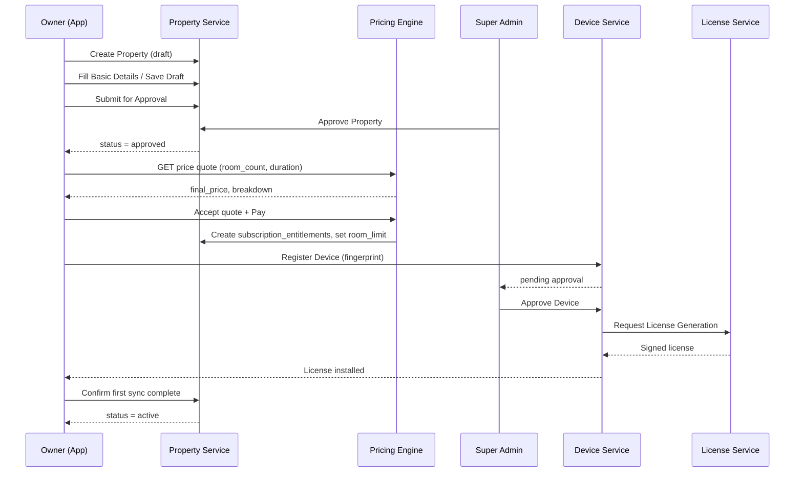

## 19.5 Acceptance Criteria

- [ ] Attempting to call Register Device (Step 7) via API for a property whose `subscription_entitlements` is absent returns 409 `subscription_required_before_device`.
- [ ] Attempting to Activate Property (Step 9) without a successfully generated, installed license returns 409 `license_required`.
- [ ] A property stuck in `draft` for 7+ days surfaces as a Property Alert on the Owner Dashboard (§2.6.1) and, separately, as a stale-onboarding entry in the Super Admin dashboard's funnel view.
- [ ] The onboarding state machine rejects any attempt to transition a property directly from `draft` to `active`, regardless of caller role, without passing through Approve → Assign Subscription → Register Device → Generate License in order.

---

# 17. OWNER REGISTRATION & PROPERTY ONBOARDING PIPELINE

## 17.1 Purpose

Formalizes how a hotel Owner enters the platform — either fully self-service or via Super-Admin-assisted onboarding when the Owner cannot complete registration themselves — and the single, shared pipeline every property then passes through from first draft to fully active, license-protected operation.

## 17.2 Two Registration Paths

| Path | Trigger | Actor Who Performs Data Entry | Notes |
|---|---|---|---|
| **A — Self-Service Registration** | Owner opens the App's public "Register" entry point | Owner | Owner is an App-only role (§0.3), so this happens entirely in-App: business name, owner name, mobile/email, password creation, initial property basic details. |
| **B — Admin-Assisted Registration ("Call for Help")** | Owner cannot complete self-registration (payment difficulty, low digital literacy, needs a custom/negotiated term) and contacts support by phone/WhatsApp/email | Super Admin (or a Support-Engineer sub-role, §1.5) | Super Admin uses the existing **Create Customer** flow (§1.6.2) to create the Customer + Owner account on the Owner's behalf, then either enters the Owner's property details directly or hands the Owner temporary credentials to continue self-service from the "Fill Basic Details" step onward. |

**Business Rule:** Regardless of path, both converge into the identical Property Onboarding Pipeline (§17.3) — there is no separate "admin fast-track" that skips Approval or Subscription assignment; Admin-Assisted Registration only changes *who performs data entry*, never *which gates apply*. This prevents support-assisted onboarding from becoming a loophole around payment or verification.

**Audit:** Admin-Assisted Registration additionally logs a mandatory `assistance_reason` (e.g. `payment_confusion`, `no_smartphone_literacy`, `custom_terms_negotiation`) on the Customer record, distinct from standard Super Admin audit fields (§1.10), so Product can track how often and why assisted onboarding is needed.

## 17.3 Property Onboarding Pipeline

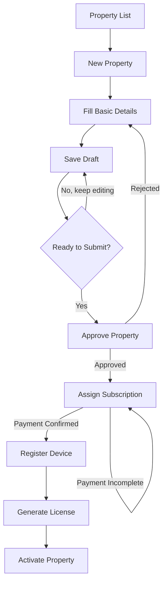

**State Machine — Property Onboarding Status:**

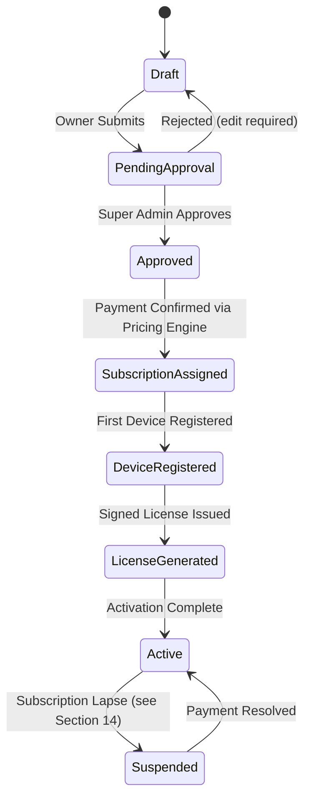

## 17.4 Functional Requirements Per Step

### 17.4.1 Property List

**Purpose:** Entry screen showing all of an Owner's properties across every pipeline stage (Draft, Pending Approval, Active, Suspended), or — for a Super Admin/Support user — all properties awaiting approval platform-wide.

**Access:** Owner sees only their own properties; Super Admin sees a global queue filterable by status.

### 17.4.2 New Property

**Purpose:** Initiate a new property record. **Input:** none beyond the trigger action. **Output:** an empty draft shell with a generated `property_id`, `status = draft`.

### 17.4.3 Fill Basic Details

**Purpose:** Capture the property's identifying and operational-intent information.

**Inputs:** Property Name, Property Type, Address, GPS Coordinates, Timezone, Currency, **Requested Room Count** (the Owner's intended room count — distinct from the final enforced `room_limit`, which is only fixed once payment is confirmed at §17.4.6), Amenities, Photos.

**Validations:** Same field rules as §1.6.3 (Create/Approve Property). Requested Room Count ≥ 1; no upper cap applied at this step (the cap is a function of what the Owner is willing/able to pay, resolved at Assign Subscription — capping it here would prevent the Owner from seeing an accurate price quote for a larger number first).

**Business Rule:** Basic Details remain fully editable while `status = draft`. Once `status` advances past `Approved`, changing Property Name/Address/Type requires a formal change request (not a silent edit), since Approval implies the Super Admin verified the facts as submitted.

### 17.4.4 Save Draft

**Purpose:** Persist in-progress data without submitting for review, so an Owner (or Admin, in Path B) can return later.

**Business Rule:** A Draft never consumes any subscription/room allocation and is not visible in Super Admin's approval queue until explicitly submitted.

### 17.4.5 Approve Property

**Purpose:** Super Admin verification gate (identical mechanics to the existing §1.6.3 feature, now formally positioned as pipeline step 5). Verifies business legitimacy/documentation before any money changes hands or any device/license is issued.

**Business Rule:** Approval does **not** itself grant any functional access — it only unlocks the ability to proceed to Assign Subscription. A property cannot reach Register Device or Generate License while `status < Approved`.

### 17.4.6 Assign Subscription

**Purpose:** Convert the Owner's Requested Room Count into a binding, paid subscription using the Dynamic Subscription & Pricing Rule Engine (§18) — this is the step where price is actually computed and the enforceable `room_limit` is fixed.

**Workflow:**
```
Approved property + Requested Room Count
   → Pricing Engine computes effective_rate_per_room for today's date (§18.3)
   → Present quote: total_amount = effective_rate_per_room × requested_room_count (per chosen billing cycle, §18.4)
   → Owner (or Admin on their behalf) confirms payment
   → On payment confirmation: subscription.status = active, property.room_limit = paid room count
   → On partial/failed payment: property remains at Approved, quote re-computable at any later date
      (note: the effective_rate may differ on a later date if applicable rules — e.g. weekend/launch-phase
      modifiers, §18.3 — have changed in the interim; the Owner always pays the rate in effect
      at the moment of confirmed payment, never a stale quoted rate)
```

**Business Rule:** Register Device and Generate License are both hard-blocked until `subscription.status = active` for that property — there is no way to obtain a device license for an unpaid property, consistent with §14's paywall gate.

### 17.4.7 Register Device

**Purpose:** Bind the Owner's first physical device to the now-paid property (mechanics per §1.6.6 Device Management, initiated Owner-side and approved Super-Admin-side or via an automated trust policy for standard cases).

### 17.4.8 Generate License

**Purpose:** Issue the signed, device-bound offline license (per §1.6.4/§16), scoped to the confirmed `room_limit` and subscription entitlements (feature flags for the assigned plan).

### 17.4.9 Activate Property

**Purpose:** Final transition — `property.status = active`, full App functional access unlocked for the Owner and any staff they subsequently create, subject to ongoing §14 subscription-gate enforcement and §16 license re-validation for the life of the subscription.

**Acceptance Criteria (Pipeline-Level):**
- [ ] A property cannot reach `DeviceRegistered` while `subscription.status != active`.
- [ ] Rejecting a property at Approve Property returns it to `Draft` with a mandatory reason, never silently deletes the draft data.
- [ ] Requested Room Count captured at Fill Basic Details is advisory only — the enforced `room_limit` is always the value fixed at Assign Subscription, sourced from confirmed payment, never from the earlier request alone.

---

# 18. DYNAMIC SUBSCRIPTION & PRICING RULE ENGINE

## 18.1 Purpose

Subscription pricing, duration options, and Owner access limits must be entirely **data-driven and Super-Admin-configurable at runtime** — never hardcoded in application code. This engine determines (a) the price per room, (b) how that price varies by day, phase, or promotion, and (c) how many rooms an Owner is actually permitted to use, all from admin-editable rules.

## 18.2 Core Pricing Model

| Table | Purpose |
|---|---|
| `pricing_plans` | `id`, `name`, `pricing_unit` (`per_room` \| `flat` \| `tiered`), `base_rate_per_room`, `currency`, `is_active` |
| `billing_cycle_options` | `id`, `plan_id`, `cycle_name` (Monthly/Quarterly/Annual/Custom), `cycle_length_days`, `rate_multiplier`, `discount_percentage` — e.g. Annual = 12× monthly rate × 0.85 (15% off), fully admin-editable, never hardcoded |
| `pricing_rules` | `id`, `plan_id`, `rule_name`, `priority` (integer, lower = evaluated first), `condition_type` (`day_of_week` \| `date_range` \| `subscription_phase` \| `property_type` \| `promo_code`), `condition_value` (JSON), `adjustment_type` (`percentage_increase` \| `percentage_discount` \| `fixed_override`), `adjustment_value`, `auto_revert` (boolean, default `true`), `effective_from`, `effective_to` (nullable), `created_by` |
| `subscription_price_calculations` | Immutable audit log: `subscription_id`, `calculation_date`, `base_rate`, `applied_rule_id` (nullable if none matched), `effective_rate_per_room`, `room_count`, `total_amount` — written on **every** price computation (quote or actual billing run), giving full explainability for any charge |

## 18.3 Rule Evaluation Engine

**Purpose:** For any given date and subscription, resolve the single effective per-room rate by evaluating all applicable rules in priority order; if nothing matches, the rate **auto-reverts** to the plan's unmodified `base_rate_per_room` — nothing persists beyond the window its own condition defines.

**Worked Example (mirrors the requirement as specified):**

| Rule | Condition | Adjustment |
|---|---|---|
| Launch-Phase Weekend Rate | `day_of_week ∈ {Sat, Sun}` AND `subscription_phase = launch` (first 30 days of that subscription, admin-configurable length) | +15% over base |
| Standard Weekend Rate | `day_of_week ∈ {Sat, Sun}` AND `subscription_phase = standard` (day 31 onward) | +20% over base |
| *(no rule for weekdays)* | — | Auto-reverts to unmodified `base_rate_per_room` |

Result: a Saturday within the first 30 days bills at base+15%; the same Saturday after day 30 bills at base+20%; any Monday–Friday, in either phase, bills at the plain base rate — the price "moves back to initial" the moment the weekend condition stops matching, exactly as specified.

**Evaluation Workflow:**
```
Given evaluation_date and subscription:
1. Load active pricing_rules for the subscription's plan where
   effective_from <= evaluation_date <= (effective_to OR unbounded)
2. Filter to rules whose condition_type/condition_value evaluate TRUE for
   (evaluation_date, subscription_age_in_days, property_type, promo_code_if_any)
3. Sort matching rules by priority ascending
4. Apply the single highest-priority match's adjustment to base_rate_per_room
5. If none match -> effective_rate = base_rate_per_room (auto-revert)
6. total_amount = effective_rate x room_count x billing_cycle_options.rate_multiplier
   (prorated per cycle_length_days where applicable)
7. Persist the full computation to subscription_price_calculations
```

## 18.4 Duration / Billing-Cycle Configurability

Duration is never a fixed enum in code — it is a row in `billing_cycle_options` per plan (e.g. Monthly, Quarterly with a bundled discount, Annual with a larger bundled discount). Super Admin can additionally define **one-off custom-duration subscriptions** (e.g. a negotiated 45-day pilot term for an Admin-Assisted Registration, §17.2 Path B) with a manually entered total, recorded identically in `subscription_price_calculations` for audit consistency.

## 18.5 Room-Based Access Determination

**Purpose:** The Owner's actual usable `room_limit` is *derived from what they pay* under the currently effective dynamic rate — not an arbitrary number assigned independent of payment (though Super Admin retains manual override capability for exceptional Admin-Assisted cases, always logged with a reason).

**Workflow:**
```
Owner requests N rooms at Assign Subscription (§17.4.6)
   -> Engine computes effective_rate_per_room for today (§18.3)
   -> total_due = effective_rate_per_room x N (per chosen billing cycle)
   -> Owner pays total_due (in full, or partially if the plan explicitly allows partial-room activation)
   -> property.room_limit = N, upon full payment
      OR property.room_limit = floor(amount_paid / effective_rate_per_room), if partial payment permitted by plan
   -> Only rooms up to room_limit may ever be created (enforced by the existing §2.6.2 rule,
      now fed entirely by this engine's output rather than a manually assigned cap)
```

**Business Rule — Mid-Cycle Room Increases:** If an Owner later wants additional rooms mid-subscription, the engine re-quotes the **currently effective rate** (which may differ from the original purchase rate if applicable rules have changed in the interim) for the incremental rooms only; rooms already paid for at the original rate are never retroactively re-priced.

## 18.6 Super Admin Rule Configuration (UI/API)

**UI:** A rule-builder screen lets Super Admin construct a condition (day-of-week / date-range / subscription-phase / property-type / promo-code picker), choose an adjustment type and value, set an effective window and `auto_revert` toggle, and drag-reorder priority against existing rules — with a live "Preview" panel showing the resulting effective rate across a sample date range and room count before saving, so pricing changes are validated visually, never blind.

**API Specification:**

```
POST /api/v1/superadmin/pricing/plans/{plan_id}/rules
Request:
{
  "rule_name": "Launch-Phase Weekend Rate",
  "priority": 10,
  "condition_type": "composite",
  "condition_value": {
    "day_of_week": ["saturday", "sunday"],
    "subscription_phase": "launch",
    "phase_length_days": 30
  },
  "adjustment_type": "percentage_increase",
  "adjustment_value": 15,
  "auto_revert": true,
  "effective_from": "2026-07-01",
  "effective_to": null
}
Response 201: { "rule_id": "uuid", "status": "active" }
Errors: 400, 401, 403 (missing subscription.plan.edit-equivalent permission), 409 (conflicting equal-priority rule), 422

GET /api/v1/superadmin/pricing/plans/{plan_id}/quote?room_count=100&date=2026-07-25
Response 200:
{
  "evaluation_date": "2026-07-25",
  "base_rate_per_room": 100.00,
  "applied_rule": "Standard Weekend Rate",
  "effective_rate_per_room": 120.00,
  "room_count": 100,
  "total_amount": 12000.00
}
```

## 18.7 Business Rules

1. No pricing threshold, date, or percentage is ever hardcoded in application code — every value originates from `pricing_plans` / `billing_cycle_options` / `pricing_rules`, editable by Super Admin without a deployment.
2. `auto_revert = true` (the default) means the rule's effect applies **only** on days its condition matches; the rate snaps back to `base_rate_per_room` (or the next applicable lower-priority rule) on all other days. `auto_revert = false` (a sticky modifier that persists until explicitly superseded) is a rare, discouraged configuration requiring a documented Super Admin justification, since it breaks the "moves back to initial" expectation by design.
3. Two rules with identical `priority` that could both match the same date are rejected at creation time (409) — the engine never non-deterministically resolves a tie; Super Admin must assign distinct priorities.
4. Every price actually charged is persisted to `subscription_price_calculations`; an Owner disputing an invoice line item can always be shown the exact base rate and rule that produced it.
5. Cannot reduce `room_limit` below the property's already-created room count (existing §5 Global Business Rule #3), now additionally meaning a downward room-count adjustment mid-subscription must first pass the same existing-rooms check before any refund/credit is processed.

## 18.8 Acceptance Criteria

- [ ] Editing a `pricing_rules.adjustment_value` takes effect on the very next price calculation with zero code deployment.
- [ ] A weekend date within a subscription's launch phase computes using the +15% rule; the identical weekend after the launch phase ends computes using the +20% rule; any weekday in either phase computes using the unmodified base rate.
- [ ] An Owner who pays for exactly 100 rooms at the rate effective at time of payment cannot create a 101st room (409 `room_limit_exceeded`).
- [ ] Every subscription invoice line item traces to a specific `subscription_price_calculations` record showing the base rate and any applied rule.
- [ ] Requesting a quote for a future date correctly reflects whichever rule's `effective_from`/`effective_to` window will be active on that date, without requiring the calling client to know the rule logic itself (the engine is the single source of truth).

---

# 20. SUPER ADMIN SECURITY DASHBOARD

## 20.1 Purpose

A dedicated, high-signal security console — distinct from the general platform dashboard (§1.6.1) — giving Super Admin real-time visibility into and control over account locks, concurrent-session violations, app-integrity failures, and device-fingerprint anomalies across the entire platform, since these are time-sensitive incidents that must not be buried among routine operational metrics.

## 20.2 Permission Registry

| Resource | Permissions Exposed |
|---|---|
| `security.dashboard` | `view` |
| `security.account` | `view`, `unlock`, `force_logout_all_sessions` |
| `security.device` | `view`, `blacklist_fingerprint`, `unblacklist_fingerprint` |
| `security.incident` | `view`, `export`, `mark_resolved` |

These are granted independently of the general Super Admin permission set (§1.5) so a Support-Engineer sub-role can be given `security.account.unlock` without also receiving `customer.delete` or `subscription.plan.edit` — consistent with the non-hardcoded RBAC model in §0.2.

## 20.3 Functional Requirements

### 20.3.1 Feature: Security Incident Feed

**Purpose:** Real-time, chronological feed of every security-relevant event platform-wide: concurrent-session violations (§13.7), app-integrity failures (§19.3), device-fingerprint mismatches (§16.2), repeated mis-platformed login attempts (§13.2.1), and OTP/credential lockouts.

**Inputs:** Filters — event type, severity, property, date range, resolved/unresolved.

**Outputs:** A live table: timestamp, event type, severity, affected account/device, IP, geo-location, current status (open/resolved), one-click action (Unlock Account / Blacklist Device / Mark Resolved).

**Workflow:**
```
Any security event (13.7 lock, 19.3 integrity failure, 16.2 fingerprint mismatch, etc.)
   -> Emitted as an event to the Security Incident stream (separate from general audit_logs,
      though every incident also still writes a standard audit_logs entry per the polymorphic
      pattern in Section 1.8)
   -> Security Dashboard subscribes and renders in real time (WebSocket push; polling fallback every 10s)
   -> Incidents older than the configured SLA without action (default 4 hours) escalate to a
      higher-visibility banner state on the dashboard
```

**Business Rules:** Security incidents are never auto-resolved by the passage of time alone — an incident remains `open` until a Super Admin explicitly takes action (unlock/blacklist/mark resolved) or the underlying condition is independently remedied by the affected user re-verifying (e.g., successful OTP re-verification during an unlock flow), which itself still requires a Super Admin to finalize.

### 20.3.2 Feature: Account Unlock

**Purpose:** Reverse a §13.7 concurrent-session lock (or other account-level lock) after verifying the legitimate account holder.

**Inputs:** Target user_id, `unlock_reason` (required, ≥10 characters), confirmation that identity re-verification (OTP to the account's registered mobile/email) has been completed.

**Workflow:**
```
Super Admin selects locked account -> triggers identity re-verification OTP to the account holder
   -> Account holder confirms OTP -> Super Admin enters unlock_reason -> Submit
   -> user.account_status = active -> all previously revoked sessions remain revoked
      (unlock does not resurrect old sessions; the user must log in fresh)
   -> Audit Log -> Notify account holder (Email, `account_unlocked_v1`)
```

**Business Rule:** Unlock always requires both the OTP re-verification step and a Super Admin's explicit action — neither alone is sufficient, ensuring a stolen-then-locked account cannot be unlocked by whoever currently holds the device, only by someone who also controls the registered contact channel, with Super Admin as a mandatory second factor.

### 20.3.3 Feature: Device Fingerprint Blacklist

**Purpose:** Permanently block a specific device fingerprint identified as running a tampered/modded build (§19) from ever authenticating again, independent of which account credentials are attempted against it.

**Business Rule:** A blacklisted fingerprint fails at the integrity/signature-verification layer (§19.2) before any login or license heartbeat is even evaluated — this is a device-level block, layered underneath and in addition to any account-level lock.

### 20.3.4 Feature: Security KPIs (Dashboard Tiles)

| Tile | Description |
|---|---|
| Locked Accounts (Open) | Count of accounts currently `locked` from concurrent-session violations, with drill-down. |
| App Integrity Failures (24h) | Count of blocked launches/heartbeats due to signature/attestation failure. |
| Device Fingerprint Mismatches (24h) | Count of §16.2 cloned-license detections. |
| Blacklisted Devices | Total active fingerprint blacklist entries. |
| Average Time-to-Unlock | SLA metric — median time from lock event to Super Admin resolution. |
| Repeat Offenders | Accounts/devices with ≥3 security incidents in the trailing 30 days, surfaced for manual review even if each individual incident was resolved. |

## 20.4 UI Requirements

Real-time incident feed with severity color-coding (Critical = integrity failure/fingerprint mismatch, High = concurrent-session lock, Medium = repeated mis-platformed login attempts); one-click action buttons with mandatory confirmation + reason capture on every destructive/access-granting action; a dedicated "Locked Accounts" queue view separate from the general Customer/User management screens (§1.7) so this workflow is never buried in unrelated CRUD screens.

## 20.5 Database Mapping

| Table | Purpose |
|---|---|
| `security_incidents` | `id`, `incident_type`, `severity`, `user_id` (nullable), `device_fingerprint` (nullable), `ip_address`, `status`, `created_at`, `resolved_at`, `resolved_by` |
| `device_blacklist` | `fingerprint_hash`, `blacklisted_at`, `blacklisted_by`, `reason` |
| `login_sessions` | Shared with §13.7 |

## 20.6 API Specification

```
POST /api/v1/superadmin/security/accounts/{user_id}/unlock
Request:
{ "unlock_reason": "Verified via OTP re-confirmation with account holder", "otp_verification_id": "uuid" }
Response 200: { "user_id": "uuid", "status": "active", "unlocked_by": "uuid", "unlocked_at": "..." }
Errors: 400, 401, 403, 404, 409 (otp_verification_id not confirmed)

POST /api/v1/superadmin/security/devices/blacklist
Request: { "device_fingerprint": "hash...", "reason": "Repackaged APK detected, signature mismatch" }
Response 201: { "fingerprint_hash": "hash...", "status": "blacklisted" }
```

## 20.7 Acceptance Criteria

- [ ] Every §13.7 lock and §19.3 integrity failure appears on the Security Dashboard within 10 seconds of occurrence.
- [ ] Account unlock is impossible without both a completed OTP re-verification and an explicit Super Admin action with a logged reason.
- [ ] A blacklisted device fingerprint is rejected at the integrity-check layer even when paired with fully valid, unexpired account credentials.
- [ ] The Security Dashboard is reachable only to Super Admin identities holding `security.dashboard.view`, verifiable independently of the general `platform.dashboard.view` permission.

---

# 21. MODULE 5 — MANAGER (APP)

## 21.1 Module Overview

**Purpose:** The Manager role is the Owner's on-property operational deputy — a day-to-day supervisory layer that coordinates staff, oversees bookings/check-in-out status, and dispatches Housekeeping/Maintenance work, without holding the Owner's financial-approval or platform-configuration authority.

**Business Value:** Lets an Owner delegate daily floor operations confidently on multi-shift or larger properties, while retaining exclusive control over payments, refunds, staff creation, and settings.

**Problem It Solves:** Without a supervisory tier between Owner and front-line staff, Owners are forced to personally coordinate every task assignment and staff-attendance check, which does not scale past a small property.

**Dependencies:** Booking Service, Room Service, Housekeeping Service, Maintenance Service, Staff Service, Report Service, Notification Service, Audit Service, Offline Data Layer (§15).

**Actors**

| Actor | Type |
|---|---|
| Manager | Primary User |
| Receptionist, Housekeeping, Maintenance | Secondary Users (task recipients) |
| Owner | Secondary User (delegator, retains override authority) |

**Access:** App-only (§0.3). Manager cannot access Super Admin or Guest Portal surfaces. Manager's access is Owner-delegated and property-scoped — an Owner can grant or withhold each Manager permission individually via the Permission Registry below; nothing is implied by the "Manager" label alone.

## 21.2 Business Objectives

1. Reduce Owner's direct daily task-coordination load by delegating assignment/monitoring to Manager.
2. Ensure staff attendance and task-completion visibility is available in real time, on or offline.
3. Ensure no booking or check-in/out modification bypasses the same validation rules Receptionist/Owner are bound by (Manager gets broader visibility, not looser rules).

## 21.3 Scope

**In Scope:** Manager Dashboard, Staff task assignment/attendance/performance monitoring, Booking view/modify/confirm, Check-In/Check-Out status monitoring, Housekeeping/Laundry/Maintenance task assignment, Maintenance issue lifecycle, Operational/Staff/Occupancy reporting.

**Out of Scope:** Payment collection/refund approval, staff creation/disabling (Owner-only per §2.6.6), Settings, Subscription, and any Super-Admin-level function.

## 21.4 User Stories

- As a Manager, I want to see all pending requests across Housekeeping, Kitchen, and Maintenance on one screen, so I can prioritize dispatch.
- As a Manager, I want to assign a cleaning task to a specific, currently-on-shift Housekeeping staff member, so work isn't assigned to someone who isn't present.
- As a Manager, I want to modify a booking's room assignment when a guest requests a change, so front desk isn't blocked waiting for the Owner.
- As a Manager, I want to close a maintenance ticket once a technician confirms the fix, so the room can return to available status.

## 21.5 Permission Registry — Manager Module

| Resource | Permissions Exposed |
|---|---|
| `manager.dashboard` | `view` |
| `staff.task` | `assign`, `view_attendance`, `monitor`, `view_performance` |
| `booking` | `view`, `edit`, `confirm` (no `create`, `cancel`, or `export` unless separately granted by Owner) |
| `checkinout` | `view`, `monitor` (no override — override remains Owner-only per §2.6.4) |
| `housekeeping.task` | `assign_cleaning`, `assign_laundry` |
| `maintenance` | `create_issue`, `assign_technician`, `close_issue` |
| `report.operational` | `view` |
| `report.staff` | `view` |
| `report.occupancy` | `view` |

Every permission above is individually toggleable by the Owner at staff-creation/edit time (§2.6.6) — "Manager" is a starting template, not a hardcoded bundle.

## 21.6 Functional Requirements

### 21.6.1 Feature: Manager Dashboard

**Purpose:** Consolidated operational view for the shift in progress.

**Outputs:** Daily Operations summary (arrivals/departures/occupancy at a glance), Active Tasks (Housekeeping/Kitchen/Maintenance in progress), Staff Availability (on-shift vs scheduled), Occupancy (current %), Pending Requests (unassigned guest/service requests awaiting dispatch).

**Workflow:** Same aggregation pattern as Owner Dashboard (§2.6.1) but filtered to operational tiles only — no revenue/financial tiles, since Manager lacks `payment.view` by default.

**Acceptance Criteria:**
- [ ] Pending Requests tile updates within 60 seconds of a new Guest Portal service request (§3.6.4) being created.

### 21.6.2 Feature: Staff Oversight (Assign Tasks, Attendance, Performance)

**Purpose:** Dispatch work to on-shift staff and monitor completion.

**Inputs (Assign Task):** Task ID (housekeeping/maintenance), Staff Member (filtered to currently on-shift, role-matching staff only).

**Business Rules:** Cannot assign a task to a staff member who is not on an active shift at assignment time (returns 409 `staff_not_on_shift`) — this mirrors the Owner-level rule in §2.6.7 that task-type must match staff role. Cannot assign a task to a Disabled staff account (already structurally impossible since disabled accounts are excluded from the on-shift staff list).

**Outputs:** View Attendance (check-in/out times per shift), Monitor Work (live task status), View Performance (completion time, guest ratings tied to that staff member per §3.6.8's feedback linkage).

**Acceptance Criteria:**
- [ ] Attempting to assign a Kitchen order to a Housekeeping-role staff member is rejected server-side, not merely hidden in the UI (consistent with §2.6.7's rule).

### 21.6.3 Feature: Booking Oversight (View, Modify, Confirm)

**Purpose:** Give Manager the ability to adjust bookings during a shift without needing Owner or Receptionist intervention.

**Business Rules:** Modify/Confirm actions run through the identical availability-lock and validation logic as Owner's Booking Management (§2.6.3) — Manager is a different actor invoking the same Booking Service, not a parallel path with different rules. Manager cannot Cancel a booking (Owner-only, since cancellation can trigger refund workflows Manager is not authorized to approve).

**Acceptance Criteria:**
- [ ] A Manager-initiated booking modification triggers the same exclusion-constraint availability check as an Owner- or Receptionist-initiated one.

### 21.6.4 Feature: Check-In / Check-Out Monitoring

**Purpose:** Read-only-plus-monitoring visibility into check-in/out status across the property, without the override authority reserved for Owner (§2.6.4).

**Outputs:** View Status (per-booking check-in/out state), Monitor (live feed of check-ins/check-outs as they occur, to support staffing/timing decisions).

### 21.6.5 Feature: Housekeeping/Maintenance Dispatch

**Purpose:** Assign Cleaning, Assign Laundry, Assign Maintenance to on-shift staff; separately, Create Issue / Assign Technician / Close Issue for the Maintenance ticket lifecycle.

**Workflow (Maintenance):**
```
Create Issue (Manager or auto-created from Guest request §3.6.4 or Housekeeping-reported damage §1.11's event chain)
   -> status=open -> Assign Technician -> status=assigned -> Technician works -> status=in_progress
   -> Technician/Manager marks resolved -> Manager Close Issue -> status=closed -> Room returns to available (if it was blocked)
```

**Business Rule:** Closing an issue on a room that is currently `blocked`/`maintenance` (§2.6.2 state machine) automatically returns that room to `available`, re-enabling booking search — this is the same room-state transition already defined in §2.6.2, invoked here from the Manager's closing action.

**State Machine — Maintenance Ticket (Manager View):**

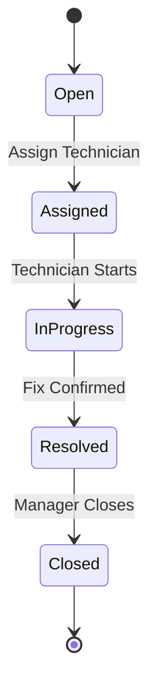

### 21.6.6 Feature: Reports

**Purpose:** Operational Reports (task throughput, request-to-resolution time), Staff Reports (attendance %, task completion rate), Occupancy Reports (read-only view of the same occupancy analytics Owner sees in §2.6.8, without financial figures).

## 21.7 UI Requirements

Mobile-first task-board layout (Kanban-style columns: Pending/Assigned/In Progress/Complete) for Housekeeping/Maintenance dispatch; staff-availability strip showing on-shift avatars; identical empty/loading/error-state conventions as §1.7/§2.7.

## 21.8 Database Mapping

Manager reads/writes the same core tables as Owner (`bookings`, `rooms`, `housekeeping_tasks`, `maintenance_tickets`, `staff`, `staff_shifts`) — no separate Manager-owned tables exist; access is scoped purely by the Permission Registry (§21.5) applied against the same schema described in §2.8.

## 21.9 Security Rules

Manager JWT carries the same `property_ids` scoping as Owner (§2.9) plus the specific granted-permission set; a Manager token can never reach `payment.*`, `staff.create`, or `settings.*` endpoints even if the request is otherwise well-formed (403).

## 21.10 Audit Requirements

Task assignment, booking modification, and maintenance-issue closure all log actor, action, before/after snapshot — identical structure to §1.10/§2.10.

## 21.11 Notifications

| Trigger | Recipient | Channel |
|---|---|---|
| Task assigned to staff | Assigned staff member | In-App + Push |
| Maintenance issue closed | Owner (if issue was high-priority) | In-App |
| New unassigned guest request pending >15 min | Manager | Push |

## 21.12 Acceptance Criteria (Module-Level)

- [ ] A Manager account with only the default permission set cannot cancel a booking or collect a payment (403).
- [ ] All Manager actions are traceable in the property's audit log identically to Owner/Receptionist actions.

---

# 22. MODULE 6 — RECEPTIONIST (APP)

## 22.1 Module Overview

**Purpose:** The Receptionist is the primary front-desk operator: guest registration/verification, booking creation, check-in/check-out execution, and payment collection at the counter.

**Business Value:** Directly drives the guest-facing speed and accuracy of arrival/departure — the highest-friction moments in the guest journey — and is the primary data-entry point for new guest and booking records.

**Problem It Solves:** Manual paper registers and disconnected booking sheets cause double-bookings, slow check-in, and untracked payments; Receptionist consolidates all three into one guided flow.

**Dependencies:** Guest Service, Booking Service, Room Service, Payment Service, Document/OCR Service, Notification Service, Audit Service, Offline Data Layer (§15).

**Actors**

| Actor | Type |
|---|---|
| Receptionist | Primary User |
| Guest | Secondary User (subject of registration/booking/payment) |
| Manager, Owner | Secondary Users (oversight/override authority) |

**Access:** App-only (§0.3).

## 22.2 Business Objectives

1. Reduce average check-in time to under 3 minutes per guest, including ID verification.
2. Achieve zero unregistered/unverified guests occupying a room (KYC compliance).
3. Ensure 100% of counter payments are recorded with a generated invoice at time of collection.

## 22.3 Scope

**In Scope:** Receptionist Dashboard, Guest registration/verification/ID upload/OCR, Booking creation/edit/confirm/history, Check-In/Check-Out execution, Payment collection/invoice generation/receipt printing, Room status viewing.

**Out of Scope:** Refund approval (Owner-only, §2.6.5), staff management, reporting beyond their own shift's booking history, room pricing/inventory configuration (Owner-only, §2.6.2).

## 22.4 User Stories

- As a Receptionist, I want to scan a guest's ID and have the name auto-filled via OCR, so registration is fast and accurate.
- As a Receptionist, I want to create a booking and collect an advance payment in one flow, so the guest isn't kept waiting.
- As a Receptionist, I want to see today's arrivals and departures on my dashboard, so I can prepare rooms and paperwork in advance.
- As a Receptionist, I want to print a receipt immediately after collecting payment, so the guest has physical proof.

## 22.5 Permission Registry — Receptionist Module

| Resource | Permissions Exposed |
|---|---|
| `receptionist.dashboard` | `view` |
| `guest` | `register`, `verify`, `upload_document`, `view` |
| `booking` | `create`, `edit`, `confirm`, `view_history` |
| `checkinout` | `checkin`, `checkout` |
| `payment` | `collect`, `generate_invoice`, `print_receipt` |
| `room` | `view_status` |

No `delete`, `refund.approve`, `export`, or `cancel` permissions — these remain with Owner/Manager per §2.5/§21.5.

## 22.6 Functional Requirements

### 22.6.1 Feature: Dashboard

**Outputs:** Today's Arrivals (with expected time, room pre-assignment status), Today's Departures, Available Rooms (live count, filterable by type).

### 22.6.2 Feature: Guest Registration & Verification

**Purpose:** Capture and verify a guest's identity at the point of booking or check-in.

**Inputs:** Full Name, Mobile, Email (optional), ID Document Type + Upload (Aadhaar/Passport/Driving License/Other), Address.

**Workflow:**
```
Input -> Upload ID document (camera capture or file) -> OCR extraction (name, ID number, DOB)
   -> Compare OCR-extracted name against manually entered name
   -> Match -> verification_status=verified
   -> Mismatch -> verification_status=mismatch_flagged, Receptionist prompted to manually confirm/override with reason
   -> Save guest record -> Audit Log
```

**Validations:** ID document image ≤5MB, jpg/png/pdf; Mobile per the global E.164 rule (§6); Full Name 2–120 characters.

**Business Rules:** A guest cannot be checked in (§22.6.4) while `verification_status = pending` — verification (auto or manually overridden) must resolve first. A manual override on a mismatch requires a reason code (≥10 characters) and is separately audit-logged as an elevated action.

**Offline Behaviour:** OCR runs on-device where a local OCR model is available (lightweight, per §15.8's weight budget) to keep registration functional with zero connectivity; if on-device OCR is unavailable on a given device, verification falls back to manual-only entry with `verification_status=manual_pending_ocr`, reconciled server-side on next sync.

**Nationality Branching:** Registration requires the Receptionist to select `nationality_status` (Indian National / Foreign National) up front. Indian Nationals proceed with the standard proof set above. Foreign Nationals require the additional mandatory passport/visa field set and trigger the automatic Form C / FRRO compliance workflow at check-in — see **Section 28** for the complete specification.

**Acceptance Criteria:**
- [ ] A guest with `verification_status=pending` cannot be checked in.
- [ ] OCR mismatch requires an explicit reason before the Receptionist can proceed.

### 22.6.3 Feature: Booking Creation/Edit/Confirm/History

**Purpose:** Identical underlying feature to Owner's Booking Management (§2.6.3), invoked here by the Receptionist actor with the Receptionist's permission scope (no Cancel).

**Business Rule:** Booking History view is scoped to bookings the Receptionist's property has access to, not filtered further by "created by me" — front-desk staff need full property booking visibility across shifts.

### 22.6.4 Feature: Check-In / Check-Out (Execution)

**Purpose:** Execute the check-in/out transition defined in §2.6.4, without the Owner-level override capability (a Receptionist facing a blocked check-in due to outstanding balance or unverified guest must escalate to Manager/Owner for an override, they cannot self-override).

**Workflow:**
```
Booking selected -> Validate guest verification_status=verified -> Validate payment threshold met (§2.6.4 rule)
   -> If blocked -> Receptionist sees "Escalate to Manager/Owner" action (raises an in-app request, does not silently fail)
   -> If clear -> Execute check-in -> Room status -> occupied -> Audit Log -> Guest welcome notification (§3.12)
```

**Acceptance Criteria:**
- [ ] A Receptionist blocked by the outstanding-balance rule sees an explicit escalation path, not a dead-end error.

### 22.6.5 Feature: Payment Collection

**Purpose:** Record payment at the counter and generate accompanying documentation.

**Inputs:** Invoice, Amount, Method (Cash/UPI/Card/Bank), Reference Number (non-cash).

**Workflow:** Identical to Owner's Payment feature (§2.6.5) for the `collect` and `generate_invoice`/`print_receipt` actions; `refund.approve` is not exposed to this role.

**Business Rule:** Print Receipt is available only after a payment has been successfully recorded (not a pre-payment "preview" print that could be mistaken for a real receipt) — the printed receipt always carries the server-confirmed payment ID.

**Acceptance Criteria:**
- [ ] A receipt can never be printed for a payment that has not been confirmed server-side (or, offline, locally queued with a valid pending sync record — never for an unattempted payment).

### 22.6.6 Feature: Room Status Viewing

**Purpose:** Read-only live view of every room's current status (available/occupied/dirty/cleaning/blocked/maintenance) to inform walk-in and check-in decisions.

## 22.7 UI Requirements

Fast, keyboard/camera-optimized single-screen flows (Register Guest → Create Booking → Collect Payment as a linear guided sequence with the option to jump between steps); large "Check In" / "Check Out" buttons on the day's arrival/departure list; receipt print preview before physical print.

## 22.8 Database Mapping

Reads/writes `guests`, `guest_documents`, `bookings`, `invoices`, `payments`, `rooms` — same schema as §2.8/§3.8, scoped by the Receptionist's granted permissions.

## 22.9 Security Rules

ID document uploads are encrypted at rest identically to Guest Portal uploads (§3.10); Receptionist's own access to view a guest's uploaded ID is itself access-logged (§1.10 pattern), since front-desk staff handling PII is itself an auditable event.

## 22.10 Audit Requirements

Guest registration, verification overrides, booking creation/edit, check-in/out execution, and payment collection are all logged with actor, action, before/after, timestamp, IP, device.

## 22.11 Notifications

| Trigger | Recipient | Channel |
|---|---|---|
| Guest registered with mismatch override | Manager (informational) | In-App |
| Payment collected | Guest (if contact on file) | Email/WhatsApp, `payment_receipt_v1` (§3.12) |
| Check-in escalation raised | Manager/Owner | Push (high priority) |

## 22.12 Acceptance Criteria (Module-Level)

- [ ] Receptionist cannot approve a refund or cancel a booking under any UI path (403 server-side even if attempted directly against the API).
- [ ] Every guest registered by a Receptionist is retrievable in Owner's Guest Management (§2.6.5) immediately, online or after next sync.

---

# 23. MODULE 7 — HOUSEKEEPING (APP)

## 23.1 Module Overview

**Purpose:** The Housekeeping role manages the physical readiness of rooms — cleaning task execution, guest service-request fulfillment (towels, pillows, extra bed, luggage), property-issue reporting, and Lost & Found handling.

**Business Value:** Directly determines room-turnaround speed (the interval between checkout and the room becoming bookable again), which is a core driver of achievable occupancy on high-turnover properties.

**Problem It Solves:** Without a structured task queue, housekeeping coordination relies on verbal handoffs or paper checklists that are invisible to Owner/Manager and cannot trigger downstream events (e.g., automatically flagging a damaged fixture to Maintenance).

**Dependencies:** Room Service, Guest Request Service (§3.6.4), Maintenance Service, Notification Service, Audit Service, Offline Data Layer (§15).

**Actors**

| Actor | Type |
|---|---|
| Housekeeping Staff | Primary User |
| Manager, Owner | Secondary Users (task assignment, oversight) |
| Guest | Secondary User (originates service requests) |
| Maintenance | Secondary User (recipient of property-issue escalations) |

**Access:** App-only (§0.3).

## 23.2 Business Objectives

1. Reduce average room-turnaround time (checkout → available) to a property-configured SLA target.
2. Ensure zero guest service requests (towels, pillows, etc.) go unacknowledged beyond a configured response window.
3. Ensure 100% of property-damage observations made during cleaning are captured as Maintenance tickets, not lost to informal reporting.

## 23.3 Scope

**In Scope:** Housekeeping Dashboard, Cleaning (Room/Deep Cleaning, Laundry), Guest Request fulfillment, Property Issue reporting (with photo upload), Lost & Found, Task Status lifecycle (Accept/Start/Complete/Close).

**Out of Scope:** Task *assignment* (Manager/Owner-only, §21.6.5/§2.6.7) — Housekeeping receives and executes tasks, it does not self-assign across other staff members; room pricing/inventory configuration; guest payment/booking data beyond what's needed to identify the room/request.

## 23.4 User Stories

- As a Housekeeping staff member, I want to see my assigned tasks in priority order, so I know what to do next.
- As a Housekeeping staff member, I want to report a broken AC unit with a photo directly from the room, so Maintenance is notified immediately without me having to find a supervisor.
- As a Housekeeping staff member, I want to register a found item with a photo, so it can be matched to a guest inquiry later.
- As a Manager, I want a Housekeeping task I assigned to show its full Accept → Start → Complete → Close lifecycle, so I can verify SLA compliance.

## 23.5 Permission Registry — Housekeeping Module

| Resource | Permissions Exposed |
|---|---|
| `housekeeping.dashboard` | `view` |
| `housekeeping.task` | `view_assigned`, `accept`, `start`, `complete`, `close` |
| `guest_request.fulfillment` | `view`, `update_status` (cleaning, extra towels/pillow/bed, luggage take-in/out) |
| `property_issue` | `report` (with photo), `view_own_reported` |
| `lost_found` | `register`, `upload_photo`, `mark_returned` |

Housekeeping does not receive `housekeeping.task.assign` — that permission belongs to Manager/Owner (§21.5/§2.5).

## 23.6 Functional Requirements

### 23.6.1 Feature: Dashboard

**Outputs:** Assigned Tasks (queued to this staff member), Pending Tasks (accepted but not started), Completed Tasks (today's shift).

### 23.6.2 Feature: Cleaning (Room Cleaning, Deep Cleaning, Laundry)

**Purpose:** Execute the room-readiness workflow triggered by checkout (§2.6.4) or scheduled deep-cleaning.

**Inputs:** Task ID, Task Type (Room Cleaning/Deep Cleaning/Laundry), Checklist items (property-configurable, e.g. "Bathroom sanitized," "Linens changed," "Minibar restocked").

**Workflow:**
```
Checkout event (§2.6.4/§4 matrix) -> Housekeeping task auto-created (status=pending, type=room_cleaning)
   -> Manager/Owner assigns to on-shift staff (§21.6.5) -> Staff sees task in Assigned Tasks
   -> Accept -> Start -> [complete checklist items] -> Complete
   -> Room status transitions dirty -> cleaning -> available (per §2.6.2 room state machine)
   -> Close (Manager/Owner or auto-close on Complete, per property configuration)
```

**Business Rules:** A room cannot return to `available` status until its cleaning task reaches `Complete` — this is the same rule already encoded in §2.6.2's room state machine, executed here from the Housekeeping actor's action. Deep Cleaning tasks do not block a room's day-to-day booking availability unless explicitly configured to (property setting) since deep cleaning is often scheduled during a vacancy window rather than blocking bookability outright.

**Acceptance Criteria:**
- [ ] Completing a Room Cleaning task transitions the associated room to `available` within the same transaction (no intermediate window where the room is neither cleaning nor available).

### 23.6.3 Feature: Guest Requests (Cleaning, Extra Towels/Pillow/Bed, Luggage Take-in/Take-out)

**Purpose:** Fulfill service requests originated either by a Guest via the Guest Portal (§3.6.4) or created directly by front-desk/Manager on a guest's behalf.

**Workflow:** Identical downstream fulfillment mechanics to §3.6.4's request lifecycle (`pending → assigned → in_progress → completed`); Housekeeping's role here is executing the `assigned → in_progress → completed` transitions once Manager/Owner or an auto-assignment rule has routed the request to them.

**Business Rule:** Extra Bed/Extra Towel requests that carry a charge (per §3.6.4's business rule) are marked `completed` only after physical delivery is confirmed by the Housekeeping staff member — the charge itself was already applied to the guest folio at request-creation time (§3.6.4), so this step is fulfillment confirmation, not a second billing trigger.

### 23.6.4 Feature: Property Issues (Broken Furniture, Plumbing, Electrical, AC, TV, Water Leakage)

**Purpose:** Let Housekeeping staff report a physical property defect discovered during cleaning, with photo evidence, feeding directly into the Maintenance module.

**Inputs:** Issue Category (Broken Furniture/Plumbing/Electrical/AC/TV/Water Leakage/Other), Room/Location, Description, Photo(s) (≤5MB each, jpg/png).

**Workflow:**
```
Input -> Create property_issue record -> Auto-create linked Maintenance ticket (status=open)
   -> Notify Maintenance staff + Manager -> Room optionally auto-flagged `maintenance` if the
      issue makes the room unbookable (e.g. water leakage), per property-configurable severity mapping
   -> Audit Log
```

**Business Rule:** This is the same Housekeeping → Maintenance event already defined in the cross-module communication matrix (§4: "Housekeeping ↓ Maintenance — Room Damaged"); this section specifies its Housekeeping-side trigger conditions and severity-to-room-status mapping in full.

**Acceptance Criteria:**
- [ ] A Water Leakage report with severity mapped to "unbookable" automatically transitions the room to `maintenance` status, removing it from availability search immediately.

### 23.6.5 Feature: Lost & Found

**Purpose:** Register items found during cleaning/turnover, track them until returned.

**Inputs (Register Item):** Description, Location Found, Room Number, Photo.

**Workflow:** `Register Item → (status=unclaimed) → Guest/Front-Desk inquiry matches item → Mark Returned (status=returned, returned_to captured)`.

**Business Rule:** Items unclaimed beyond a property-configured retention period (default 90 days) are flagged for Owner review/disposal decision — never auto-deleted, since Lost & Found records are potential dispute evidence.

### 23.6.6 Feature: Task Status Lifecycle (Accept, Start, Complete, Close)

**Purpose:** A uniform status model applied across Cleaning, Guest Request fulfillment, and (contributing to) Property Issue/Maintenance tasks, giving Manager/Owner consistent SLA visibility regardless of task type.

**State Machine — Generic Housekeeping Task:**

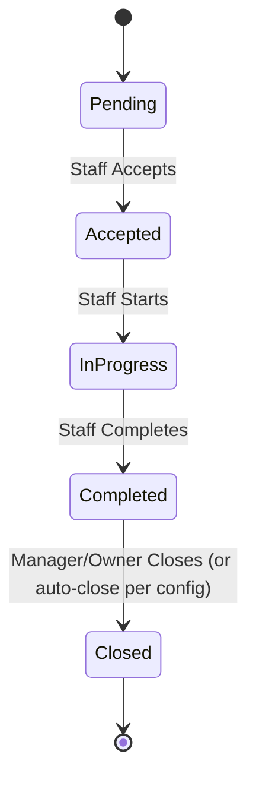

**Business Rule:** A task cannot skip from `Pending` directly to `Completed` — every intermediate transition must be recorded (even if compressed to seconds apart) so completion-time analytics (§21.6.6/§2.6.8's Housekeeping Reports) reflect genuine work duration, not a post-hoc bulk update.

**Acceptance Criteria:**
- [ ] Task-status transitions always move forward through the defined state machine; a client attempting to set `status=completed` on a `pending` task without passing through `accepted`/`in_progress` is rejected (409) by the Booking/Task Service, not merely discouraged in the UI.

## 23.7 UI Requirements

Task-card list (swipeable Accept/Start/Complete actions) sorted by priority/room-proximity; camera-first flow for Property Issues and Lost & Found (photo capture is the primary action, not an optional attachment); offline-capable throughout per §15.

## 23.8 Database Mapping

`housekeeping_tasks` (FK `room_id`, `assigned_staff_id`, `status`), `service_requests` (shared with §3.8, `fulfilled_by` FK), `property_issues` (FK `maintenance_ticket_id`), `lost_found_items` (FK `room_id`, `status`).

## 23.9 Security Rules

Photo uploads for Property Issues/Lost & Found are stored in the same encrypted object storage as other document uploads; Housekeeping staff cannot view guest payment/billing data — their guest-facing context is limited to room number and request details only.

## 23.10 Audit Requirements

Every task status transition, property-issue report, and lost & found registration logs actor, action, timestamp, room/entity reference, and (for issue reports) photo storage reference.

## 23.11 Notifications

| Trigger | Recipient | Channel |
|---|---|---|
| Task assigned | Housekeeping staff | Push |
| Property Issue reported (high severity) | Maintenance + Manager | Push (high priority) |
| Guest request fulfilled | Guest | In-App (portal, §3.12) |
| Lost & Found item registered | Manager | In-App |

## 23.12 Acceptance Criteria (Module-Level)

- [ ] Housekeeping cannot self-assign a task to another staff member (403) — only Manager/Owner can assign.
- [ ] Every Property Issue report results in exactly one linked Maintenance ticket, never zero or duplicate tickets for the same report submission (idempotency-key guarded, consistent with §15.3's offline mutation pattern).

---

# 24. MODULE 8 — KITCHEN (APP)

## 24.1 Module Overview

**Purpose:** The Kitchen role manages the food/room-service order pipeline from acceptance through delivery, and exposes basic billing visibility for orders served.

**Business Value:** Converts ad-hoc phone/verbal food ordering into a trackable queue with clear status states, reducing missed or duplicated orders and giving Owner/Manager visibility into kitchen throughput.

**Problem It Solves:** Without a structured order queue, room-service requests placed via the Guest Portal (§3.6.4) or front desk have no reliable hand-off mechanism to kitchen staff.

**Dependencies:** Guest Request Service (§3.6.4), Payment/Folio Service (order amounts append to guest folio), Notification Service, Audit Service, Offline Data Layer (§15).

**Actors**

| Actor | Type |
|---|---|
| Kitchen Staff | Primary User |
| Guest | Secondary User (order originator) |
| Manager, Owner | Secondary Users (oversight) |

**Access:** App-only (§0.3).

## 24.2 Business Objectives

1. Reduce order-to-delivery time visibility gap to zero — every order's current state is always queryable.
2. Ensure zero orders are billed without being delivered, and zero deliveries occur without a corresponding bill line.

## 24.3 Scope

**In Scope:** Kitchen Dashboard, Order lifecycle (Accept/Reject/Prepare/Ready/Delivered), Billing (view bills tied to delivered orders).

**Out of Scope:** Menu/pricing configuration (Owner-only, part of Room/Amenity-adjacent Settings, §2.6.9), payment collection (Receptionist/Owner, §2.6.5/§22.6.5), inventory/stock management beyond the existing Kitchen → Inventory event already defined in the communication matrix (§4).

## 24.4 User Stories

- As Kitchen staff, I want to see all pending orders in one queue, so nothing is missed during a rush.
- As Kitchen staff, I want to reject an order that can't be fulfilled (item out of stock), so the guest and front desk are notified immediately rather than waiting indefinitely.
- As a Manager, I want to see which orders are still "Ready" but not yet "Delivered," so I can chase down room-service delivery delays.

## 24.5 Permission Registry — Kitchen Module

| Resource | Permissions Exposed |
|---|---|
| `kitchen.dashboard` | `view` |
| `kitchen.order` | `accept`, `reject`, `prepare`, `mark_ready`, `mark_delivered` |
| `kitchen.billing` | `view_bills` |

## 24.6 Functional Requirements

### 24.6.1 Feature: Dashboard

**Outputs:** Active Orders (currently in Accepted/Preparing/Ready states), Pending Orders (awaiting Accept/Reject decision).

### 24.6.2 Feature: Order Lifecycle

**Purpose:** Move a food order from creation (via Guest Portal §3.6.4 or front-desk-entered) through to delivery.

**Inputs:** Order ID, Action (Accept/Reject/Prepare/Ready/Delivered), Rejection Reason (required if Reject).

**Workflow:**
```
Order created (Guest Portal §3.6.4 or Receptionist-entered) -> status=pending
   -> Kitchen Accept -> status=accepted (or Reject -> status=rejected, reason required,
      guest/front-desk notified, no charge applied/charge reversed if it had been pre-added to folio)
   -> Prepare -> status=preparing
   -> Ready -> status=ready (triggers delivery-staff notification, typically Housekeeping/Bell-Desk
      per property configuration)
   -> Delivered -> status=delivered -> Billing line finalized against guest folio
```

**Business Rules:** An order cannot move directly from `pending` to `ready`/`delivered` — every intermediate state must be recorded, mirroring the Housekeeping task-status rule (§23.6.6), for the same operational-analytics reason. Rejecting an order that had already been added to the guest's folio (§3.6.4's business rule that food orders append to the folio at creation time) automatically reverses that folio line — a rejected order is never left as a phantom charge.

**Notifications:**

| Trigger | Recipient | Channel |
|---|---|---|
| Order accepted/rejected | Guest | In-App (portal) |
| Order ready | Delivery-responsible staff (Housekeeping/Bell-Desk per config) | Push |
| Order delivered | Guest (order-complete confirmation) | In-App |

**Acceptance Criteria:**
- [ ] A rejected order that had an associated folio charge results in that charge being reversed within the same transaction as the rejection.
- [ ] Order status can never regress backward (e.g. `ready → pending`) — only forward transitions or the terminal `rejected` state are permitted.

**State Machine — Kitchen Order:**

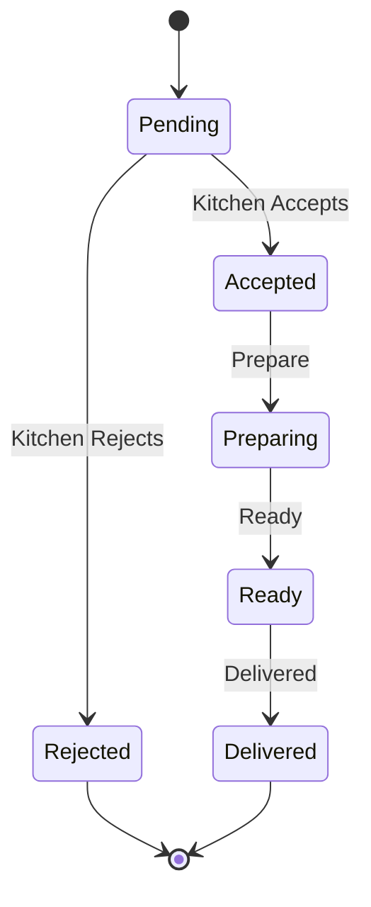

### 24.6.3 Feature: Billing (View Bills)

**Purpose:** Read-only visibility into the billing lines generated from delivered orders, for Kitchen staff's own reconciliation/awareness — not an edit or collection capability (Payment collection remains Receptionist/Owner-only, §22.6.5/§2.6.5).

## 24.7 UI Requirements

Kanban-style order board (Pending/Preparing/Ready/Delivered columns), large accept/reject buttons optimized for a kitchen environment (glove-friendly touch targets), audible/vibration alert on new pending order.

## 24.8 Database Mapping

`kitchen_orders` (FK `booking_id`, `room_id`, `status`), `kitchen_order_items` (FK `order_id`, menu item, quantity, price at time of order), shared `invoices`/`payments` tables for folio integration (§2.8/§3.8).

## 24.9 Security Rules

Kitchen staff access is scoped to order/menu-item data only — no guest payment-method or ID-document visibility.

## 24.10 Audit Requirements

Every order status transition logs actor, action, timestamp, order reference; rejections additionally log the mandatory reason.

## 24.11 Acceptance Criteria (Module-Level)

- [ ] Kitchen staff cannot collect payment or modify menu pricing under any UI path (403 server-side).
- [ ] Reduce Stock event (§4 matrix, "Kitchen ↓ Inventory") fires exactly once per order reaching `preparing`, never duplicated across a retried offline sync (idempotency-key guarded per §15.3).

---

# 25. MODULE 9 — ACCOUNTANT (APP)

## 25.1 Module Overview

**Purpose:** The Accountant role manages the property's financial record-keeping — transaction categorization, GST reporting/filing support, profit & loss and cash-flow reporting, and invoice generation/printing — distinct from Payment *collection*, which remains a Receptionist/Owner front-desk function.

**Business Value:** Gives Owners audit-ready books without manual reconciliation, and produces the statutory GST reports required for tax filing directly from operational transaction data rather than a separate spreadsheet exercise.

**Problem It Solves:** Hospitality properties frequently reconcile cash/UPI/card/bank transactions manually at month-end, leading to errors and delayed GST filing; Accountant continuously categorizes and reconciles as transactions occur.

**Dependencies:** Payment Service (read), Invoice Service, Report Service, Notification Service, Audit Service, Offline Data Layer (§15).

**Actors**

| Actor | Type |
|---|---|
| Accountant | Primary User |
| Owner | Secondary User (recipient of financial reports, retains refund-approval authority) |

**Access:** App-only (§0.3).

## 25.2 Business Objectives

1. Achieve same-day transaction categorization (Credit/Debit/Expense/Income) for 100% of the day's payment activity.
2. Produce a GST-compliant report set ready for filing without manual data re-entry.
3. Ensure every generated invoice is immutably linked to its source payment record (no orphaned or manually-fabricated invoices).

## 25.3 Scope

**In Scope:** Accountant Dashboard, Transactions (Cash/UPI/Card/Bank recording and reconciliation view), Accounting (Credit/Debit/Expense/Income categorization), GST (Reports/Filing support), Reports (Profit & Loss/Cash Flow/Monthly), Invoice (Generate/Print/Download).

**Out of Scope:** Payment *collection* at the counter (Receptionist/Owner, §22.6.5/§2.6.5), refund approval (Owner-only, §2.6.5's segregation-of-duties rule), booking/room management.

## 25.4 User Stories

- As an Accountant, I want to see today's collection broken down by payment method, so I can reconcile against the cash drawer.
- As an Accountant, I want to record a property expense (e.g. laundry supplier invoice), so it's reflected in Profit & Loss.
- As an Accountant, I want to generate the GST report for a given month, so I can hand it directly to a filing agent.
- As an Owner, I want to see Outstanding Payments alongside today's collection, so I understand true cash position, not just what's been received.

## 25.5 Permission Registry — Accountant Module

| Resource | Permissions Exposed |
|---|---|
| `accountant.dashboard` | `view` |
| `transaction` | `view`, `reconcile` |
| `accounting.entry` | `create` (credit/debit/expense/income), `edit` (only same-day, unposted entries — see business rules), `view` |
| `gst.report` | `view`, `generate`, `export` |
| `gst.filing` | `prepare_filing_package` |
| `report.financial` | `view`, `export` (Profit & Loss, Cash Flow, Monthly) |
| `invoice` | `generate`, `print`, `download` |

Accountant does **not** receive `payment.collect` or `payment.refund.approve` — those remain Receptionist/Owner-scoped, preserving the segregation-of-duties principle already established in §2.6.5 (the person who records the books is not the same authority who authorizes money movement).

## 25.6 Functional Requirements

### 25.6.1 Feature: Dashboard

**Outputs:** Today's Collection (by method), Outstanding Payments (aggregate, feeding into the same figure Owner sees in §2.6.1), Expenses (today's recorded).

### 25.6.2 Feature: Transactions (Cash, UPI, Card, Bank)

**Purpose:** Read and reconcile the payment records generated by Receptionist/Owner payment collection (§22.6.5/§2.6.5) — Accountant does not create the underlying payment record (that requires `payment.collect`), but reconciles it against actual bank/cash-drawer figures.

**Workflow:**
```
Payment collected (Receptionist/Owner action, §22.6.5) -> appears in Accountant's Transaction list
   -> Accountant marks reconciled=true once verified against physical/bank records
   -> Discrepancy flagged if reconciliation amount doesn't match recorded amount -> Owner notified
```

**Business Rule:** Accountant can flag a discrepancy but cannot unilaterally alter the original payment record — correcting a genuine data-entry error on a payment requires the same credit-note mechanism already defined in §2.6.5 (payments/invoices are immutable once created).

### 25.6.3 Feature: Accounting (Credit, Debit, Expense, Income)

**Purpose:** Categorize and record the property's broader financial ledger beyond guest-payment transactions — supplier expenses, miscellaneous income, manual credit/debit adjustments.

**Inputs:** Entry Type (Credit/Debit/Expense/Income), Amount, Category, Date, Description, Supporting Document (optional upload).

**Validations:** Amount > 0; Category from a Super-Admin- or Owner-configured category list (not free text, to keep GST/report categorization consistent); Date cannot be in the future.

**Business Rules:** An accounting entry can be edited by its creator only on the same calendar day it was created and only while `posted=false`; once a day rolls over (or the entry is included in a generated GST/financial report), it becomes immutable and any correction requires a new offsetting entry — mirroring the invoice-immutability principle in §2.6.5, applied to the general ledger.

**Acceptance Criteria:**
- [ ] An entry from a prior day cannot be edited in place; only a new offsetting entry can correct it.

### 25.6.4 Feature: GST (Reports, Filing)

**Purpose:** Generate GST-compliant summary reports from the period's transaction and accounting-entry data, and prepare a filing-ready export package.

**Inputs:** Reporting Period (month/quarter, per property's configured GST filing cycle).

**Outputs:** GST Report (tax collected, tax paid, net liability, itemized by rate slab per the property's Tax Settings, §2.6.9), Filing Package (structured export in the format required by the applicable GST filing process/portal).

**Business Rule:** GST figures are computed only from finalized (posted) transactions and accounting entries as of the report-generation moment — a report generated mid-day does not include same-day unposted entries, and regenerating the same period later will reflect any entries posted since, with the discrepancy between two generations itself logged for audit clarity.

### 25.6.5 Feature: Reports (Profit & Loss, Cash Flow, Monthly Reports)

**Purpose:** Standard financial statements derived from the categorized ledger (§25.6.3) plus guest-payment transaction data (§25.6.2).

**Outputs:** Profit & Loss (revenue minus categorized expenses over a period), Cash Flow (cash-position movement by day/week/month), Monthly Reports (composite summary).

### 25.6.6 Feature: Invoice (Generate, Print, Download)

**Purpose:** Produce guest-facing or internal invoices from confirmed payment/booking data — the same underlying invoice generation used elsewhere (§2.6.5, §3.6.5), exposed here for Accountant's back-office use (e.g. regenerating a copy, producing a consolidated monthly invoice summary for a corporate account).

**Business Rule:** Generate never creates a new financial obligation — it only renders a document from already-existing, immutable payment/invoice data; Accountant cannot use this feature to fabricate an invoice unlinked to a real payment record.

## 25.7 UI Requirements

Data-table-first layout (transaction ledger, accounting entries) with strong filtering (date range, category, method, reconciliation status); GST report screen with a clear "Generated At" timestamp and a locked/immutable visual state once a period has been filed.

## 25.8 Database Mapping

`accounting_entries` (FK `property_id`, `category_id`, `posted` boolean), `gst_reports` (FK `property_id`, period, generated_at, snapshot data), `transaction_reconciliation` (FK `payment_id`, `reconciled_by`, `reconciled_at`, `discrepancy_amount`), shared `invoices`/`payments` (§2.8).

## 25.9 Security Rules

Accountant role never receives `payment.refund.approve` or `payment.collect` regardless of any Owner-side permission customization attempt beyond the defined registry boundaries relevant to segregation of duties — this specific pairing is enforced as a hard constraint in the RBAC engine (§0.2), not merely a default Owner can silently override, since it protects against a single actor both recording and authorizing money movement.

## 25.10 Audit Requirements

Every accounting entry creation, reconciliation action, and GST report generation is logged with actor, action, before/after (for entries), timestamp, and — for GST reports — the exact snapshot of data included, since regulatory reports must be reproducible/defensible after the fact.

## 25.11 Acceptance Criteria (Module-Level)

- [ ] Accountant cannot collect a payment or approve a refund under any configuration (hard RBAC constraint, not merely an unchecked default).
- [ ] A GST report, once generated for a filed period, is retrievable byte-identical on subsequent views (immutable snapshot, not a live recomputation that could silently drift).

---

# 26. MODULE 10 — SECURITY GUARD (APP)

## 26.1 Module Overview

**Purpose:** The Security Guard role manages physical premises security: visitor entry/exit logging and guest verification at the gate, vehicle/parking tracking, and incident reporting.

**Business Value:** Provides a verifiable, timestamped record of who entered/exited the property and when, supporting both guest safety and post-incident investigation, and reduces unauthorized-visitor risk by tying gate verification into the same guest/booking data used at check-in.

**Problem It Solves:** Paper visitor registers are slow, illegible, and disconnected from the booking system, making it impossible to quickly confirm whether a visitor is actually associated with a current guest.

**Dependencies:** Guest/Booking Service (read, for verification), Notification Service, Audit Service, Offline Data Layer (§15).

**Actors**

| Actor | Type |
|---|---|
| Security Guard | Primary User |
| Guest, Visitor | Secondary Users (subjects of entry/exit/verification) |
| Manager, Owner | Secondary Users (incident recipients) |

**Access:** App-only (§0.3).

## 26.2 Business Objectives

1. Achieve a complete, timestamped visitor/vehicle log with zero unrecorded gate movements during a Guard's shift.
2. Enable sub-30-second guest verification at the gate against active booking data.
3. Ensure every security incident is captured with photo evidence at time of occurrence, not reconstructed later from memory.

## 26.3 Scope

**In Scope:** Security Guard Dashboard, Visitor Entry/Exit logging, Guest Verification (against booking data), Vehicle Parking Entry/Exit, Incident creation with photo upload.

**Out of Scope:** Booking/guest data modification (read-only verification access only), payment/financial data, staff/task management.

## 26.4 User Stories

- As a Security Guard, I want to verify a visitor claiming to be visiting Room 204 against the actual guest record, so I can confirm legitimacy before granting entry.
- As a Security Guard, I want to log a vehicle's parking entry with its plate number, so overstays or unregistered vehicles can be identified.
- As a Security Guard, I want to create an incident report with a photo directly from my phone, so evidence is captured immediately.
- As a Manager, I want to see all incidents logged during the night shift, so I can follow up each morning.

## 26.5 Permission Registry — Security Guard Module

| Resource | Permissions Exposed |
|---|---|
| `security.dashboard` | `view` |
| `visitor` | `log_entry`, `log_exit`, `verify_guest` |
| `vehicle` | `log_parking_entry`, `log_parking_exit` |
| `incident` | `create`, `upload_photo`, `view_own_reported` |

(Note: this `security.*` permission namespace is scoped to the physical-security domain and is entirely distinct from the `security.*` namespace used for the Super Admin Security Dashboard in §20 — the two are namespaced separately in implementation, e.g. `guard.visitor.*` vs. `platform.security.*`, to avoid any ambiguity between physical-premises security and platform account-security.)

## 26.6 Functional Requirements

### 26.6.1 Feature: Dashboard

**Outputs:** Visitors (currently on-premises count), Vehicles (currently parked count).

### 26.6.2 Feature: Visitors (Entry, Exit, Verify Guests)

**Purpose:** Log gate movement and verify a visitor's claimed association with a current guest/booking.

**Inputs (Entry):** Visitor Name, Mobile (optional), Purpose of Visit, Room/Guest being visited (searchable against active bookings), Photo (optional, gate camera or manual capture).

**Workflow (Verify Guest):**
```
Guard enters Room Number or Guest Name -> System queries active bookings (checked_in status only)
   -> Match found -> Guard sees guest name, room, stay dates (read-only, no payment/ID-document data exposed)
   -> No match -> Guard flagged "No active guest found" -> visitor entry can still be logged
      but is marked unverified_visit for Manager follow-up
```

**Business Rule:** Guard's verification query returns only the minimum data needed to confirm legitimacy (name, room, active-stay confirmation) — it explicitly does not expose guest payment status, ID document images, or contact details, since Security Guard has no operational need for that PII (data-minimization, consistent with the platform's broader PII-protection posture in §1.9/§3.10).

**Inputs (Exit):** Visitor ID (from the matching entry record), Exit Time (defaults to now).

**Acceptance Criteria:**
- [ ] A visitor logged as Entry without a subsequent Exit before shift-end is surfaced in the next shift's dashboard as still on-premises, not silently dropped.
- [ ] Verify Guest never returns guest payment, ID document, or contact-detail fields to the Security Guard role.

### 26.6.3 Feature: Vehicles (Parking Entry, Parking Exit)

**Purpose:** Log vehicle movement in/out of property parking.

**Inputs:** Vehicle Plate Number, Vehicle Type, Associated Guest/Room (optional), Entry/Exit Time.

**Business Rule:** A vehicle logged as parked beyond a property-configured overstay threshold (default 48 hours past the associated guest's checkout date, or indefinitely for non-guest-associated vehicles) is flagged for Manager review.

### 26.6.4 Feature: Incident (Create, Upload Photo)

**Purpose:** Capture a security-relevant event (altercation, suspicious activity, property damage witnessed, theft report) with contemporaneous evidence.

**Inputs:** Incident Category, Description, Location, Photo(s) (≤5MB each), Involved Parties (guest/visitor/staff, where identifiable).

**Workflow:**
```
Input -> Create incident record (status=reported) -> Upload photo(s) to encrypted object storage
   -> Notify Manager + Owner (high-priority) -> Audit Log
```

**Business Rule:** Incident reports are immutable once created (append-only) — a Guard can add a follow-up note but cannot edit or delete the original report, preserving evidentiary integrity; only Owner/Manager can mark an incident `resolved`, and doing so requires a resolution note.

## 26.7 UI Requirements

Simple, fast-entry forms optimized for gate/parking conditions (large touch targets, minimal required fields for routine entries, camera-first for incidents); live "currently on-premises" visitor/vehicle counter.

## 26.8 Database Mapping

`visitor_logs` (FK `property_id`, `associated_booking_id` nullable, entry/exit timestamps), `vehicle_logs` (FK `property_id`, plate_number, associated_booking_id nullable), `incidents` (FK `property_id`, `reported_by`, `status`, photo storage keys).

## 26.9 Security Rules

Guard's guest-verification query is rate-limited (30/minute) to prevent using the verification endpoint as a guest-directory enumeration tool; incident photos are encrypted at rest identical to other document uploads (§3.10/§22.9).

## 26.10 Audit Requirements

Every entry/exit log, verification query, and incident creation is logged with actor, action, timestamp, and entity reference; incident reports additionally retain a permanent, immutable audit trail given their evidentiary purpose.

## 26.11 Notifications

| Trigger | Recipient | Channel |
|---|---|---|
| Incident created | Manager + Owner | Push (high priority) |
| Vehicle overstay flagged | Manager | In-App |
| Unverified visitor logged | Manager | In-App |

## 26.12 Acceptance Criteria (Module-Level)

- [ ] Security Guard cannot view any guest payment, ID document, or contact-detail field under any UI or direct-API path (403/field-omitted server-side).
- [ ] Incident reports cannot be edited or deleted after creation by the reporting Guard — only Manager/Owner resolution actions are possible, and those are additive, not destructive.

---

# 27. MODULE 11 — BROKER (APP)

## 27.1 Module Overview

**Purpose:** The Broker role represents an external booking-referral partner (travel agent, corporate travel coordinator, local tour operator) who submits booking requests on behalf of clients and earns tracked commission, without holding any internal operational access.

**Business Value:** Formalizes an indirect sales channel with transparent, auditable commission tracking, incentivizing third-party referral volume without manual, error-prone commission reconciliation.

**Problem It Solves:** Broker-driven bookings are often tracked informally (phone calls, spreadsheets), leading to commission disputes and no visibility for the Broker into their own booking/lead pipeline.

**Dependencies:** Booking Service (request-only, not direct creation), Lead/CRM-lite Service, Commission/Payment Service, Notification Service, Audit Service.

**Actors**

| Actor | Type |
|---|---|
| Broker | Primary User |
| Owner/Manager/Receptionist | Secondary Users (approve/convert Broker's booking requests) |

**Access:** App-only (§0.3). Broker is the most restricted App role — it is external to the property's own staff and never receives operational permissions (no room/guest/payment-collection access).

## 27.2 Business Objectives

1. Give Brokers real-time visibility into their own lead-to-booking conversion and commission earnings, eliminating manual reconciliation requests.
2. Ensure commission is calculated consistently and automatically from confirmed (not merely requested) bookings.
3. Prevent any Broker from viewing another Broker's leads, bookings, or commission data.

## 27.3 Scope

**In Scope:** Broker Dashboard, Lead creation/status tracking, Booking Request creation and own-booking visibility, Commission earnings view and statement download.

**Out of Scope:** Direct booking creation/confirmation (a Broker *requests* a booking; Receptionist/Manager/Owner confirms it through the standard Booking flow, §2.6.3/§21.6.3/§22.6.3), any guest PII beyond what's needed to submit the request, payment collection, any other Broker's data.

## 27.4 User Stories

- As a Broker, I want to submit a booking request for my client, so the property can confirm it without me needing front-desk system access.
- As a Broker, I want to track the status of my leads, so I know which ones converted.
- As a Broker, I want to see my commission earnings and download a statement, so I can reconcile my own accounting.

## 27.5 Permission Registry — Broker Module

| Resource | Permissions Exposed |
|---|---|
| `broker.dashboard` | `view` |
| `lead` | `create`, `view_own_status` |
| `booking.request` | `create`, `view_own` |
| `commission` | `view_own_earnings`, `download_statement` |

Every Broker permission is implicitly scoped to `broker_id = self` at the data-access layer — there is no configuration path that grants a Broker visibility into another Broker's records; this is enforced structurally in the same way Guest sessions are scoped to a single `booking_id` (§3.5), not merely filtered in the UI.

## 27.6 Functional Requirements

### 27.6.1 Feature: Dashboard

**Outputs:** My Leads (count/status breakdown), My Bookings (confirmed count), My Commission (running total for current period).

### 27.6.2 Feature: Leads (Create, View Status)

**Purpose:** Track a prospective client relationship before it becomes a firm booking request.

**Inputs:** Client Name, Contact Info, Interested Dates/Room Type, Notes.

**Workflow:** `Create Lead → status=new → (Broker or property staff updates) → status=contacted/negotiating/converted/lost`.

**Business Rule:** A Lead reaching `converted` is expected to link to a corresponding Booking Request (§27.6.3); a Lead cannot be marked `converted` without that link, preventing inflated conversion metrics disconnected from actual bookings.

### 27.6.3 Feature: Booking (Create Booking Request, View Own Bookings)

**Purpose:** Submit a booking request for property staff to review and confirm — a Broker never directly creates a live, room-locking booking themselves (that authority remains with Receptionist/Manager/Owner, §22.6.3/§21.6.3/§2.6.3), since a Broker's request has not yet been validated against real-time availability with the same operational rigor, and should not be able to lock inventory unilaterally.

**Inputs:** Guest/Client Name, Contact Info, Requested Room Type, Check-In/Check-Out Dates, Special Requests, Source Lead (optional link).

**Workflow:**
```
Broker submits Booking Request -> status=pending_review
   -> Receptionist/Manager/Owner reviews -> checks real availability (same exclusion-constraint
      logic as §2.6.3) -> Confirms -> creates an actual Booking record (§2.6.3), linked back to
      this booking_request as its source, booking_source=broker
   -> Or Declines -> status=declined, reason provided, Broker notified
```

**Business Rule:** A Booking Request never itself locks room availability (unlike a confirmed Booking's exclusion constraint, §2.6.3) — it is purely a request queued for staff action, explicitly to prevent an external, less-trusted actor from being able to block inventory simply by submitting requests.

**Acceptance Criteria:**
- [ ] A pending Booking Request does not appear in, or affect, the room-availability calendar used by Receptionist/Owner (§2.6.3) — only a confirmed Booking does.
- [ ] Once a Booking Request is confirmed into a real Booking, the Broker's "View Own Bookings" reflects it immediately.

### 27.6.4 Feature: Commission (View Earnings, Download Statement)

**Purpose:** Transparent, self-service visibility into commission accrued from the Broker's converted bookings. The full calculation, accrual, and disbursement mechanics — including the percentage-based, real-time-on-payment model — are specified in full in **Section 29: Dynamic Broker Commission Engine**; this section covers the Broker's own view of the results.

**Outputs:** Wallet balance (available + pending), itemized `commission_transactions` list (each linked to its triggering booking and payment), downloadable statement (PDF, date-range filterable).

**Acceptance Criteria:**
- [ ] Commission Statement download reflects only the requesting Broker's own commission records, verified server-side against the authenticated Broker's `broker_id`, never accepting a client-supplied broker identifier.
- [ ] See Section 29.8 for the full commission-calculation acceptance criteria.

## 27.7 UI Requirements

Simple lead/request pipeline view (Kanban or list, filterable by status); commission summary card with period selector (this month/last month/custom range); statement download as PDF.

## 27.8 Database Mapping

`leads` (FK `broker_id`), `booking_requests` (FK `broker_id`, `lead_id` nullable, `converted_booking_id` nullable), `commissions` (FK `broker_id`, `booking_id`, `rate_applied`, `amount`, `status`: `provisional`/`qualified`/`reversed`).

## 27.9 Security Rules

Every Broker-scoped query mandatorily filters by the authenticated Broker's own `broker_id` at the repository layer (never trusted from client input) — identical structural pattern to Owner's `property_ids` scoping (§2.9) and Guest's `booking_id` scoping (§3.10).

## 27.10 Audit Requirements

Lead/Booking Request creation, status changes, and every commission calculation/reversal are logged with actor, action, before/after, timestamp.

## 27.11 Notifications

| Trigger | Recipient | Channel |
|---|---|---|
| Booking Request confirmed/declined | Broker | Email + In-App |
| Commission qualified (booking completed) | Broker | In-App |
| Commission reversed (booking cancelled) | Broker | In-App + Email |

## 27.12 Acceptance Criteria (Module-Level)

- [ ] A Broker Booking Request never locks room availability the way a confirmed Booking does.
- [ ] A Broker cannot, under any request payload manipulation, retrieve another Broker's leads, bookings, or commission data (mirrors the Guest Portal's isolation guarantee in §3.14).

---

# 28. FOREIGN GUEST COMPLIANCE — FORM C / FRRO REPORTING

## 28.1 Purpose & Scope Clarification

Within Pinesphere Stay, **"Form C" refers exclusively to the Indian Immigration (Foreigners Act) reporting requirement** — the document hotels, guest houses, and hosts must file for every foreign national staying at the property, submitted to the Foreigners Regional Registration Office (FRRO) or local police within 24 hours of arrival. This module has no relationship to, and does not implement, either the U.S. SEC Regulation Crowdfunding "Form C" Offering Statement or the (largely GST-superseded) Indian Central Sales Tax "C Form" — both are unrelated concepts that share only the name and are explicitly out of scope for this PRD.

**Purpose:** Ensure every foreign national guest is identified at registration, has the correct nationality-specific proof captured, and has a compliant Form C generated and tracked toward its 24-hour FRRO/police submission deadline — while Indian national guests follow a simpler, standard domestic KYC path.

**Business Value:** Removes manual FRRO paperwork and missed-deadline compliance risk (a legal exposure for the property) by making Form C generation an automatic consequence of guest registration rather than a separate administrative task staff must remember to perform.

**Dependencies:** Guest Service (§2.6.5/§22.6.2), Document/OCR Service (§3.6.6), Notification Service, Audit Service, Report Service.

## 28.2 Nationality-Branched Proof Requirement

Guest registration (Receptionist §22.6.2, and self-service Document upload in Guest Portal §3.6.6) now requires a `nationality_status` selection that determines which proof type is mandatory:

| Guest Type | Required Proof | Downstream Requirement |
|---|---|---|
| **Indian National** | Any one valid Indian government-issued proof of identity: Aadhaar, Voter ID (EPIC), Passport (Indian), Driving License, or other Indian-government-issued photo ID | Standard KYC only — no Form C obligation |
| **Foreign National** | Passport (mandatory) + Visa (mandatory) — Visa Number, Visa Type (Tourist/Business/Employment/etc.), Visa Issue Date, Visa Expiry Date, Port of Entry, Date of Entry into India | **Form C is automatically generated and must be submitted to FRRO/local police within 24 hours of check-in** (§28.3) |

**Validation Rules (additions to §6 Global Validation Rules):**

| Field | Min | Max | Regex/Format | Required (Foreign Nationals) |
|---|---|---|---|---|
| passport_number | 6 | 15 | `^[A-Z0-9]{6,15}$` | Yes |
| passport_expiry_date | — | — | date, must be > check_out_date | Yes |
| visa_number | 5 | 20 | alphanumeric | Yes |
| visa_type | — | — | enum (Tourist/Business/Employment/Student/Diplomatic/Other) | Yes |
| visa_expiry_date | — | — | date, must be ≥ check_out_date | Yes |
| nationality | 2 | 60 | ISO country name/code | Yes |
| port_of_entry | 2 | 100 | free text | Yes |
| date_of_entry_india | — | — | date, ≤ today | Yes |

**Business Rule:** A guest cannot be checked in (§2.6.4/§22.6.4) with `nationality_status = foreign_national` unless all mandatory passport/visa fields above are captured and `verification_status = verified` — this extends the existing "cannot check in unverified guest" rule (§22.6.2) with the additional foreign-national-specific field set. An Indian National guest is unaffected by this stricter set and follows the pre-existing verification rule only.

## 28.3 Form C Generation & FRRO Submission Workflow

**Purpose:** Automatically produce a compliant Form C the moment a foreign national guest's registration is verified, and track it against the mandatory 24-hour submission deadline.

**Workflow:**
```
Foreign National guest registered + verified (passport/visa fields complete, §28.2)
   -> Check-In executed (§2.6.4/§22.6.4)
   -> System auto-generates Form C record: guest details, passport/visa data, property details,
      arrival date/time, expected departure date -> status = generated, deadline = check_in_time + 24 hours
   -> Form C rendered as a submission-ready document (PDF, matching the FRRO-prescribed format)
   -> Property staff (Receptionist/Manager/Owner, per property configuration of who is
      responsible) submits it to the FRRO portal or local police station, then marks it
      submitted in-app with a submission reference/acknowledgment number
   -> status = submitted (on-time) or status = submitted_late (if past deadline) or
      status = overdue (deadline passed, not yet submitted -> escalating alerts, §28.4)
```

**Business Rules:**
- The 24-hour deadline is calculated from the guest's actual check-in timestamp, not the booking's scheduled check-in date, since the legal obligation is tied to actual arrival.
- A Form C cannot be edited after `status = submitted` — corrections require a linked amendment record referencing the original, preserving an accurate compliance trail (mirroring the invoice-immutability pattern in §2.6.5).
- If a foreign guest's stay is extended (booking edit, §2.6.3), the system flags whether an updated/supplementary Form C submission is required per property policy, since some jurisdictions require re-reporting on extension — this is a property-configurable flag rather than a hardcoded assumption, since exact FRRO practice can vary by state/jurisdiction.
- Departure of a foreign guest (check-out, §2.6.4) similarly triggers an optional departure-reporting flag per property configuration, matching the same jurisdiction-variability principle.

**Offline Behaviour:** Form C generation itself works fully offline (it is a document-rendering operation against already-captured local data, per §15); actual *submission* to the FRRO portal requires connectivity and is queued if attempted offline, with the 24-hour deadline clock continuing to run regardless of connectivity — staff are shown the deadline prominently so a connectivity gap does not silently cause a missed submission.

## 28.4 Compliance Tracking & Alerts

**Purpose:** Prevent missed FRRO deadlines through escalating, time-based alerts, and give Owner/Super Admin a compliance overview.

**Notifications:**

| Trigger | Recipient | Channel | Timing |
|---|---|---|---|
| Form C generated | Receptionist/Manager (responsible role per config) | In-App | Immediate |
| Form C approaching deadline | Responsible staff + Manager | Push | 6 hours before deadline |
| Form C overdue (not submitted, deadline passed) | Manager + Owner | Push + Email (high priority) | Immediately at deadline, then daily until resolved |

**Reporting:** A "Foreign Guest Compliance" report (feeding into §2.6.8 Owner Reports and §1.6.8 Global Reports for Super Admin's portfolio-wide view) shows: Form C generated/submitted/overdue counts, average time-to-submission, and a list of currently-open (unsubmitted) Form C records requiring action.

## 28.5 Database Mapping

| Table | Purpose |
|---|---|
| `guest_nationality_documents` | `guest_id`, `nationality_status` (indian/foreign), passport/visa fields (FK to `guests`), `verification_status` |
| `form_c_records` | `id`, `guest_id`, `booking_id`, `property_id`, `check_in_time`, `deadline_at`, `status` (generated/submitted/submitted_late/overdue), `submitted_at`, `submitted_by`, `acknowledgment_reference`, `document_storage_key` |
| `form_c_amendments` | FK `form_c_records.id`, amendment reason, new values, timestamp |

## 28.6 Security Rules

Passport/visa data is classified as sensitive PII identical to other ID documents (§3.10/§22.9) — encrypted at rest (AES-256), access-logged per view, and subject to the same retention/purge policy (§3.6.6). Form C documents themselves, once submitted, are retained for the statutory compliance period (property-jurisdiction-configurable, default 1 year) rather than the shorter general document-retention window, given their regulatory purpose.

## 28.7 Audit Requirements

Every Form C generation, submission, amendment, and status change is logged with actor, timestamp, deadline, and (for submissions) the acknowledgment reference — this audit trail is itself part of the property's compliance evidence in the event of an FRRO inquiry.

## 28.8 Acceptance Criteria

- [ ] A foreign national guest cannot be checked in without complete, verified passport and visa data.
- [ ] A Form C is auto-generated within the same transaction as a verified foreign guest's check-in — never a separate manual step staff must remember to trigger.
- [ ] An unsubmitted Form C past its 24-hour deadline is visibly flagged `overdue` on both the property's dashboard and the Super Admin's Global Compliance report.
- [ ] An Indian national guest's registration never requires or displays passport/visa fields, keeping the standard-KYC path unchanged from §22.6.2/§3.6.6.
- [ ] A submitted Form C is immutable; any correction is captured as a linked amendment, never an in-place edit.

---

# 29. DYNAMIC BROKER COMMISSION ENGINE

## 29.1 Purpose

Replace the flat/manual commission concept sketched in §27.6.4 with a fully **Super-Admin/Owner-configurable, percentage-based, real-time-calculated** commission system: the moment a guest payment is recorded against a broker-sourced booking, the configured percentage is automatically computed and credited to that broker — no manual calculation or approval step required for the routine case.

## 29.2 Data Model

| Table | Purpose |
|---|---|
| `broker_commission_rules` | `id`, `broker_id` (nullable — null means "default rule for all brokers at this property"), `property_id`, `rate_type` (`percentage` \| `flat`), `rate_value`, `applies_to` (`per_payment` \| `per_completed_stay`, property-configurable, see §29.3), `effective_from`, `effective_to` (nullable), `created_by`, `priority` (for resolving broker-specific vs. property-default overlaps, most-specific wins) |
| `broker_wallets` | `broker_id`, `available_balance`, `pending_balance` (for accrued-but-not-yet-payable commission), `currency` |
| `commission_transactions` | `id`, `broker_id`, `booking_id`, `payment_id` (FK — the specific guest payment that triggered this), `rule_id` (which commission rule was applied), `base_amount` (the guest payment amount commission was computed against), `commission_rate_applied`, `commission_amount`, `status` (`accrued` \| `disbursed` \| `reversed`), `created_at` |
| `commission_payouts` | `id`, `broker_id`, `amount`, `payout_method` (bank transfer/UPI), `payout_reference`, `status`, `initiated_at`, `completed_at` |

## 29.3 Real-Time Calculation & Credit Workflow

**Purpose:** Mirror exactly the requirement given — a guest payment of ₹1000 against a broker-sourced booking with, say, a 10% commission rule instantly produces a ₹100 credit to that broker, with zero manual intervention for the standard case.

**Workflow:**
```
Guest payment recorded (Receptionist/Owner collects payment, §22.6.5/§2.6.5, or Guest Portal
   self-pay, §3.6.5) against a booking where booking_source = broker and broker_id is set
   -> Payment Service confirms payment (server-side gateway webhook or in-person collection
      confirmation, per §3.6.5's authoritative-confirmation rule)
   -> Commission Engine triggered synchronously as part of the same payment-confirmation event
   -> Resolve applicable broker_commission_rules for (broker_id, property_id, today's date),
      most-specific-and-highest-priority match wins (identical resolution pattern to the
      Dynamic Pricing Rule Engine, Section 18.3)
   -> commission_amount = payment_amount x rate_value (if rate_type=percentage)
      or a fixed rate_value (if rate_type=flat)
   -> Create commission_transactions record, status=accrued
   -> Credit broker_wallets.available_balance += commission_amount (immediate, real-time)
   -> Notify Broker (In-App: "You earned Rs.100 commission on Booking #PS2026JUL001")
   -> Audit Log
```

**Worked Example (mirrors the stated requirement exactly):** Guest pays ₹1,000 toward a broker-sourced booking. The applicable `broker_commission_rules` entry specifies `rate_type = percentage`, `rate_value = 10`. The Commission Engine computes `commission_amount = 1000 × 0.10 = ₹100`, creates the `commission_transactions` record, and credits ₹100 to the broker's wallet — automatically, in the same processing cycle as the payment confirmation, with no separate approval step.

**Configurability (`applies_to`):** Property/Super Admin can configure whether commission accrues **per payment** (the default matching the stated requirement — every partial/advance/final payment against a broker-sourced booking immediately generates its proportional commission) or **per completed stay** (commission only accrues once, calculated against the full booking value, when the stay reaches `checked_out`/`completed` — a more conservative policy reducing cancellation clawback risk, as originally described in §27.6.4). **Per-payment, real-time accrual is the platform default**, directly satisfying the stated requirement; per-completed-stay remains available as an explicit opt-in policy for properties that prefer it.

## 29.4 Disbursement (Payout)

**Purpose:** Move accrued wallet balance to the broker's actual bank/UPI account.

**Modes (property/Super-Admin-configurable):**

| Mode | Behaviour |
|---|---|
| Immediate Auto-Payout | Every commission credit (§29.3) immediately triggers a payout attempt for that amount — closest match to "automatically sent" in the literal, real-time sense. |
| Scheduled Auto-Payout | Wallet balance accumulates; a scheduled job (daily/weekly/monthly, property-configurable) auto-disburses the full `available_balance` to the broker's registered payout method. |
| Manual Payout | Wallet balance accrues; Owner/Accountant reviews and manually triggers payout (retains the human-approval step for properties that want it). |

**Business Rule:** Regardless of disbursement mode, the **accrual** step (§29.3, crediting the broker's wallet) is always automatic and immediate — only the *disbursement* (moving money out to the broker's bank account) has a configurable timing/approval policy, since disbursement involves real money movement subject to each property's own financial-control preference, while accrual is purely an internal ledger update.

## 29.5 Reversal on Cancellation/Refund

**Purpose:** Ensure a broker is never left with commission for a booking that did not ultimately result in a paid, completed stay, consistent with the original §27.6.4 safeguard.

**Workflow:**
```
Booking cancelled or payment refunded (§2.6.3/§2.6.5)
   -> Commission Engine locates linked commission_transactions for that payment_id
   -> If status=accrued and not yet disbursed -> reverse: status=reversed,
      broker_wallets.available_balance -= commission_amount
   -> If status=disbursed already (money already sent to broker) -> status=reversed,
      broker_wallets.available_balance -= commission_amount (can go negative — offset
      against future commission, per property policy), Owner notified for manual
      follow-up if the negative balance is not resolved within a configured period
```

**Business Rule:** A reversal always produces an explicit, auditable `commission_transactions` entry of its own (never a silent balance adjustment) — a Broker can always see exactly which booking's cancellation caused a given deduction.

## 29.6 Super Admin / Owner Commission Rule Configuration

**UI:** A rule-builder identical in spirit to the Pricing Rule Engine (§18.6) — Owner (property-scoped) or Super Admin (platform-default template) sets a percentage or flat rate per broker or as a property-wide default, with an effective-date window and a live preview ("A ₹1,000 payment under this rule credits the broker ₹100").

**API Specification:**

```
POST /api/v1/owner/properties/{property_id}/brokers/{broker_id}/commission-rules
Request:
{
  "rate_type": "percentage",
  "rate_value": 10,
  "applies_to": "per_payment",
  "effective_from": "2026-07-01",
  "effective_to": null
}
Response 201: { "rule_id": "uuid", "status": "active" }

GET /api/v1/broker/commission/wallet
Response 200:
{ "available_balance": 4300.00, "pending_balance": 0.00, "currency": "INR" }
```

## 29.7 Business Rules

1. Commission calculation is never hardcoded — always sourced from `broker_commission_rules`, editable per broker or as a property default without a code deployment, consistent with the platform's broader dynamic-rule-engine philosophy (§18).
2. A booking not sourced from a Broker (`booking_source != broker`) never generates any commission transaction.
3. A Broker can view only their own `commission_transactions` and `broker_wallets` records (§27.9's scoping rule applies identically here).
4. Every accrual and every reversal is individually auditable and traceable to its triggering payment/cancellation event.
5. Commission rate changes apply only to payments processed after the new rate's `effective_from` — already-accrued commission from prior payments is never retroactively recalculated.

## 29.8 Acceptance Criteria

- [ ] A ₹1,000 guest payment against a broker-sourced booking with a 10% active rule credits exactly ₹100 to the broker's wallet within the same processing cycle as the payment confirmation.
- [ ] Cancelling that booking (before any further qualifying condition) reverses the ₹100 credit with an explicit, auditable reversal transaction.
- [ ] Changing a broker's commission rate takes effect only for subsequent payments, never retroactively altering already-accrued transactions.
- [ ] A Broker's wallet/commission API calls never expose another broker's data, verified server-side against the authenticated `broker_id`.
